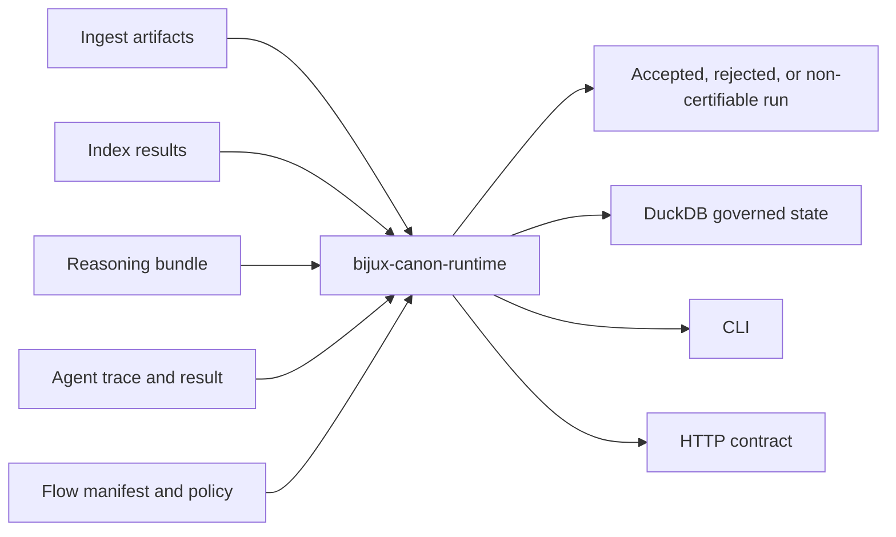

# Repository Fit

`bijux-canon-runtime` is the independently installable authority and persistence
layer for complete Canon runs. It composes the package family, admits exact
inputs, governs execution and effects, arbitrates verification, persists the
closed record, and evaluates replay against the original contract.

## Package boundary


```mermaid
flowchart LR
    I[Ingest artifacts] --> R[bijux-canon-runtime]
    X[Index results] --> R
    Q[Reasoning bundle] --> R
    A[Agent trace and result] --> R
    M[Flow manifest and policy] --> R
    R --> V[Accepted, rejected, or non-certifiable run]
    R --> S[DuckDB governed state]
    R --> C[CLI]
    R --> H[HTTP contract]
```

Runtime depends on the four capability packages because it governs their
composition. The dependency does not transfer semantic ownership: ingest owns
prepared data, index owns retrieval execution, reason owns evidence-to-claim
records, and agent owns role orchestration.

## Why the boundary is independently useful

Applications need one place to answer questions that no lower package can
answer alone: whether the declared dataset is admissible, whether dependencies
and policy resolve, whether effects are authorized, whether verification
results satisfy whole-run policy, whether the retained record is certifiable,
and whether a later attempt is equivalent under the original variance bounds.

The package is not merely the last executor. Planning, refusal, observation,
recovery, inspection, diffing, and replay all use the same authority model even
when no new live work is performed.

## Public surfaces

| Surface | Role | Current contract |
| --- | --- | --- |
| Python package | resolve, plan, execute, persist, inspect, compare, and replay governed flows | typed manifests, policies, plans, traces, decisions, and stores |
| `bijux-canon-runtime` CLI | expose plan, dry-run, run, observe, unsafe-run, replay, inspect, diff, explain, and validate workflows | exit behavior, structured rendering, and DuckDB state |
| DuckDB execution store | retain local governed execution and replay evidence | migrations, read/write protocols, checkpoints, and single-writer locking |
| versioned HTTP schema | define health, execution, replay, request, and failure envelopes | health is operational; flow execution and replay currently return `501` |
| legacy compatibility packages | preserve established import and command paths | delegate to canonical Canon packages rather than defining parallel authority |

The HTTP schema is valuable as a pinned public contract, but schema presence is
not implementation evidence. Clients requiring execution or replay must use the
implemented Python or CLI surfaces until the versioned handlers cease returning
`501 Not Implemented`.

## Repository placement

```text
packages/bijux-canon-runtime/
├── src/bijux_canon_runtime/
│   ├── application/         # resolution, execution coordination, replay, persistence
│   ├── model/               # manifests, policy, plans, traces, datasets, decisions
│   ├── observability/       # capture, analysis, classification, migrations, stores
│   ├── runtime/             # execution strategies and effect handling
│   ├── verification/        # checks and whole-run arbitration inputs
│   ├── interfaces/cli/      # canonical command surface
│   └── api/v1/              # versioned HTTP application and contract boundary
├── tests/                   # unit, smoke, contract, end-to-end, and regression evidence
├── README.md                # package entry point
└── pyproject.toml           # distribution, dependencies, extras, and CLI metadata

apis/bijux-canon-runtime/v1/ # governed OpenAPI source, pinned output, and schema hash
```

Keeping the OpenAPI source at the repository API boundary and its hash in the
wheel makes contract drift observable. It does not justify implementing policy
twice: HTTP handlers must call the same application authority used by Python and
CLI.

## Dependency direction

Runtime may depend on ingest, index, reason, and agent. Those packages must not
depend on runtime to complete their own domain contracts. Hosts may replace
executors or storage through explicit interfaces, but replacements must retain
the same authority, event, recovery, and replay evidence.

DuckDB is the local reference store. It is not a distributed scheduler,
replicated event log, remote-effect transaction manager, or authorization
service. Deployments needing those properties must supply them at the host
boundary without weakening runtime's retained contract.

## Boundary failure conditions

The repository fit has degraded if:

- runtime reimplements preparation, retrieval, reasoning, or orchestration;
- execution order rather than declared policy determines authority;
- persistence is treated as proof of acceptance;
- external effects are described as transactionally coupled to DuckDB;
- HTTP, CLI, and Python paths apply different admission or replay semantics;
- compatibility packages develop independent authority decisions;
- run and replay endpoints are documented as operational while returning
  `501`; or
- unrelated final-stage utilities accumulate under runtime.

The boundary is justified by whole-run authority. If admission, effects,
arbitration, persistence, recovery, and replay no longer form a coherent
contract, the package should be reshaped by ownership rather than retained
because it happens to execute last.
