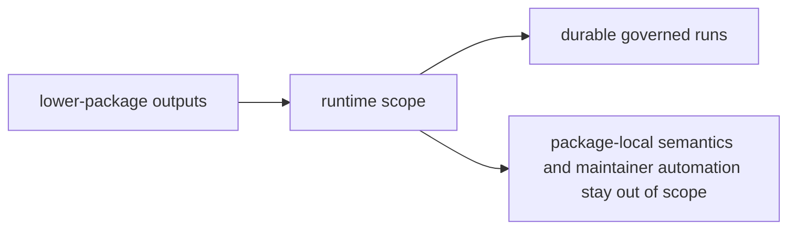

# Scope and Non-Goals

The scope of `bijux-canon-runtime` is explicit authority over runs. It is not a convenient place for any code that happens late in execution.

## Scope Map

This page should make runtime look narrow for a reason. It owns the verdict,
the persistence model, and the replay contract, but it should stop before
becoming a second home for whatever lower packages leave unresolved.

## In Scope

- acceptance policy for governed runs
- persistence and replay behavior tied to runtime authority
- runtime-facing interfaces and artifacts that define what a durable run means

## Non-Goals

- package-local semantics owned by ingest, index, reason, or agent
- maintainer automation that belongs to the maintenance handbook
- convenience features that never affect governed run outcomes

## Scope Check

If the change makes runtime broader without making run authority easier to explain, it is probably misplaced.

## Design Pressure

If runtime grows by collecting every late-stage concern, authority becomes less
explicit rather than more. The non-goals keep governed execution separate from
both package-local behavior and repository operations.
