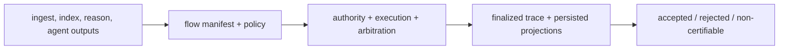

# Scope and Non-Goals

`bijux-canon-runtime` owns end-to-end execution authority. It resolves a
tenant-bound manifest, plans ordered work, enforces mode and budgets, records
causal events and entropy, arbitrates verification, persists governed state,
and judges replay under the original acceptance contract.

```mermaid
flowchart LR
    lower["ingest, index, reason, agent outputs"]
    manifest["flow manifest + policy"]
    runtime["authority + execution + arbitration"]
    record["finalized trace + persisted projections"]
    verdict["accepted / rejected / non-certifiable"]

    lower --> manifest --> runtime --> record --> verdict
```

## In scope

- immutable flow, step, dataset, artifact, execution-plan, compatibility, and
  replay contracts;
- tenant, dependency, dataset, environment, package, policy, resolver, and plan
  identity;
- plan, dry-run, live, observe, and unsafe mode semantics;
- execution authority, step/retrieval/reasoning/agent adapters, causal event
  recording, checkpoints, interruptions, and resume;
- resource and entropy budgets, nondeterministic intent, allowed variance, and
  semantic warnings for reduced guarantees;
- verification engine results, contradiction handling, arbitration policy,
  certifiability, and final trace authority;
- migration-owned DuckDB persistence, artifact lineage and payload stores,
  typed reconstruction, inspection, comparison, and failure explanation;
- replay envelopes, exact/bounded acceptability, semantic diffs, drift
  analysis, and replay verdicts.

## Non-goals

| Not owned here | Owning boundary |
| --- | --- |
| Parsing and normalizing source data | `bijux-canon-ingest` |
| Vector ranking and backend execution semantics | `bijux-canon-index` |
| Claim grounding and reasoning verification facts | `bijux-canon-reason` |
| Role lifecycle, convergence, and pipeline trace production | `bijux-canon-agent` |
| Reimplementing lower-layer semantics to make a flow pass | never runtime authority |
| Distributed queues, multi-writer databases, cluster scheduling, or external transactions | deployment and integration platform |
| Authentication, filesystem isolation, encryption, backups, or secret management | hosting system |
| Repository synchronization, release mechanics, or maintainer policy | maintenance tooling and handbook |

## Authority limits

A finalized trace is a closed record, not automatic acceptance. Arbitration can
accept, reject, or mark it non-certifiable under a declared policy. Runtime
verification proves registered rules and budgets were applied; it does not
certify source truth, scientific validity, legal compliance, or model
calibration.

DuckDB is a durable single-writer execution store. It cannot roll back an
external provider call or filesystem effect. Integrations whose effects may be
retried after interruption require their own idempotency or compensation.

## Scope test

A change belongs here when it alters authorization, ordered flow execution,
verification arbitration, governed persistence, resume, or replay acceptance.
If it changes the meaning of a lower-package record, runtime should consume the
corrected record rather than absorb its implementation.

See the [capability map](capability-map.md) and
[known limitations](../quality/known-limitations.md) for the complete authority
and infrastructure boundary.
