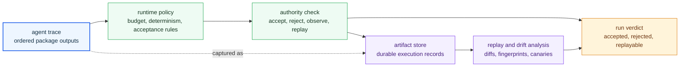

# Runtime Handbook

`bijux-canon-runtime` is the execution authority layer in `bijux-canon`. It decides when lower-package work becomes an acceptable, replayable, durable run instead of a merely successful execution trace.

The main failure this handbook prevents is treating runtime as a miscellaneous bucket for late-stage plumbing. Runtime exists to own acceptance, replay, persistence, and governed execution authority. If those decisions leak downward, no one can say why one run counts and another does not.

## What The Reader Should See First

Runtime is where a run becomes governable. Lower packages can prepare,
retrieve, reason, and orchestrate correctly, but runtime decides whether the
combined execution satisfies policy, whether its artifacts can be persisted,
and whether another reviewer can replay or compare it later.

## What This Package Owns

- run acceptance and replay policy above the lower package family
- runtime persistence boundaries and durable runtime-facing artifacts
- execution authority that governs agent coordination rather than replacing it

## What This Package Does Not Own

- ingest, index, reasoning, or agent-specific semantics inside their own packages
- repository-wide maintainer automation that belongs in the maintenance handbook
- package-local convenience behavior that never affects governed runs

## Boundary Test

If the issue is whether a run should be accepted, persisted, replayed, or rejected under explicit policy, it belongs here. If the issue is how a lower package produced its local result, runtime should consume that result rather than re-own the behavior.

## First Proof Check

- `packages/bijux-canon-runtime/src/bijux_canon_runtime/application/execute_flow.py` for governed execution entrypoints
- `packages/bijux-canon-runtime/src/bijux_canon_runtime/observability` for durable replay and trace surfaces
- `packages/bijux-canon-runtime/src/bijux_canon_runtime/core/authority.py` for explicit runtime authority rules
- `packages/bijux-canon-runtime/src/bijux_canon_runtime/model/execution` for replay envelopes, traces, verdicts, and run modes
- `packages/bijux-canon-runtime/tests` for acceptance, replay, and persistence evidence

## Start Here

- open [Foundation](https://bijux.io/bijux-canon/06-bijux-canon-runtime/foundation/) when the question is why this package exists or where its ownership stops
- open [Architecture](https://bijux.io/bijux-canon/06-bijux-canon-runtime/architecture/) when you need module boundaries, dependency flow, or execution shape
- open [Interfaces](https://bijux.io/bijux-canon/06-bijux-canon-runtime/interfaces/) when the question is about commands, APIs, schemas, imports, or artifacts that callers may treat as stable
- open [Operations](https://bijux.io/bijux-canon/06-bijux-canon-runtime/operations/) when you need local workflow, diagnostics, release, or recovery guidance
- open [Quality](https://bijux.io/bijux-canon/06-bijux-canon-runtime/quality/) when the question is whether the package has proved its promises strongly enough

## Pages In This Package

- [Foundation](https://bijux.io/bijux-canon/06-bijux-canon-runtime/foundation/)
- [Architecture](https://bijux.io/bijux-canon/06-bijux-canon-runtime/architecture/)
- [Interfaces](https://bijux.io/bijux-canon/06-bijux-canon-runtime/interfaces/)
- [Operations](https://bijux.io/bijux-canon/06-bijux-canon-runtime/operations/)
- [Quality](https://bijux.io/bijux-canon/06-bijux-canon-runtime/quality/)

## Bottom Line

If a proposed change makes `bijux-canon-runtime` broader without making its owned role easier to defend, the change is probably crossing a package boundary rather than improving the design.
