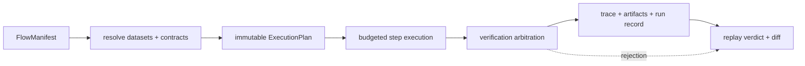

# Runtime Handbook

`bijux-canon-runtime` is the authority that resolves a `FlowManifest`, checks
dataset and dependency state, plans ordered execution, enforces budgets and
verification gates, records causally ordered events, and decides whether a run
may be persisted or accepted for replay.

A completed lower-layer call is not automatically a valid runtime step. The
runtime distinguishes execution failure from verification failure, records
authority and human interventions, and binds replay to the original flow,
dataset, policy, environment, plan, artifact, and entropy identities.

```mermaid
flowchart LR
    manifest["FlowManifest"]
    resolve["resolve datasets + contracts"]
    plan["immutable ExecutionPlan"]
    execute["budgeted step execution"]
    verify["verification arbitration"]
    persist["trace + artifacts + run record"]
    replay["replay verdict + diff"]

    manifest --> resolve --> plan --> execute --> verify --> persist --> replay
    verify -. rejection .-> replay
```

## Manifest Authority

| Manifest field | Runtime decision |
| --- | --- |
| flow, tenant, state, agents, dependencies | who owns the run and which order is valid |
| dataset descriptor and deprecation policy | whether the exact data identity is admissible |
| retrieval contracts and verification gates | which lower-layer evidence and checks are mandatory |
| determinism level and nondeterminism intent | which variability is declared rather than accidental |
| entropy budget and allowed variance | how much uncertainty the run may consume |
| replay envelope, mode, and acceptability | which future execution can count as a replay |

`FlowManifest` is structural; semantic validity is enforced during resolution,
planning, authority checks, execution, verification, and replay. Constructing
the dataclass alone does not prove that a flow is executable.

## Run Modes

- `plan` resolves and plans without executing steps
- `dry-run` exercises runtime preparation without live side effects
- `live` executes under declared policy and records the run
- `observe` captures evidence without granting normal execution authority
- `unsafe` is an explicit reduced-guarantee mode, not an alias for live

## What This Package Owns

- run acceptance and replay policy above the lower package family
- runtime persistence boundaries and durable runtime-facing artifacts
- execution authority that governs agent coordination rather than replacing it

## What This Package Does Not Own

- ingest, index, reasoning, or agent-specific semantics inside their own packages
- repository-wide maintainer automation that belongs in the maintenance handbook
- package-local convenience behavior that never affects governed runs

## Ownership Test

If the issue is whether a run should be accepted, persisted, replayed, or
rejected under explicit policy, it belongs here. If the issue is how a lower
package produced its local result, runtime should consume that result rather
than re-own the behavior.

## Implementation Anchors

- `packages/bijux-canon-runtime/src/bijux_canon_runtime/application/execute_flow.py` for governed execution entrypoints
- `packages/bijux-canon-runtime/src/bijux_canon_runtime/observability` for durable replay and trace surfaces
- `packages/bijux-canon-runtime/src/bijux_canon_runtime/core/authority.py` for explicit runtime authority rules
- `packages/bijux-canon-runtime/src/bijux_canon_runtime/model/execution` for replay envelopes, traces, verdicts, and run modes
- `packages/bijux-canon-runtime/tests` for acceptance, replay, and persistence evidence

## Start Here

- open [Foundation](https://bijux.io/bijux-canon/06-bijux-canon-runtime/foundation/) when the question is why this package exists or where its ownership stops
- open [Architecture](https://bijux.io/bijux-canon/06-bijux-canon-runtime/architecture/) when you need module boundaries, dependency flow, or execution shape
- open [Interfaces](https://bijux.io/bijux-canon/06-bijux-canon-runtime/interfaces/) when the question is about commands, APIs, schemas, imports, or artifacts that callers may treat as stable
- open [Operations](https://bijux.io/bijux-canon/06-bijux-canon-runtime/operations/) when you need local workflow, diagnostics, release, or recovery guidance
- open [Quality](https://bijux.io/bijux-canon/06-bijux-canon-runtime/quality/) when the question is whether the package has proved its promises strongly enough

## Reference Areas

- [Foundation](https://bijux.io/bijux-canon/06-bijux-canon-runtime/foundation/)
- [Architecture](https://bijux.io/bijux-canon/06-bijux-canon-runtime/architecture/)
- [Interfaces](https://bijux.io/bijux-canon/06-bijux-canon-runtime/interfaces/)
- [Operations](https://bijux.io/bijux-canon/06-bijux-canon-runtime/operations/)
- [Quality](https://bijux.io/bijux-canon/06-bijux-canon-runtime/quality/)

## Replay Is A Verdict

Replay analysis can accept, reject, or qualify a comparison based on policy,
dataset evolution, environment, entropy, event order, verification results,
and stored-envelope identity. A replay mismatch remains a mismatch even when
the new run produces superficially similar content.
