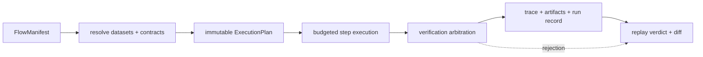
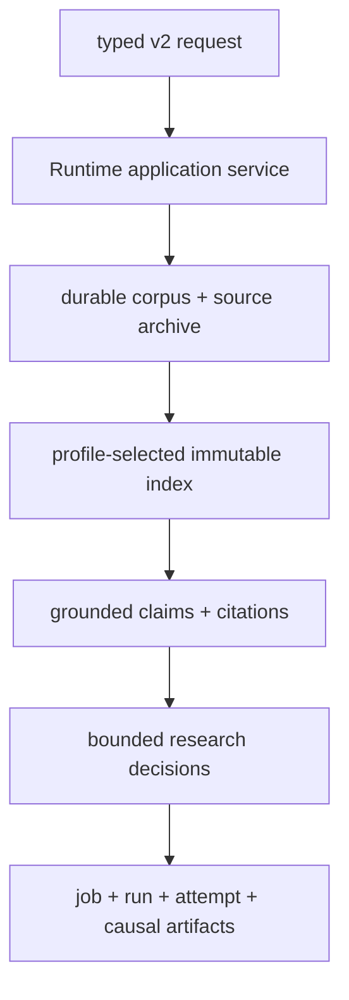
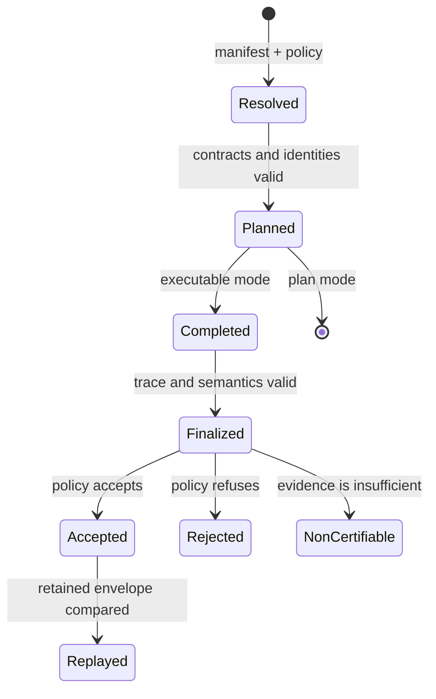

# Runtime Handbook

`bijux-canon-runtime` is the authority that resolves a `FlowManifest`, checks
dataset and dependency state, plans ordered execution, enforces budgets and
verification gates, records causally ordered events, and decides whether a run
may be persisted or accepted for replay.

A completed lower-layer call is not automatically a valid runtime step. The
runtime distinguishes execution failure from verification failure, records
authority and human interventions, and binds replay to the original flow,
dataset, policy, environment, plan, artifact, and entropy identities.


```mermaid
flowchart LR
    manifest["FlowManifest"]
    resolve["resolve datasets + contracts"]
    plan["immutable ExecutionPlan"]
    execute["budgeted step execution"]
    verify["verification arbitration"]
    persist["trace + artifacts + run record"]
    replay["replay verdict + diff"]

    manifest --> resolve --> plan --> execute --> verify --> persist --> replay
    verify -. rejection .-> replay
```

## Manifest Authority

| Manifest field | Runtime decision |
| --- | --- |
| flow, tenant, state, agents, dependencies | who owns the run and which order is valid |
| dataset descriptor and deprecation policy | whether the exact data identity is admissible |
| retrieval contracts and verification gates | which lower-layer evidence and checks are mandatory |
| determinism level and nondeterminism intent | which variability is declared rather than accidental |
| entropy budget and allowed variance | how much uncertainty the run may consume |
| replay envelope, mode, and acceptability | which future execution can count as a replay |

`FlowManifest` is structural; semantic validity is enforced during resolution,
planning, authority checks, execution, verification, and replay. Constructing
the dataclass alone does not prove that a flow is executable.

## Legacy Manifest Authority Modes

- `plan` resolves and plans without executing steps
- `dry-run` exercises runtime preparation without live side effects
- `live` executes under declared policy and records the run
- `observe` captures evidence without granting normal execution authority
- `unsafe` is an explicit reduced-guarantee mode, not an alias for live

These modes belong to the hidden manifest-oriented compatibility surface. Plan
and dry-run deliberately avoid product execution, and observe evaluates a
supplied run. Success in those modes does not establish v2 operation or profile
readiness. New whole-product workflows use the v2 commands below.

## Run The Installed Product

Initialize a workspace and execute the complete secret-free lexical path:

```bash
bijux-canon-runtime init --workspace ./canon-workspace --json
export BIJUX_CANON_RUNTIME_WORKING_ROOT=./canon-workspace

bijux-canon-runtime v2 run \
  "What evidence does this corpus support?" \
  --source-directory ./documents \
  --profile offline-lexical \
  --wait \
  --wait-timeout-seconds 30
```

The terminal job document identifies the authoritative run and attempt. Use
`v2 result` to resolve the output, then `v2 inspect`, `v2 replay`, and
`v2 compare` to examine or reproduce the causal history. The same application
service exposes separate ingest, index, search, answer, and research operations
when an operator needs explicit lifecycle control.

The execution profile determines the plan before the durable job is accepted.
`offline-lexical` never schedules a model or dense step. Local dense and hybrid
profiles first require the `local-cpu` installation extra and a model acquired
and validated through `bijux-canon-index model` commands.

## Installed Composition


```mermaid
flowchart TD
    request["typed v2 request"] --> runtime["Runtime application service"]
    runtime --> ingest["durable corpus + source archive"]
    ingest --> index["profile-selected immutable index"]
    index --> reason["grounded claims + citations"]
    reason --> agent["bounded research decisions"]
    agent --> record["job + run + attempt + causal artifacts"]
```

Runtime composes domain application services without requiring uniform
package-root callables. Every operation retains request, plan, configuration,
input and output artifact identities in the workspace DuckDB and CAS. Installed
wheel acceptance executes this composition outside the source checkout and
proves restart, bounded inspection, replay, comparison, cancellation,
backup/restore, grounded answers, research, and agent traces.

## Follow One Governed Run


```mermaid
stateDiagram-v2
    [*] --> Resolved: manifest + policy
    Resolved --> Planned: contracts and identities valid
    Planned --> Completed: executable mode
    Planned --> [*]: plan mode
    Completed --> Finalized: trace and semantics valid
    Finalized --> Accepted: policy accepts
    Finalized --> Rejected: policy refuses
    Finalized --> NonCertifiable: evidence is insufficient
    Accepted --> Replayed: retained envelope compared
```

Plan mode stops after resolution and returns no run identifier or trace. Other
modes require an execution store and the resources appropriate to their
authority. A finalized trace can describe a rejected or non-certifiable run;
finalization means the record is closed, not that policy accepted it.

## Read A Runtime Result

| Record | Question it answers | Failure if absent or inconsistent |
| --- | --- | --- |
| manifest and resolved plan | what was authorized, ordered, and fingerprinted? | the run has no stable execution contract |
| dataset descriptor | which exact data state was admissible? | dataset drift cannot be distinguished from replay drift |
| authority and verification policy | who permitted effects and how findings were arbitrated? | completion can be mistaken for acceptance |
| event trace and checkpoints | what happened, in which causal order? | resume and failure analysis become speculative |
| artifacts, evidence, claims, and tool calls | what the run consumed and produced | outputs lose lineage |
| entropy use and replay envelope | which variance was declared and retained? | determinism claims exceed captured evidence |
| replay verdict and diff | whether a later run satisfies the original policy | similar final content can be mislabeled equivalent |

## Do Not Collapse Runtime States

Execution, finalization, acceptance, and replay are separate decisions:

| State | What may be claimed | What may not be claimed |
| --- | --- | --- |
| executed | declared steps returned outcomes | verification passed or the run is complete |
| finalized | the trace and required records were closed | policy accepted the run |
| accepted | arbitration admitted the finalized record under its policy | the result is universally correct |
| non-certifiable | retained evidence cannot support the requested guarantee | the run necessarily failed to produce useful observations |
| replay acceptable | the comparison satisfied the original replay policy | the two executions were bitwise identical unless exactness was required and established |
| replay unacceptable | a disallowed difference or identity mismatch was found | every output from the later execution is false |

This vocabulary prevents a common integrity failure: promoting “the command
finished” into “the run is valid.” Persist the status, arbitration evidence,
certifiability, and replay verdict independently so downstream systems cannot
infer a stronger state from a weaker one.

## Runtime Trust Boundary

Runtime governs lower-package results; it does not recreate them. Ingest owns
source preparation, index owns vector execution, reason owns claim/evidence
semantics, and agent owns role lifecycle. Runtime binds their governed outputs
to authority, policy, persistence, and replay.

The DuckDB execution store retains causal run state and supports inspection,
resume, and replay. It is a single-writer local store, not a transaction manager
for external tools. A database commit cannot undo a provider call or filesystem
write; live integrations need idempotency or compensation beyond the store.

Its schema retains run and dataset identity, steps, event payloads,
checkpoints, artifact and evidence metadata, entropy use, tool invocations,
claim identifiers, a verification-policy fingerprint, and the run-level
arbitration decision. Artifact content and evidence content are not stored in
those metadata rows. Per-engine verification results and replay analysis also
do not have dedicated tables. Operators must retain external content by hash
and must not infer payload availability or full verification detail from the
presence of a run row.

## Evidence And Limits

| Claim | Evidence to inspect | Limit |
| --- | --- | --- |
| a run was accepted | finalized trace, verification results, arbitration decision, certifiability | acceptance is only under the declared policy |
| resume preserved authority | tenant, manifest, plan, dataset, policy, checkpoint, store identity | changed authority requires a new run |
| replay is exact | original envelope, retained inputs, event and artifact identity, zero disallowed diff | cannot control state never captured |
| bounded replay is acceptable | original allowed variance and evaluated semantic diff | tolerance cannot be invented after divergence |
| storage is complete | workspace schema, DuckDB authority, admitted CAS inventory and verified causal edges | hashes cannot reconstruct deliberately deleted bytes |
| installed composition works | terminal jobs, causal artifact graph, source locators, grounded claims, research trace, replay and restore evidence | import success or a fabricated result document |

The [entrypoint examples](interfaces/entrypoints-and-examples.md) show installed
execution, inspection, replay, comparison, backup/restore, and the HTTP v2
server. The separately importable v1 module is compatibility-only and is not
mounted by the installed server.

## Continue By Question

| Question | Next page |
| --- | --- |
| why is runtime the final execution authority? | [Foundation](foundation/index.md) |
| how do planning, execution, verification, storage, and replay connect? | [Architecture](architecture/index.md) |
| which Python, CLI, HTTP, configuration, and artifact contracts are callable? | [Interfaces](interfaces/index.md) |
| how do I operate, inspect, resume, replay, secure, or recover a run? | [Operations](operations/index.md) |
| which invariants defend authority, persistence, entropy, and replay? | [Quality](quality/index.md) |

## Replay Is A Verdict

Replay analysis can accept, reject, or qualify a comparison based on policy,
dataset evolution, environment, entropy, event order, verification results,
and stored-envelope identity. A replay mismatch remains a mismatch even when
the new run produces superficially similar content.
