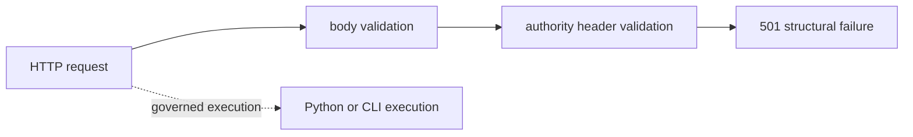

# HTTP API

The runtime HTTP application is experimental. Health and storage readiness are
implemented. Flow run and replay endpoints validate their contracts and then
return `501 Not Implemented`. Use the Python or CLI surfaces for governed
execution.

## Current Availability

| Method and path | Status | Behavior |
| --- | --- | --- |
| `GET /health` | implemented | process liveness: `{ "status": "ok" }` |
| `GET /api/v1/health` | implemented | versioned alias of `/health` |
| `GET /ready` | implemented | checks that configured DuckDB storage can be opened |
| `GET /api/v1/ready` | implemented | versioned alias of `/ready` |
| `POST /api/v1/flows/run` | contract only | validates body and required headers, then returns `501` |
| `POST /api/v1/flows/replay` | contract only | validates body and required headers, then returns `501` |

The versioned schema freezes the request and response shapes for compatibility
checks. It does not mean the two flow operations have an execution backend.

## Health And Readiness

Readiness requires `AGENTIC_FLOWS_DB_PATH`. The probe constructs and closes a
`DuckDBExecutionStore` at that path. Missing configuration or any open failure
returns `503 { "ready": false }`; success returns `200 { "ready": true }`.

This is a storage-open check, not a deep dependency check. It does not validate
datasets, external tools, agent providers, policies, artifact payloads, or the
ability to run a flow.

## Flow Contract Headers

Both flow operations require:

| Header | Accepted form | Current validation |
| --- | --- | --- |
| `X-Agentic-Gate` | non-empty characters from letters, digits, `.`, `_`, `:`, `-` | presence and syntax only |
| `X-Determinism-Level` | `strict`, `bounded`, `probabilistic`, or `unconstrained` | required enum; empty and `default` refused |
| `X-Policy-Fingerprint` | non-empty characters from letters, digits, `.`, `_`, `:`, `-` | presence and syntax only |

Missing or invalid authority headers return `406` with an authority failure
envelope. The current endpoint does not compare the policy header with the
request body's `policy_fingerprint` before returning `501`.

## Request Shapes

Run accepts a strict object containing `flow_manifest`, `inputs_fingerprint`,
`dataset_id`, `policy_fingerprint`, and HTTP run mode `live`, `dry`, or
`observer`. Replay accepts `run_id`, `expected_plan_hash`, `observer_mode`, and
acceptability threshold `exact_match`, `invariant_preserving`, or
`statistically_bounded`. Unknown fields are rejected.

These HTTP mode strings are a schema contract and do not mirror every Python
`RunMode` spelling or capability. In particular, their acceptance by Pydantic
does not make remote execution available.

## Failure Envelope

| Status | Contract outcome |
| --- | --- |
| `400` | request body could not be parsed |
| `406` | authority headers are missing or invalid |
| `422` | request validation failed |
| `501` | validated run or replay operation is not implemented |

These failures use `FailureEnvelope`, carrying failure class, reason code,
violated contract, evidence identities, and determinism impact. The current
structural helper uses `contradiction_detected` as the reason code even for
parse, validation, and not-implemented failures. Clients should key diagnosis
on status and `violated_contract`, not infer a semantic contradiction from that
reason code alone.

Method mismatch returns `405` with an `Allow` header. The application declares
no OpenAPI security scheme and implements no authentication or tenant
isolation. Required authority headers are contract metadata, not credentials.

## Successful Response Shape

`FlowRunResponse` defines run and flow identity, terminal status, determinism
and environment classification, replay acceptability, and artifact count. It
is retained in the versioned schema but is not returned by the current run or
replay handlers. Integration code must not fabricate or mock that response and
present the HTTP operation as implemented.

## Contract Authority

The tracked schema is
[`apis/bijux-canon-runtime/v1/schema.yaml`](https://github.com/bijux/bijux-canon/blob/main/apis/bijux-canon-runtime/v1/schema.yaml),
with its pin and hash. The route code establishes current availability. See
[Entrypoints and Examples](entrypoints-and-examples.md) for supported Python
and CLI execution, and [Data Contracts](data-contracts.md) for the distinction
between HTTP envelopes and runtime domain models.
