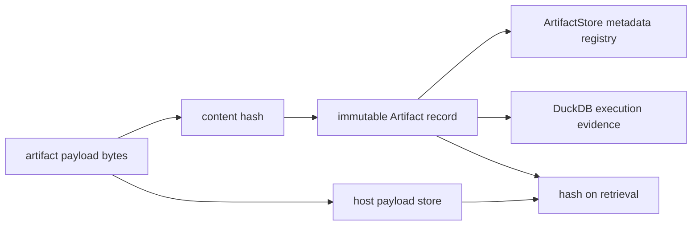

# Artifact Contracts

Runtime artifacts are authority records, not arbitrary blobs. Identity,
tenancy, content hashes, parentage, trace order, verification policy, and
replay semantics remain explicit from execution through persistence.

## Flow Result

`FlowRunResult` is the complete in-process handoff:

| Field | Contract |
| --- | --- |
| `resolved_flow` | manifest-derived, plan-hashed execution authority |
| `trace` | finalized execution trace; absent only for plan mode |
| `artifacts` | immutable produced artifact records |
| `evidence` | retrieved evidence with content identity |
| `reasoning_bundles` | claims and their evidence relationship |
| `verification_results` | per-engine rule outcomes |
| `verification_arbitrations` | policy-governed final decisions |
| `run_id` | persisted run identity; absent in plan mode |

## Artifact Record

An `Artifact` carries specification version, artifact and tenant IDs, artifact
type, producer (`agent`, `retrieval`, or `reasoning`), parent artifact IDs,
content hash, and scope. The record is immutable. Payload storage may live
elsewhere; this contract retains the provenance needed to identify it.

Artifact IDs alone are not integrity evidence. Compare content hashes and
parentage, and enforce tenant scope whenever artifacts cross an interface.

### Metadata Is Not Payload Storage

Despite its name, the runtime `ArtifactStore` interface creates, saves, and
loads `Artifact` records only. It has no byte-write or byte-read operation. The
default `InMemoryArtifactStore` therefore retains artifact metadata for the
life of the process; it does not retain the content whose digest appears in
`content_hash`.

The DuckDB execution store persists the record and its parent edges, not the
payload bytes. A production integration must bind those records to a durable
payload store, verify the digest when bytes are written and read, and apply the
same tenant authorization at both stores. Keeping only the DuckDB file
preserves lineage metadata but may leave the referenced content unavailable.

## Finalized Trace

An `ExecutionTrace` binds execution to:

- flow, tenant, parent, and child identities;
- flow and dataset state;
- determinism level, replay mode, acceptability, and envelope;
- environment, plan, verification-policy, and resolver fingerprints;
- ordered events and tool invocations;
- recorded entropy use;
- claim IDs, contradiction count, and arbitration decision; and
- exhaustion and certifiability status.

The trace can be accessed only after finalization. Events, tool calls, evidence,
or fields cannot be amended after that boundary without invalidating runtime
authority.

## Verification Evidence

Each verification result names its engine, deterministic or non-deterministic
classification, phase, applied rules, violated rules, checked artifacts,
status, reason, and decision. Arbitration then records the policy fingerprint,
arbitration rule, participating engines and statuses, target artifacts, and
decision.

Keeping engine results separate from arbitration is important: a policy can
escalate or halt on selected rules without rewriting what an engine observed.

## Installed Research State

The `agent.research-trace.v1` payload retains an Agent-owned
`research_state_history` and terminal `research_state`. Each state names the
research question, answer requirement and claim identities, semantic evidence
relations, blocking and non-blocking gaps, the search budget, and the decisions
that changed the state. Causal events bind their before and after identities to
these content-addressed states.

`status` retains the Reason convergence outcome for compatibility. The
terminal state's `terminal_status` is the completion interpretation: a budget
limit, refusal, tool failure, ambiguity, material opposition, unsearched
important claim, or unclassified candidate remains incomplete even if a raw
convergence observation says to stop. No-result search gaps are explicitly
non-blocking and must retain their bounded negative-search statement.

The same payload retains `answer_requirement_plan`, the exact Reason-owned
plan from which Agent state was constructed. Verification revalidates its
content identity, graph binding, question, dependency order, search selection,
and outcome, then requires every Agent requirement to retain the corresponding
source requirement identity. A counterevidence plan alone is not evidence that
the question's findings, methods/context, opposition, limitations,
disambiguation, and answerability needs were considered.

`targeted_search_plan` records Agent's exact next-call decision. Verification
recomputes its plan and attempt identities, requires at most one selected
requirement, binds that requirement to the Reason retrieval plan, and requires
the executed query to preserve the selected substantive query. Index records
formatting-equivalent multi-query variants as duplicates rather than executing
them again.

The plural `targeted_search_plans`, `targeted_search_observations`,
`counterevidence_plans`, and `counterevidence_runs` fields retain adaptive
history in order. Verification recomputes every identity, rejects repeated
attempt or query-equivalence identities, requires observations to reference the
executed attempts in order, and binds the terminal compatibility records to the
last history entries.

## DuckDB Execution Store

The execution store is the durable audit-and-replay boundary. It is explicitly
single-writer and is not the transaction coordinator for live execution. Its
governed records include:

- runs, datasets, and normalized plan actions;
- ordered execution events and checkpoints;
- artifact records and artifact-parent edges;
- evidence, claim IDs, and tool invocations;
- entropy budget, sources, intent, and observed use;
- finalized trace metadata and replay policy; and
- schema migrations and the active schema contract hash.

Write and read capabilities are exposed separately. Replay uses the read store;
live and resumed execution use the write store. The schema is migration-owned;
editing tables outside that contract can make a syntactically readable database
semantically unreplayable.

Persistence methods commit their own record groups: run creation, steps,
events, tools, entropy, artifacts, evidence, claims, and finalization are not
one database-wide commit. An interruption may leave a valid resumable run with
`finalized = false` and a subset of later records. This is expected lifecycle
state, not completed execution evidence.

The writer guard is a neighboring lock file containing a process ID. It is a
local-filesystem exclusion mechanism, not a distributed lease or DuckDB-level
authorization boundary. All writers must use the runtime store protocol and
must agree on filesystem and process identity for the guard to be meaningful.

## Stored Projection

The store reconstructs replay-oriented domain records rather than preserving a
generic serialized `FlowRunResult`:

| In-process record | Persisted representation | Round-trip boundary |
| --- | --- | --- |
| execution plan | normalized run and step tables | plan authority and hashes, not the original Python object graph |
| execution trace | run row plus events, tools, entropy, claims, and child flows | events, tools, and entropy retain entry order; claims and children are identity sets |
| artifact | artifact row plus parent-edge rows | payload bytes remain in the artifact store |
| evidence | ordered evidence rows | source URI, score, content hash, determinism, and vector contract only |
| reasoning bundle | claim IDs; evidence and artifacts occupy separate tables | full reasoning bundle and its internal links are not a dedicated table |
| verification result and arbitration | finalized trace decision and policy fingerprint | full per-engine result objects are not dedicated tables |

Loaded trace, event, artifact, evidence, tool, and dataset models are
reconstructed with specification version `v1`; individual model
`spec_version` values are not stored as per-row fields. Schema migrations and
the active schema contract hash govern the database representation. Treat a
change in that normalization as a storage compatibility change.

## Replay Acceptability

Replay verdicts are `acceptable`, `acceptable_with_warnings`, `unacceptable`,
or `non_certifiable`. Strict mode rejects any difference. Bounded replay can
accept event, artifact, and evidence differences only when the declared
acceptability permits them; plan, tenant, environment, dataset, policy, or
replay-envelope differences remain blocking. A non-certifiable observed trace
cannot be promoted to acceptable by a permissive diff policy.

## Acceptance Procedure

Before treating a persisted run as authoritative:

1. open it through the migration-aware read store, never by ad hoc table reads;
2. select by both tenant ID and run ID;
3. require a finalized trace for completed-run claims, or explicitly enter the
   checkpoint/resume workflow for an unfinished run;
4. load artifacts, evidence, tools, entropy, and claims through typed readers,
   preserving declared order where the record contract defines it, and resolve
   artifact payloads through the host payload store, hashing the returned bytes
   against each runtime record;
5. compare plan, tenant, environment, dataset, replay envelope, determinism,
   policy, and lifecycle structure with the replay guard;
6. apply the declared replay mode and acceptability only after structural diffs
   are known; and
7. preserve the database, migrations, schema contract hash, and external
   artifact payloads as one governed retention set.

A readable DuckDB file is not by itself evidence of a finalized, tenant-valid,
or replay-acceptable run.

See [Execution Model](../architecture/execution-model.md) for the lifecycle that
produces and freezes these records.
