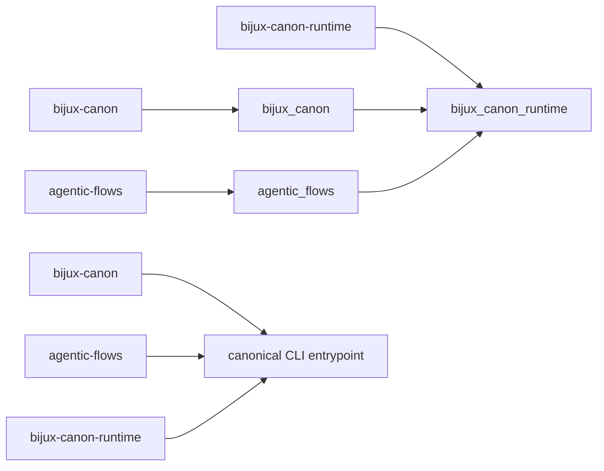

# Compatibility Commitments

The canonical distribution, import, and command are `bijux-canon-runtime`,
`bijux_canon_runtime`, and `bijux-canon-runtime`.

Runtime also preserves two synchronized compatibility identities:

| Distribution | Import | Command | Purpose |
| --- | --- | --- | --- |
| `bijux-canon` | `bijux_canon` | `bijux-canon` | shorter family-root name |
| `agentic-flows` | `agentic_flows` | `agentic-flows` | former standalone runtime name |

Both alias imports install runtime submodule aliases and forward the canonical
root export set, attribute lookup, and interactive discovery. Both alias
commands invoke the canonical CLI entrypoint. They are continuity packages, not
separate runtimes.

## Preserved Behavior

Under every name, these contracts must agree:

- manifest parsing, planning, execution modes, and refusal behavior;
- flow, tenant, dataset, artifact, evidence, and run identity;
- determinism and entropy policy enforcement;
- trace finalization, schema storage, replay, and diff semantics;
- verification results and arbitration decisions; and
- CLI option meaning, exit status, and machine-readable output.

Import-name compatibility cannot override an unsupported schema contract or
turn a non-certifiable trace into an acceptable replay.

## Explicit Limits

Only names exported by the canonical root or documented public facades carry a
Python compatibility commitment. Storage implementation details, lifecycle
helpers, and concrete executors remain internal. The v1 HTTP schema is a tracked
contract, but run and replay endpoints currently return `501`; alias packages
do not change that implementation status.

## Migration

New integrations should use the canonical distribution, import, and command.
Migrate existing deployments one surface at a time, then compare a fixed
manifest in plan mode and a retained run through validated store records. For
executable parity, compare plan hash, policy and environment fingerprints,
ordered events, artifact hashes, and replay verdict—not merely the displayed
command output.

See the [bijux-canon](../../08-compat-packages/catalog/bijux-canon.md) and
[agentic-flows](../../08-compat-packages/catalog/agentic-flows.md) catalog
entries for package-specific installation details.
