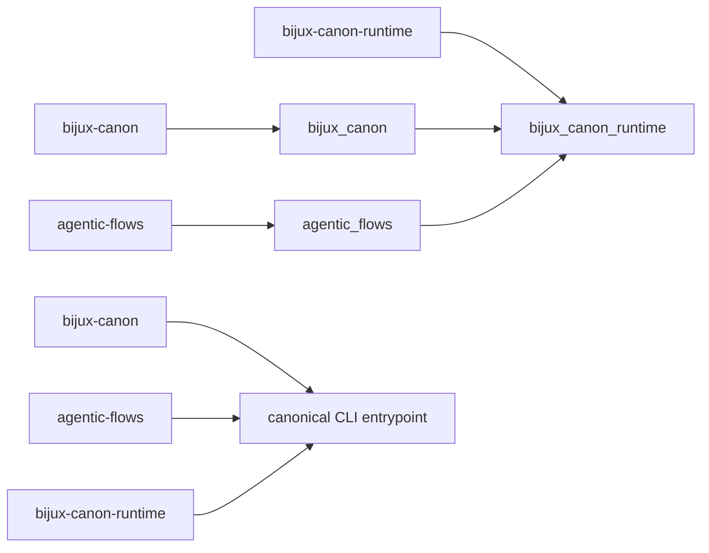
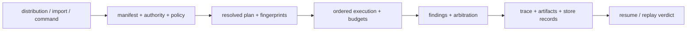

# Compatibility Commitments

The canonical distribution, import, and command are `bijux-canon-runtime`,
`bijux_canon_runtime`, and `bijux-canon-runtime`.

Runtime also preserves two synchronized compatibility identities:

| Distribution | Import | Command | Purpose |
| --- | --- | --- | --- |
| `bijux-canon` | `bijux_canon` | `bijux-canon` | shorter family-root name |
| `agentic-flows` | `agentic_flows` | `agentic-flows` | former standalone runtime name |

Both alias imports install runtime submodule aliases and forward the canonical
root export set, attribute lookup, and interactive discovery. Both alias
commands invoke the canonical CLI entrypoint. They are continuity packages, not
separate runtimes.

## Compatibility Follows Runtime Authority

| Boundary | Required compatibility evidence | Insufficient evidence |
| --- | --- | --- |
| alias identity | same-release dependency, canonical module identity, direct CLI delegation | all three commands print a version |
| admission | same manifest, dataset, dependency, authority, and policy decisions | both runs start |
| planning | same ordered steps, contracts, plan hash, and environment inputs | step names look alike |
| execution | mode, budget, event causality, artifacts, evidence, and tool-call behavior | final payload is similar |
| verification | same required gates, findings, arbitration, and certifiability | no exception was raised |
| persistence | schema, run identity, finalized trace, checksums, and store records | database file exists |
| resume/replay | retained envelope, original identities, diff, and acceptability verdict | later output looks equivalent |

## Preserved Behavior

Under every name, these contracts must agree:

- manifest parsing, planning, execution modes, and refusal behavior;
- flow, tenant, dataset, artifact, evidence, and run identity;
- determinism and entropy policy enforcement;
- trace finalization, schema storage, replay, and diff semantics;
- verification results and arbitration decisions; and
- CLI option meaning, exit status, and machine-readable output.

Import-name compatibility cannot override an unsupported schema contract or
turn a non-certifiable trace into an acceptable replay.

## Change Obligations

| Change | Required treatment |
| --- | --- |
| change root, model, ontology, or verification facade | API inventory and explicit consumer compatibility review |
| change manifest, plan, trace, or replay model | identity, persistence, and replay impact assessment |
| change semantic enum or typed ID | snapshot and serialized-record compatibility evidence |
| change authority, budget, verification, or arbitration behavior | accepted and refused regression cases |
| change persistence schema or run-file meaning | reader/writer, resume, and replay migration evidence |
| implement or alter HTTP run/replay routes | OpenAPI and live contract change; remove the documented `501` limit only with implementation evidence |
| reorganize an internal lifecycle helper or executor | internal unless a public result or governed invariant changes |

## Explicit Limits

Only names exported by the canonical root or documented public facades carry a
Python compatibility commitment. Storage implementation details, lifecycle
helpers, and concrete executors remain internal. The v1 HTTP schema is a tracked
contract, but run and replay endpoints currently return `501`; alias packages
do not change that implementation status.

The canonical root does not export `ExecutionConfig`. Explicit Python
configuration currently uses the documented operational application path,
which has weaker compatibility than the root, model, and ontology facades.
Compatibility packages forward that path but do not strengthen it into a
public extension contract.

## Migration

New integrations should use the canonical distribution, import, and command.
Migrate existing deployments one surface at a time:

1. replace the `bijux-canon` or `agentic-flows` dependency and lock entry;
2. replace root, nested, dynamic, plugin, and serialized alias paths;
3. replace console and module commands in scripts, images, schedulers, and
   runbooks;
4. compare a fixed manifest in plan mode, including plan hash and resolved
   identities;
5. compare fixed accepted and refused executions through validated traces,
   artifacts, verification, arbitration, and store records; and
6. replay a retained run and inspect the verdict and diff.

## Migration Acceptance

The relevant bridge is removable only when canonical metadata, imports, and
commands are deployed; the consumer no longer retains required alias dotted
paths; plan, policy, environment, event, artifact, and verification evidence
matches the intended contract; resume and replay behavior is accounted for;
and deployed environments no longer independently request the compatibility
distribution.

Compare plan hash, policy and environment fingerprints, ordered events,
artifact hashes, store identity, and replay verdict—not merely displayed output
or a successful process exit.

See the [bijux-canon](../../08-compat-packages/catalog/bijux-canon.md) and
[agentic-flows](../../08-compat-packages/catalog/agentic-flows.md) catalog
entries for package-specific installation details.
