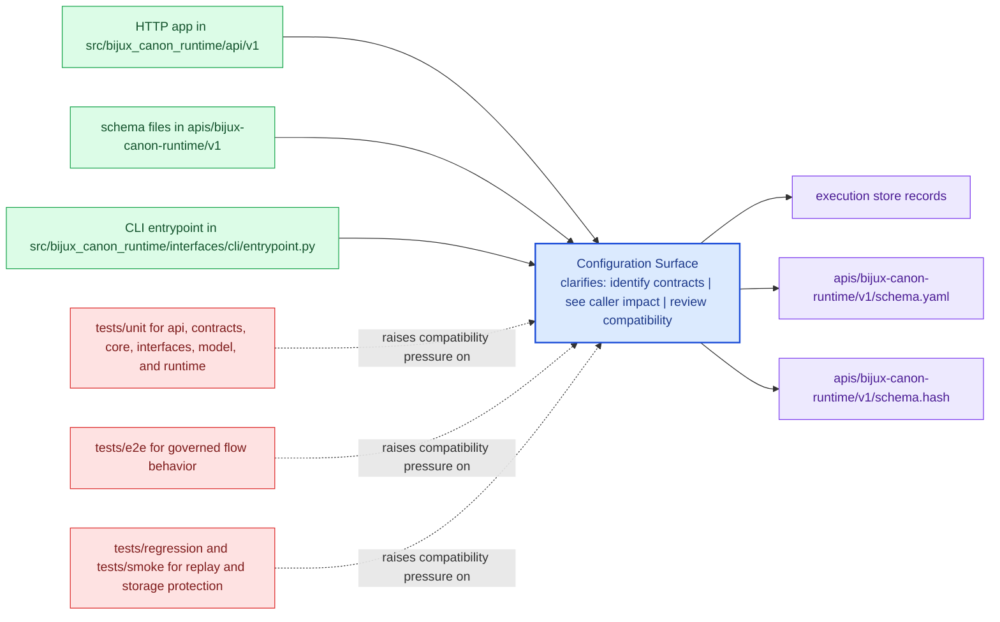

# Configuration Surface

Configuration belongs at the package boundary, not scattered through unrelated
modules.

When configuration is documented well, maintainers can tell which behavior is
meant to vary without editing code. When it is documented poorly, package
behavior starts to feel magical or fragile.

Treat the interfaces pages for `bijux-canon-runtime` as the bridge between implementation detail and caller expectation. They should show what the package is prepared to defend before a dependency forms.

## Visual Summary

## Configuration Anchors

- CLI entrypoint in src/bijux_canon_runtime/interfaces/cli/entrypoint.py
- HTTP app in src/bijux_canon_runtime/api/v1
- schema files in apis/bijux-canon-runtime/v1

## Review Rule

Configuration changes should update the operator docs, schema docs, and tests that protect the same behavior.

## Concrete Anchors

- CLI entrypoint in src/bijux_canon_runtime/interfaces/cli/entrypoint.py
- HTTP app in src/bijux_canon_runtime/api/v1
- schema files in apis/bijux-canon-runtime/v1
- apis/bijux-canon-runtime/v1/schema.yaml

## Use This Page When

- you need the public command, API, import, schema, or artifact surface
- you are checking whether a caller can safely rely on a given entrypoint or shape
- you want the contract-facing side of the package before building on it

## Decision Rule

Use `Configuration Surface` to decide whether a caller-facing surface is explicit enough to depend on. If the surface cannot be tied back to concrete code, schemas, artifacts, examples, and tests, treat it as unstable until that evidence is visible.

## What This Page Answers

- which public or operator-facing surfaces `bijux-canon-runtime` is really asking readers to trust
- which schemas, artifacts, imports, or commands behave like contracts
- what compatibility pressure a change to this surface would create

## Reviewer Lens

- compare commands, schemas, imports, and artifacts against the documented surface one by one
- check whether a seemingly local change actually needs compatibility review
- confirm that examples still point to real entrypoints and not to stale habits

## Honesty Boundary

This page can identify the intended public surfaces of `bijux-canon-runtime`, but real compatibility depends on code, schemas, artifacts, examples, and tests staying aligned. If those disagree, the prose is wrong or incomplete.

## Next Checks

- move to operations when the caller-facing question becomes procedural or environmental
- move to quality when compatibility or evidence of protection becomes the real issue
- move back to architecture when a public-surface question reveals a deeper structural drift

## Purpose

This page explains where configuration enters the package and how it should be reviewed.

## Stability

Keep it aligned with real configuration loaders, defaults, and operator-facing options.
