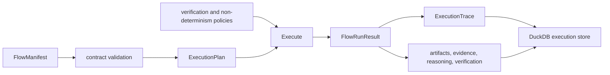

# Data Contracts

Runtime authority begins with a manifest, becomes a resolved plan, and ends as
a finalized trace plus governed evidence. Policy values remain part of that
chain; they are not ambient configuration that can be omitted from replay.

## Flow Manifest

`FlowManifest` is an immutable declaration of execution authority. It records:

- specification, flow, tenant, and lifecycle state;
- determinism level, replay mode, and acceptable replay variance;
- entropy budget and declared non-deterministic intent;
- replay envelope and dataset descriptor;
- agent and dependency inventory; and
- retrieval contracts and verification gates.

Construction establishes the structure, not complete semantic validity. The
flow contract validates cross-field rules before planning. A caller must not
treat a successfully constructed dataclass as an executable authorization.

## Execution Configuration

`ExecutionConfig` selects plan, dry-run, live, observer, or unsafe behavior
through `RunMode` and binds the execution dependencies: verification policy,
non-determinism policy, artifact and execution stores, budget, observers,
parent-child flow identity, resume identity, and strict-determinism posture.
Replay is a separate workflow over a retained run and read store.

`for_manifest()` aligns the effective determinism level with the manifest while
retaining these dependencies. Executable modes require explicit authority and
storage; plan mode returns a resolved plan without a trace or run ID.

## Policy Records

`NonDeterminismPolicy` bounds allowed entropy and intent sources, minimum and
maximum magnitude, variance class, and justification requirements. An intent
outside those bounds is a contract violation, not a warning.

`VerificationPolicy` binds the verification level, failure behavior,
randomness tolerance, arbitration policy, required evidence, rule-cost limit,
rules, and the rule IDs that halt or escalate execution. Verification results
state what each engine observed; arbitration records the policy decision across
those observations.

## Run Result

`FlowRunResult` returns the resolved plan, finalized trace, artifacts, retrieved
evidence, reasoning bundles, verification results, arbitrations, and persisted
run ID. Its collections are distinct because they carry different authority:

- an `Artifact` records immutable provenance and content identity;
- `RetrievedEvidence` binds evidence to retrieval and content identity;
- a reasoning bundle links steps and claims to evidence; and
- verification records show checks and the resulting governed decision.

`FlowRunResult` is frozen at the dataclass boundary, but its collections are
lists. Freezing prevents field reassignment; it does not make the contained
lists immutable or give the whole result a content identity. Treat the result
as an owned in-process handoff. Do not mutate it after publication, and do not
use object equality as proof that two executions are equivalent.

## Authority Joins

Runtime records join through typed identities and tenant scope:

| Relationship | Required join |
| --- | --- |
| run to flow | `tenant_id`, `run_id`, and `flow_id` |
| artifact lineage | artifact ID plus parent artifact IDs within the tenant |
| evidence to retrieval contract | evidence ID, content hash, and vector contract ID |
| claim to execution | claim ID, citation link, evidence packet, and the persisted retrieval artifact dependency |
| event to plan | event step index against the normalized plan action |
| tool call to replay evidence | tool ID plus input and output fingerprints |
| verification to artifact | checked or target artifact IDs plus policy fingerprint |

An ID without its tenant and governing contract is not sufficient authority.
Content hashes establish payload identity but do not establish producer,
parentage, scope, or verification outcome.

For an installed grounded answer, the reason artifact must depend on the exact
retrieval artifact named by its evidence packet and every selected citation.
Inspection reconstructs the citation verifier and numbered presentation from
that persisted dependency and the complete source descriptors. A plausible
quote or bibliography cannot repair a missing dependency, stale retrieval ID,
changed document/chunk/locator coordinate, or changed source bytes.

## Construction and Enforcement

Most runtime records are immutable structural dataclasses. The flow contract,
planner, execution lifecycle, persistence layer, and replay guard enforce the
cross-record rules. Direct construction therefore proves that fields were
supplied, not that a manifest is executable, a trace is finalized, an artifact
belongs to the tenant, or replay is acceptable.

The finalized trace is intentionally inaccessible before finalization. A
persisted run can also exist before finalization for checkpoint and resume.
Readers must distinguish resumable state from completed authority rather than
treating the presence of a run ID as success.

## HTTP Boundary

The v1 request models reject unknown fields and require explicit manifest,
input, dataset, policy, mode, and replay identity. `FailureEnvelope` classifies
contract failures separately from successful flow responses. The execution
endpoints are currently unimplemented, however, so these schemas describe a
versioned boundary—not a promise that HTTP execution is operational.

Changes to tenant or flow identity, policy meaning, plan hashing, event order,
entropy accounting, replay acceptability, or failure classification are
compatibility-sensitive. See [Artifact Contracts](artifact-contracts.md) for
the persisted authority record.
