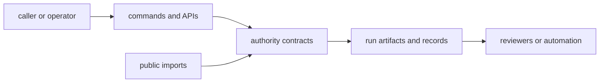

# Interfaces

Open this section when the question is contractual: which runtime commands, acceptance artifacts, schemas, and imports define what a governed run exposes to callers or operators.

## Contract Model

Runtime interfaces are the visible edge of authority. The page should make
clear which commands, schemas, and durable records callers may depend on once a
governed run exists, and which details are still internal implementation.

## Read These First

- open [Artifact Contracts](https://bijux.io/bijux-canon/06-bijux-canon-runtime/interfaces/artifact-contracts/) first when the dispute is about durable run records or replay surfaces
- open [API Surface](https://bijux.io/bijux-canon/06-bijux-canon-runtime/interfaces/api-surface/) when the question begins with a caller-visible runtime API or schema
- open [Compatibility Commitments](https://bijux.io/bijux-canon/06-bijux-canon-runtime/interfaces/compatibility-commitments/) when a runtime surface change could redefine governed run expectations

## Contract Risk

The main contract risk here is exposing runtime authority through visible surfaces that are never described precisely enough to review under change.

## First Proof Check

- `src/bijux_canon_runtime/interfaces` plus runtime artifacts for the owned boundary surfaces
- tracked schemas and examples for contract visibility
- `tests` for acceptance, replay, and compatibility evidence

## Pages In This Section

- [CLI Surface](https://bijux.io/bijux-canon/06-bijux-canon-runtime/interfaces/cli-surface/)
- [API Surface](https://bijux.io/bijux-canon/06-bijux-canon-runtime/interfaces/api-surface/)
- [Configuration Surface](https://bijux.io/bijux-canon/06-bijux-canon-runtime/interfaces/configuration-surface/)
- [Data Contracts](https://bijux.io/bijux-canon/06-bijux-canon-runtime/interfaces/data-contracts/)
- [Artifact Contracts](https://bijux.io/bijux-canon/06-bijux-canon-runtime/interfaces/artifact-contracts/)
- [Entrypoints and Examples](https://bijux.io/bijux-canon/06-bijux-canon-runtime/interfaces/entrypoints-and-examples/)
- [Operator Workflows](https://bijux.io/bijux-canon/06-bijux-canon-runtime/interfaces/operator-workflows/)
- [Public Imports](https://bijux.io/bijux-canon/06-bijux-canon-runtime/interfaces/public-imports/)
- [Compatibility Commitments](https://bijux.io/bijux-canon/06-bijux-canon-runtime/interfaces/compatibility-commitments/)

## Leave This Section When

- leave for [Foundation](https://bijux.io/bijux-canon/06-bijux-canon-runtime/foundation/) when the contract dispute is really a package-boundary dispute
- leave for [Architecture](https://bijux.io/bijux-canon/06-bijux-canon-runtime/architecture/) when a surface question reveals structural drift underneath it
- leave for [Operations](https://bijux.io/bijux-canon/06-bijux-canon-runtime/operations/) or [Quality](https://bijux.io/bijux-canon/06-bijux-canon-runtime/quality/) when the boundary is clear and the question becomes execution or proof

## Design Pressure

If authority is exposed through records and schemas that are never named as
contracts, the package invites unsafe assumptions. This section has to make the
governed-run surface explicit before callers build on it.
