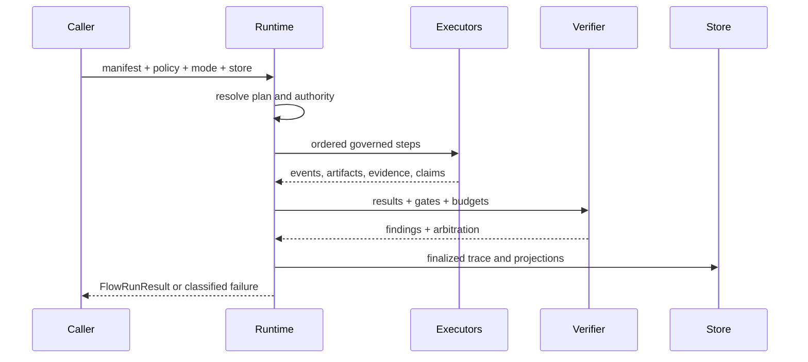

# Interfaces

Runtime interfaces carry authority. A caller must preserve tenant, manifest,
plan, dataset, policy, environment, trace, artifact, entropy, and replay
identity rather than reducing a governed run to its final payload.

## Surface map

| Surface | Availability | Authority contract |
| --- | --- | --- |
| Python | complete execution surface | manifests, plans, execution configuration, stores, policies, results, replay |
| CLI | plan, dry run, live run, replay, inspect, diff, failure explanation, database validation | JSON/plain output, exit classes, DuckDB path, tenant and run identity |
| HTTP health/readiness | implemented | liveness and ability to open configured DuckDB storage |
| HTTP flow run/replay | schema only | validates payload and headers, then returns `501 Not Implemented` |
| DuckDB store | local typed persistence | runs, datasets, steps, events, checkpoints, artifacts, evidence, claims, tools, entropy, finalization |
| artifact store | payload persistence | immutable identity, hash, parentage, producer, tenant, and scope |
| versioned schemas | compatibility boundary | HTTP payloads, database migrations, and schema hashes |

## Flow contract path

```mermaid
sequenceDiagram
    participant Caller
    participant Runtime
    participant Executors
    participant Verifier
    participant Store
    Caller->>Runtime: manifest + policy + mode + store
    Runtime->>Runtime: resolve plan and authority
    Runtime->>Executors: ordered governed steps
    Executors-->>Runtime: events, artifacts, evidence, claims
    Runtime->>Verifier: results + gates + budgets
    Verifier-->>Runtime: findings + arbitration
    Runtime->>Store: finalized trace and projections
    Runtime-->>Caller: FlowRunResult or classified failure
```

## Current interface constraints

- Plan mode returns no run ID or trace because it allocates no execution.
- Live JSON output currently omits the run ID; plain output exposes it, after
  which `inspect run --json` can retrieve the retained trace.
- `diff run` reports differences without failing the process. Automation must
  evaluate the payload.
- `validate db` proves schema initialization and readability, not row-level
  integrity or semantic replayability.
- `unsafe-run` is parsed but cannot currently supply its required verification
  policy through the CLI. Use the governed Python surface when that explicit
  reduced-guarantee mode is necessary.
- Several callable CLI commands are suppressed from top-level help.
- HTTP authority headers are syntax-checked only; run and replay have no remote
  execution backend despite their versioned schemas.

## Compatibility boundaries

Manifest meaning, determinism levels, authority headers, verification rules,
arbitration, trace finalization, event order, entropy accounting, replay
acceptability, storage normalization, migrations, and schema hashes all affect
caller-visible authority. A storage migration can be breaking even when the
Python dataclasses do not change.

## Contract index

| Need | Guide |
| --- | --- |
| Operate execution and read-side commands | [CLI surface](cli-surface.md) |
| Integrate health, readiness, or future flow routes | [API surface](api-surface.md) |
| Configure stores, strictness, policy, and budgets | [Configuration surface](configuration-surface.md) |
| Construct manifests, plans, traces, artifacts, and verification records | [Data contracts](data-contracts.md) |
| Accept persisted runs and payloads | [Artifact contracts](artifact-contracts.md) |
| Compose public runtime modules | [Public imports](public-imports.md) |
| Follow plan, live, inspect, and replay journeys | [Operator workflows](operator-workflows.md) |
| Evaluate authority-compatible evolution | [Compatibility commitments](compatibility-commitments.md) |
| Start from executable examples | [Entrypoints and examples](entrypoints-and-examples.md) |
