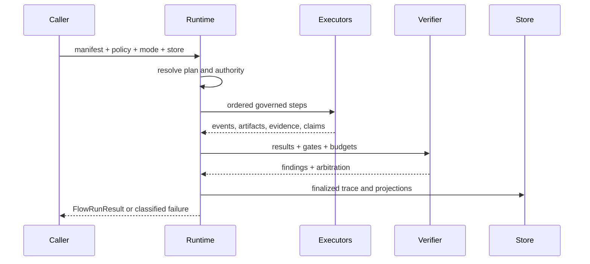

# Interfaces

Runtime interfaces carry authority. A caller must preserve tenant, manifest,
plan, dataset, policy, environment, trace, artifact, entropy, and replay
identity rather than reducing a governed run to its final payload.

## Surface map

| Surface | Availability | Authority contract |
| --- | --- | --- |
| Python | complete execution surface | manifests, plans, execution configuration, stores, policies, results, replay |
| CLI | complete v2 workflow, readiness, bounded inspection, replay, comparison, cancellation, backup and restore | typed JSON, exit classes, workspace, job, run, attempt and artifact identity |
| HTTP v2 | complete application-service surface | versioned requests, durable jobs, bounded reads, typed failures, and shared workspace authority |
| HTTP v1 compatibility module | probes plus schema-only run/replay | explicit legacy host; run and replay return `501 Not Implemented` |
| DuckDB store | local typed persistence | runs, datasets, steps, events, checkpoints, artifacts, evidence, claims, tools, entropy, finalization |
| artifact store | payload persistence | immutable identity, hash, parentage, producer, tenant, and scope |
| versioned schemas | compatibility boundary | HTTP payloads, database migrations, and schema hashes |

## Flow contract path

```mermaid
sequenceDiagram
    participant Caller
    participant Runtime
    participant Executors
    participant Verifier
    participant Store
    Caller->>Runtime: manifest + policy + mode + store
    Runtime->>Runtime: resolve plan and authority
    Runtime->>Executors: ordered governed steps
    Executors-->>Runtime: events, artifacts, evidence, claims
    Runtime->>Verifier: results + gates + budgets
    Verifier-->>Runtime: findings + arbitration
    Runtime->>Store: finalized trace and projections
    Runtime-->>Caller: FlowRunResult or classified failure
```

## Current interface constraints

- Plan mode returns no run ID or trace because it allocates no execution.
- Submission responses are bounded job documents. Resolve output explicitly
  with `v2 result`; inspect run state with `v2 inspect`.
- Inspection collections are paginated, large arbitrary values are summarized,
  and immutable payload bytes require `v2 artifact-payload` with explicit byte
  bounds.
- The manifest-oriented CLI remains parseable for compatibility but is hidden
  from top-level help. New product integrations use `v2`.
- The v2 server is local-first and supplies no authentication, tenant
  authorization, sandboxing, TLS termination, or multi-writer coordination.

## Use the least-authoritative surface

Runtime separates inspection from execution so callers do not need to grant
effect authority merely to understand a flow or retained run:

| Need | Surface | Authority consumed | Result boundary |
| --- | --- | --- | --- |
| prove the service process is reachable | HTTP v2 liveness | none | liveness only |
| prove an operation/profile is configured | HTTP v2 readiness or capabilities | read-only workspace inspection | declared capability, not a successful workflow |
| inspect an intended operation | CLI/HTTP readiness and generated v2 plan | workspace read access | configuration and required capabilities; no durable job yet |
| inspect retained history | CLI `v2 inspect` or typed readers | workspace-scoped read access | bounded causal projection; payload bytes require deliberate access |
| compare retained attempts | CLI `v2 compare` or application service | read access to both records | typed comparison and replay disposition |
| execute or resume effects | governed Python, CLI v2, or HTTP v2 operation | workspace, profile, inputs, budgets and idempotency authority | durable job plus finalized run/attempt or classified failure |
| request a local service run or replay | HTTP v2 | workspace, durable job, operation budget, and idempotency authority | bounded job status followed by deliberate result/inspection reads |

Start with readiness or read-side inspection whenever the question does not
require new effects. Moving to execution is a new authority decision: the
caller must select a profile, inputs, budgets, workspace and network policy. A
successful liveness check or initialized workspace does not confer stronger
capabilities.

## Assemble the authority packet

Before an executable call, retain the inputs that authorize work; after the
call, require the records that prove how that authority was used:

| Authority concern | Required before execution | Required before accepting the result |
| --- | --- | --- |
| ownership | flow, tenant, manifest state and authority context | identical flow/tenant identity on trace, store rows and artifacts |
| data | dataset ID, version, digest, state, location and deprecation policy | observed dataset identity and any admitted evolution decision |
| plan | resolved dependencies, ordered work, environment fingerprint and `plan_hash` | every executed or skipped operation accounted for against that plan |
| variability | determinism level, nondeterminism intent, entropy budget and allowed variance | measured entropy use, warnings and budget disposition |
| verification | declared gates, rule configuration and arbitration policy | immutable findings, separate arbitration decision and certifiability |
| effects | mode, executor bindings, credentials/capabilities and idempotency posture | causal events, effect receipts, failures and recovery disposition |
| persistence | execution-store and artifact-store identities | finalized run record plus resolvable payload hashes and lineage |
| replay | original envelope and acceptability policy | semantic diff, verdict, reason and compared identities |

If a profile dependency, model lock, backend, source, artifact, or causal edge
cannot be resolved, execution or inspection fails at that boundary. A plan,
installed dependency, or compatibility alias cannot stand in for admitted
capability. Likewise, DuckDB metadata cannot stand in for a CAS payload whose
digest no longer resolves.

## Compatibility boundaries

Manifest meaning, determinism levels, authority headers, verification rules,
arbitration, trace finalization, event order, entropy accounting, replay
acceptability, storage normalization, migrations, and schema hashes all affect
caller-visible authority. A storage migration can be breaking even when the
Python dataclasses do not change.

## Contract index

| Need | Guide |
| --- | --- |
| Operate execution and read-side commands | [CLI surface](cli-surface.md) |
| Integrate the complete v2 HTTP workflow | [API surface](api-surface.md) |
| Configure stores, strictness, policy, and budgets | [Configuration surface](configuration-surface.md) |
| Construct manifests, plans, traces, artifacts, and verification records | [Data contracts](data-contracts.md) |
| Accept persisted runs and payloads | [Artifact contracts](artifact-contracts.md) |
| Compose public runtime modules | [Public imports](public-imports.md) |
| Follow plan, live, inspect, and replay journeys | [Operator workflows](operator-workflows.md) |
| Evaluate authority-compatible evolution | [Compatibility commitments](compatibility-commitments.md) |
| Start from executable examples | [Entrypoints and examples](entrypoints-and-examples.md) |
