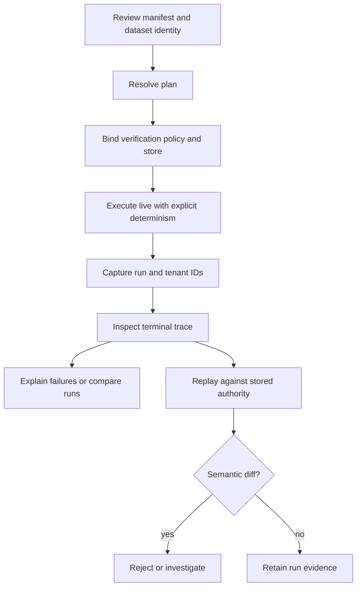

# Operator Workflows

A governed runtime operation starts with declared authority and ends with
persisted evidence. Planning, execution, inspection, and replay are distinct
operations; success in one does not imply success in the others.



## Review authority before execution

Start with plan mode:

```bash
FLOW=packages/bijux-canon-runtime/examples/boring/flow.json
POLICY=packages/bijux-canon-runtime/examples/boring/policy.json
STORE=artifacts/bijux-canon-runtime/runs.duckdb

bijux-canon-runtime plan "$FLOW" --json
```

Review:

1. flow and tenant identity;
2. dataset tenant, state, version, hash, and storage URI;
3. resolved step order and dependencies;
4. determinism level and permitted non-determinism;
5. entropy budget and exhaustion action;
6. replay mode, acceptability, and envelope;
7. retrieval contracts and verification gates.

Plan mode does not allocate a run or prove the dataset bytes at the storage URI
match the declared hash during a later execution. Preserve the reviewed
manifest as the input to the governed run.

## Execute with a dedicated store writer

```bash
bijux-canon-runtime run "$FLOW" \
  --policy "$POLICY" \
  --db-path "$STORE" \
  --strict-determinism \
  | tee artifacts/bijux-canon-runtime/run-summary.txt
```

Only one mutating process should own a DuckDB path. The store lock rejects a
second writer; read-side operational access should also be scheduled so it
does not interfere with the writer's connection lifecycle.

Capture the `run_id` from plain output and the `tenant_id` from the manifest.
The current live JSON renderer omits the run ID. The store commits run registration,
steps, streamed execution records, and finalization in separate operations.
If execution is interrupted, do not assume absence or atomic rollback: inspect
the run and its last checkpoint.

## Accept a completed run

```bash
bijux-canon-runtime inspect run "$RUN_ID" \
  --tenant-id tenant-a \
  --db-path "$STORE" \
  --json > artifacts/bijux-canon-runtime/inspected-trace.json
```

Require:

- the expected tenant, flow, dataset, plan, environment, and policy identities;
- a finalized trace with stable event indexes and valid causal ordering;
- declared entropy sources and consumption within budget;
- tool invocations, artifacts, evidence, and claim IDs expected for each step;
- verification coverage for each completed live step, or an explicit
  terminating verification-failure event;
- arbitration and non-certifiable state consistent with policy;
- no unexplained semantic-violation or failure events.

The CLI's plain `inspect run` output is only a count summary. Use JSON or the
Python read-store API for acceptance decisions.

## Investigate an incomplete or failed run

```bash
bijux-canon-runtime explain failure "$RUN_ID" \
  --tenant-id tenant-a \
  --db-path "$STORE" \
  --json
```

The command returns the last recognized failure event, not a causal analysis.
Inspect earlier events and checkpoints before attributing the root cause.
Because persistence is incremental, a run may have durable steps, evidence,
or entropy entries without a finalized trace.

Resume is currently a Python configuration surface through
`ExecutionConfig.resume_run_id`, not a CLI command. Before resuming, require
the same tenant, resolved plan, dataset, verification policy, and store. The
resume loader restores events, artifacts, evidence, tool invocations, entropy,
claim IDs, and the last checkpoint so indexes continue monotonically.

## Replay under the original acceptance contract

```bash
bijux-canon-runtime replay "$FLOW" \
  --policy "$POLICY" \
  --run-id "$RUN_ID" \
  --tenant-id tenant-a \
  --db-path "$STORE" \
  --strict-determinism \
  --json > artifacts/bijux-canon-runtime/replay-result.json
```

Replay is a new execution, not deserialization of the old result. It writes a
new run to the database, evaluates the stored replay constraints, and compares
semantic traces. Keep the new run ID and diff with the original identifiers.

For `exact_match`, any semantic difference is unacceptable. For
`invariant_preserving` or `statistically_bounded`, accept only differences
permitted by the stored replay envelope and determinism declarations. A clean
CLI exit means the semantic diff was empty; it does not make the two DuckDB row
sets byte-identical.

## Compare independent histories

```bash
bijux-canon-runtime diff run "$RUN_A" "$RUN_B" \
  --tenant-id tenant-a \
  --db-path "$STORE" \
  --json > artifacts/bijux-canon-runtime/run-diff.json
```

The comparison uses the first run's replay acceptability. A non-empty diff
still exits `0`, so automation must inspect the JSON object rather than only
the process status.

## Back up and retain

Quiesce the writer before copying the DuckDB file and its surrounding governed
artifacts. Retain:

- exact manifest and verification policy;
- dataset bytes or immutable dataset URI plus independently verified hash;
- DuckDB store and schema version;
- plan and run/tenant identifiers;
- trace, events, tool invocations, entropy, artifacts, evidence, claims,
  verification, arbitration, and checkpoint records;
- replay result, replay run ID, and semantic diff;
- package version and secret-free environment identity.

`validate db` is a readiness check, not backup verification. Validate the
copied store by opening it separately and inspecting the retained run records.
