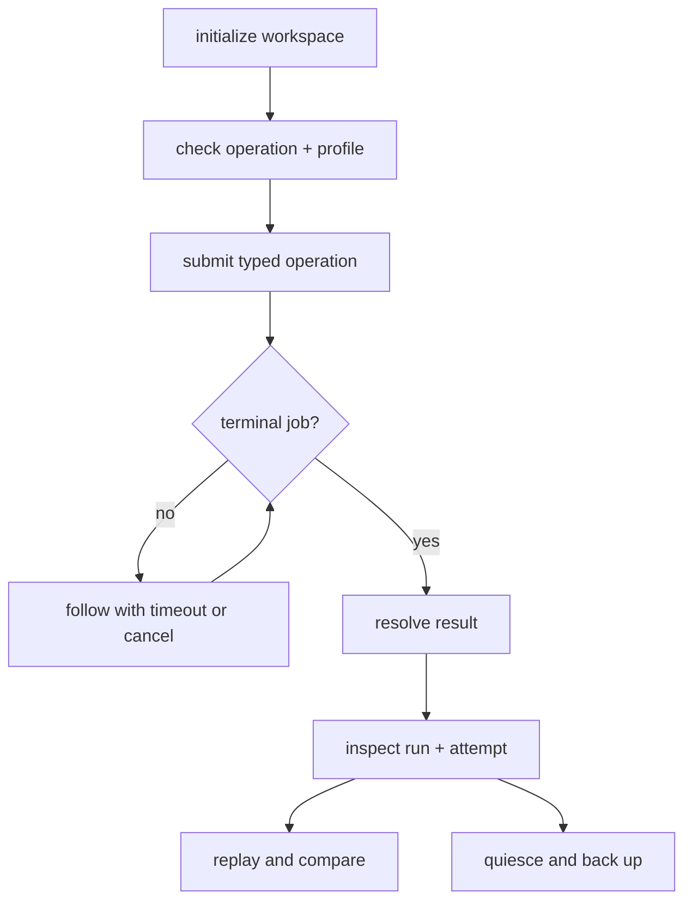

# Operator Workflows

A governed Runtime operation starts with one initialized workspace and ends
with a persisted job, run, attempt, causal artifact graph, and terminal result.
Readiness, execution, result resolution, inspection, replay and recovery are
separate decisions.



## Initialize and check the exact capability

```bash
bijux-canon-runtime init --workspace ./canon-workspace --json
export BIJUX_CANON_RUNTIME_WORKING_ROOT=./canon-workspace

bijux-canon-runtime v2 capabilities
bijux-canon-runtime v2 ready \
  --operation run \
  --profile offline-lexical
```

Liveness proves only that a process can answer. Readiness evaluates the named
operation and profile against the effective configuration. Lexical readiness
does not require a model; dense and hybrid readiness additionally validates the
locked model, active generation, backend and vector dimension.

## Submit and wait deliberately

```bash
bijux-canon-runtime v2 run \
  "What evidence does this corpus support?" \
  --source-directory ./documents \
  --profile offline-lexical \
  --wait \
  --wait-timeout-seconds 30
```

Submission without `--wait` returns immediately. `--wait` and `v2 status
--follow` use worker notification with an explicit timeout rather than an
unbounded polling loop. A timeout does not relabel durable work as failed; use
the returned job identity to inspect or cancel it.

## Resolve and inspect

```bash
bijux-canon-runtime v2 result JOB_ID
bijux-canon-runtime v2 inspect RUN_ID \
  --attempt-id ATTEMPT_ID \
  --limit 20
```

Accept a result only when the expected configuration, source archive, corpus,
index, model lock or explicit lexical absence, retrieval, citations, claim
graph, agent decisions, budgets, and terminal attempt all resolve through the
causal graph. Inspection fails closed when a new-format run has a missing or
inconsistent edge, locator, byte range, or payload digest.

Default inspection is intentionally small. Page a collection explicitly and
use `v2 artifact-payload` for a bounded byte range rather than requesting an
unbounded diagnostic dump.

## Replay and compare

```bash
bijux-canon-runtime v2 replay RUN_ID \
  --source-attempt-id ATTEMPT_ID \
  --network-policy disabled \
  --wait

bijux-canon-runtime v2 compare RUN_ID RUN_ID \
  --baseline-attempt-id ATTEMPT_ID \
  --candidate-attempt-id REPLAY_ATTEMPT_ID \
  --dimension outcome \
  --dimension claims \
  --dimension citations
```

Replay is a new attempt under the retained request and declared network policy,
not deserialization of the old result. Deterministic components require exact
identity; graded components retain their declared comparison disposition. A
missing source, model, index or artifact fails rather than being reconstructed.

## Cancel safely

```bash
bijux-canon-runtime v2 cancel JOB_ID
```

Cancellation is durable and race-aware. Inspect the terminal job and attempt;
do not infer cancellation merely because a client stopped waiting. Retrying an
operation requires its idempotency and retained-state rules, not a newly
invented successful record.

## Back up and restore

```bash
bijux-canon-runtime v2 backup nightly-2026-08-25
bijux-canon-runtime v2 restore BACKUP_GENERATION ./restored-workspace
```

Backup requires a quiescent workspace and authenticates the DuckDB authority,
CAS inventory, workspace controls, indexes, replay state and workspace-owned
model state. Restore verifies every governed byte before activating an absent
destination. Use this path for relocation; direct directory copies do not
rewrite governed machine-local locations.
