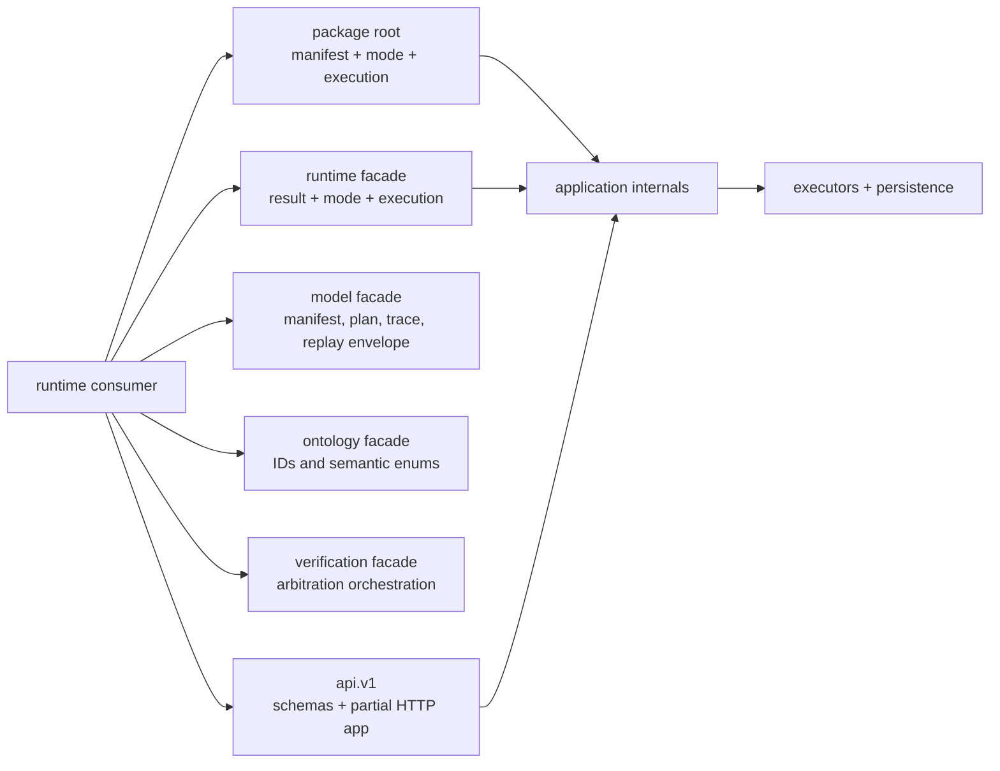

# Public Imports

The root package is the primary execution facade:

```python
from bijux_canon_runtime import FlowManifest, RunMode, execute_flow
```

`RunMode` and `execute_flow` are resolved lazily, keeping manifest-only imports
lightweight. Calling `execute_flow(manifest)` without a configuration selects
live strict execution; use an explicit `ExecutionConfig` when planning,
observing, resuming, or binding governed stores and policies.

## Facade And Authority Map



The root is the strongest general-purpose Python boundary. Model and ontology
facades expose the durable records and vocabulary required to inspect a run.
Application and execution modules implement the lifecycle and are not public
extension points merely because repository tests import them.

## Public Facades

| Need | Import surface |
| --- | --- |
| execution entrypoint | `bijux_canon_runtime` or `bijux_canon_runtime.runtime` |
| execution result facade | `bijux_canon_runtime.runtime` |
| stable plan, trace, and replay models | `bijux_canon_runtime.model` |
| identifiers and semantic enums | `bijux_canon_runtime.ontology` |
| verification orchestration | `bijux_canon_runtime.verification` |
| versioned HTTP schemas and ASGI app | `bijux_canon_runtime.api.v1` |

```python
from bijux_canon_runtime import RunMode, execute_flow
from bijux_canon_runtime.application.execute_flow import ExecutionConfig
from bijux_canon_runtime.model import FlowManifest
from bijux_canon_runtime.ontology import DeterminismLevel
```

`ExecutionConfig` currently has no package-root or public-facade export. The
shown application import is the operational path required for explicit Python
configuration, but the `application` package is marked as internal and is not
a general extension surface. Consumers that need a stronger boundary can use
the canonical CLI while a stable configuration facade is absent.

`FlowManifest` construction validates its dataclass shape. Execute through the
application boundary so contract validation, planning, determinism enforcement,
trace finalization, and persistence remain in the governed lifecycle.

## Read Construction And Execution Separately

| Object or call | Establishes | Does not establish |
| --- | --- | --- |
| `FlowManifest` construction | dataclass shape and local field invariants | resolvable datasets, admissible policy, or executable dependencies |
| `execute_flow` in plan mode | resolved immutable plan and execution contract | a run ID, event trace, artifacts, or side effects |
| non-plan `FlowRunResult` | governed result collections and optional persisted run identity | policy acceptance merely because execution completed |
| `ExecutionTrace` | finalized causal record | certifiability or replay equivalence |
| `ReplayEnvelope` | declared comparison inputs and acceptability | that required state was retained or a replay will pass |

Runtime deliberately separates completion, finalization, verification,
certifiability, acceptance, persistence, resume, and replay. Consumer code
should not collapse those states into a single success flag.

## Model and API Boundaries

The stable model facade exports `FlowManifest`, `ExecutionPlan`,
`ExecutionTrace`, and `ReplayEnvelope`. The ontology facade owns typed IDs and
enums used across those models. The API facade exports `FlowRunRequest`,
`FlowRunResponse`, `ReplayRequest`, `FailureEnvelope`, and the ASGI app.

The v1 HTTP schemas are tracked contracts, but implementation coverage is
partial: health and readiness are implemented, while flow run and replay return
`501 Not Implemented` after header and payload validation. Importing
`FlowRunRequest` or constructing the ASGI app must not be interpreted as an
available remote execution service.

Avoid importing lifecycle preparation helpers, concrete executors, DuckDB
schema internals, or modules marked as internal. They implement the public
facades and can change as long as the governed contracts remain intact.

## Upgrade Evidence By Surface

| Used surface | Focused evidence |
| --- | --- |
| root or `runtime` facade | API inventory, plan-mode behavior, result semantics |
| model and ontology facades | construction, immutability, enum/ID snapshots, plan and replay identities |
| verification facade | required-gate, contradiction, arbitration, and refusal cases |
| CLI | option/exit/output contracts plus persisted store records where applicable |
| HTTP v1 | OpenAPI pin, header validation, health/readiness, and explicit `501` behavior |
| persisted execution | schema, causal ordering, manifest/policy/environment identity, resume and replay regression tests |

`bijux_canon` and `agentic_flows` forward the canonical package for compatibility.
New integrations should use `bijux_canon_runtime`; see
[Compatibility Commitments](compatibility-commitments.md) for correspondence
and migration rules.
