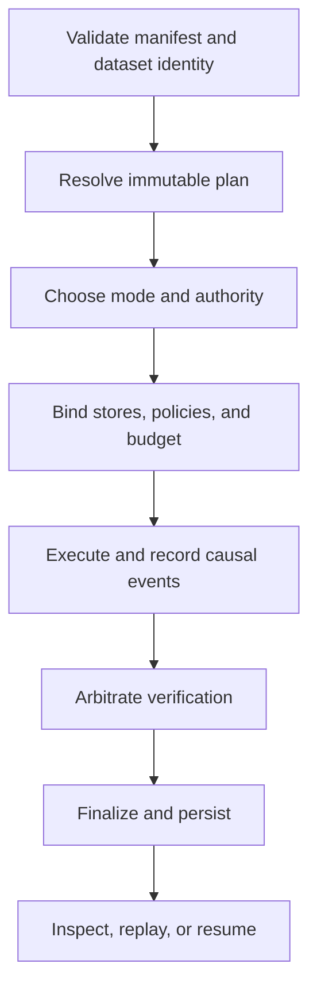

# Common Workflows

Runtime operations follow an evidence-preserving sequence: resolve authority,
execute under an explicit mode, persist causal state, arbitrate verification,
and compare replay against the original acceptance contract.

## Review a flow without execution

Use plan mode whenever the question is structural: dependency order, dataset
binding, determinism declaration, entropy authorization, retrieval contract,
or verification-gate placement. A plan result has a resolved flow but no trace
and no run identifier. That absence is intentional and must not be represented
as a persisted run.

## Run with explicit authority

Before live execution, bind:

- immutable flow and tenant identity;
- frozen or explicitly permitted dataset state and fingerprint;
- run mode and determinism level;
- replay acceptability and envelope;
- entropy sources, bounds, exhaustion action, and non-determinism intent;
- verification policy and declared gates;
- execution and artifact stores;
- latency, step, resource, or other execution budgets;
- authority for any intervention or override.

`dry-run` exercises preparation and execution checks without the normal live
side-effect posture. `observe` does not silently acquire live authority.
`unsafe` permits explicitly reduced guarantees and remains labeled unsafe in
the run record.

## Inspect and explain persisted state

Use `inspect run` for event, tool-invocation, and entropy counts or the complete
JSON trace. Use `explain failure` to find the last recorded step, retrieval,
reasoning, verification, tool, or interruption failure. Use `validate db`
before operational work that depends on an existing DuckDB store.

An incomplete or failed run remains inspectable. Do not mutate its finalized
trace or overwrite its terminal status to make it appear successful; start a
new run or resume from a recorded checkpoint under the resume contract.

## Resume after interruption

Resume uses the persisted run identifier and continues after the last durable
checkpoint. It restores starting event, evidence, tool invocation, entropy,
claim, and artifact state so new entries preserve causal order.

Before resuming, confirm that tenant, manifest, plan, dataset, policy, and store
identity still match. If they changed, begin a new run and compare it with the
interrupted one rather than extending history under altered authority.

## Replay and classify differences

Replay reloads the original run, resolves the current manifest, executes with
the replay configuration, and applies semantic trace comparison. Inspect diffs
in this order:

1. tenant, flow, run, dataset, and plan identity;
2. mode, authority, policy, and verification gates;
3. environment and external-tool identity;
4. entropy sources, magnitude, and consumption;
5. artifacts, evidence, claims, and causal events;
6. replay-envelope thresholds and final acceptability.

An exact-match declaration permits no semantic drift. Bounded acceptance
permits only the variance declared by the original flow; it is not a general
waiver for backend or policy changes.

## Compare two independent runs

Use `diff run` when both executions are first-class histories rather than an
original/replay pair. The comparison uses the first trace's replay
acceptability. Retain both run identifiers and the JSON diff so reviewers can
distinguish a clean comparison from a command that was never run.

## Preserve runtime evidence

For every governed run, retain:

- manifest, resolved plan, policy, authority, and budget;
- dataset descriptor, version, state, hash, and storage identity;
- execution trace with stable event identities and causal order;
- tool invocations, entropy ledger, evidence, reasoning bundles, and artifacts;
- verification results, arbitrations, and human interventions;
- persisted run and replay envelopes;
- resume metadata, replay diff, and acceptability verdict where applicable.

This record is the basis for execution authority and replay claims. Final
output without it is an application result, not a governed runtime run.
