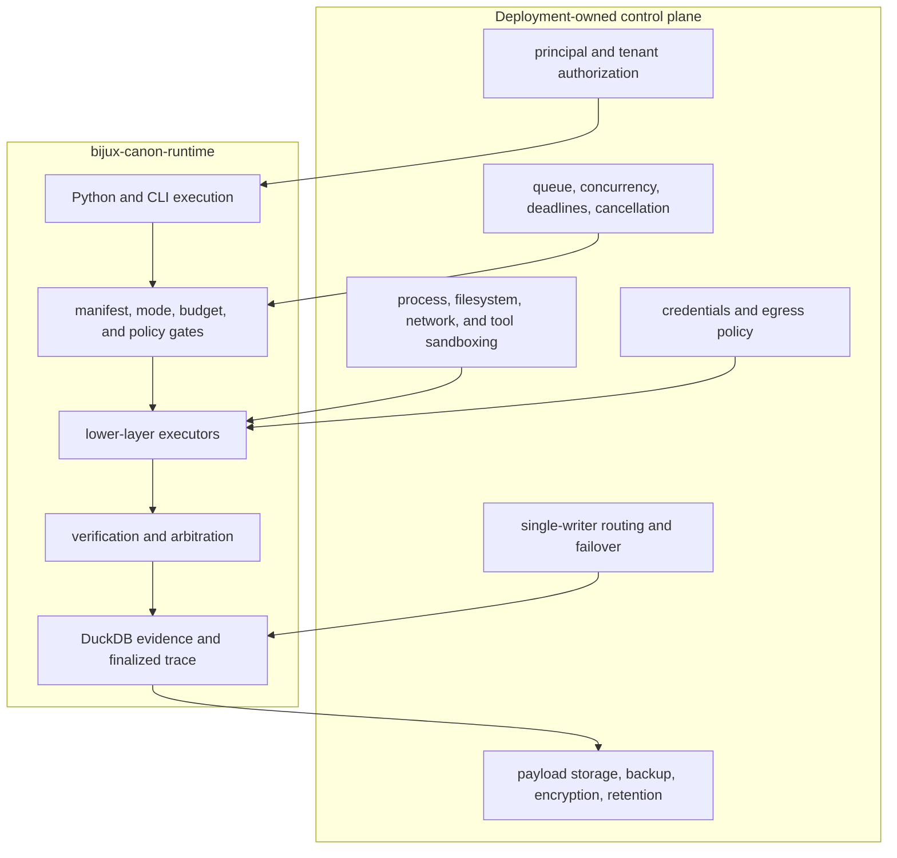

# Deployment Boundaries

Runtime is a local governed execution engine with a single-writer DuckDB audit
store and optional external artifact payloads. It is not a scheduler, cluster
coordinator, tenant identity provider, secrets service, or sandbox. Those
controls surround runtime and must preserve its evidence and refusal semantics.

## Responsibility boundary

## Deployment shapes

| Shape | Supported posture | Boundary |
| --- | --- | --- |
| Embedded Python | Full composition, including observe and explicit unsafe mode | The host supplies stores, policy, executors, observers, budgets, and lifecycle |
| Canonical CLI | Run, replay, inspect, and supporting validation workflows | Commands use an explicit manifest, policy, tenant/run identity, and database path |
| HTTP v1 | Health and readiness probes | Run and replay endpoints validate their envelope then return `501`; headers are contract declarations, not credentials |

The HTTP application is not a remote execution service. Its readiness check
only opens the configured DuckDB path; it does not establish dataset,
integration, policy, artifact-store, or lower-package readiness.

## Single-writer persistence

The DuckDB store uses a sibling lock and is designed for one writer. Route all
mutations for a database to one controlled writer. Multiple workers can use
read-only inspection against a deliberate topology, but shared concurrent
mutation requires a different coordination and store design.

Persistence commits record groups incrementally. An interrupted run can remain
valid checkpoint state with `finalized = false`; it is not completed evidence.
Resume must use the typed checkpoint path and the original authority inputs,
not manual table edits.

Artifact payload storage is separate. Backup and restore must keep database
records, migrations, schema hash, payload bytes, manifests, policies, datasets,
and lower-layer artifacts mutually resolvable.

## Production controls

A production host supplies:

- authenticated principal-to-tenant authorization before manifest loading,
  inspection, execution, resume, or replay;
- admission control, queues, concurrency caps, deadlines, cancellation, and
  operating-system CPU, memory, disk, and wall-time limits;
- least-privilege filesystem and network access for integrations;
- sandboxing or process isolation for untrusted agents, tools, and plugins;
- secret injection and egress controls that keep credentials out of manifests,
  events, evidence, and traces;
- a single-writer routing, restart, lock recovery, and failover procedure;
- encrypted and access-controlled DuckDB, artifact, dataset, and backup custody;
- monitoring for refusal, exhaustion, entropy, verification status,
  arbitration, incomplete runs, lock contention, schema mismatch, replay diff,
  and missing payloads;
- retention and deletion rules that preserve audit relationships without
  retaining sensitive data longer than authorized.

## Operational acceptance

Exercise plan, dry-run, live, inspect, resume, replay, and diff through the
interfaces actually deployed. Test invalid tenant selection, dataset change,
policy change, entropy exhaustion, integration failure, interrupted record
groups, missing payloads, lock contention, restore, and schema mismatch.
Confirm that only finalized traces are presented as completed runs and that
structural replay differences remain blocking under every bounded policy.

The [security and safety](security-and-safety.md) guide covers manifest,
integration, and HTTP trust boundaries. [Artifact contracts](../interfaces/artifact-contracts.md)
defines the retention set and completion rules.
