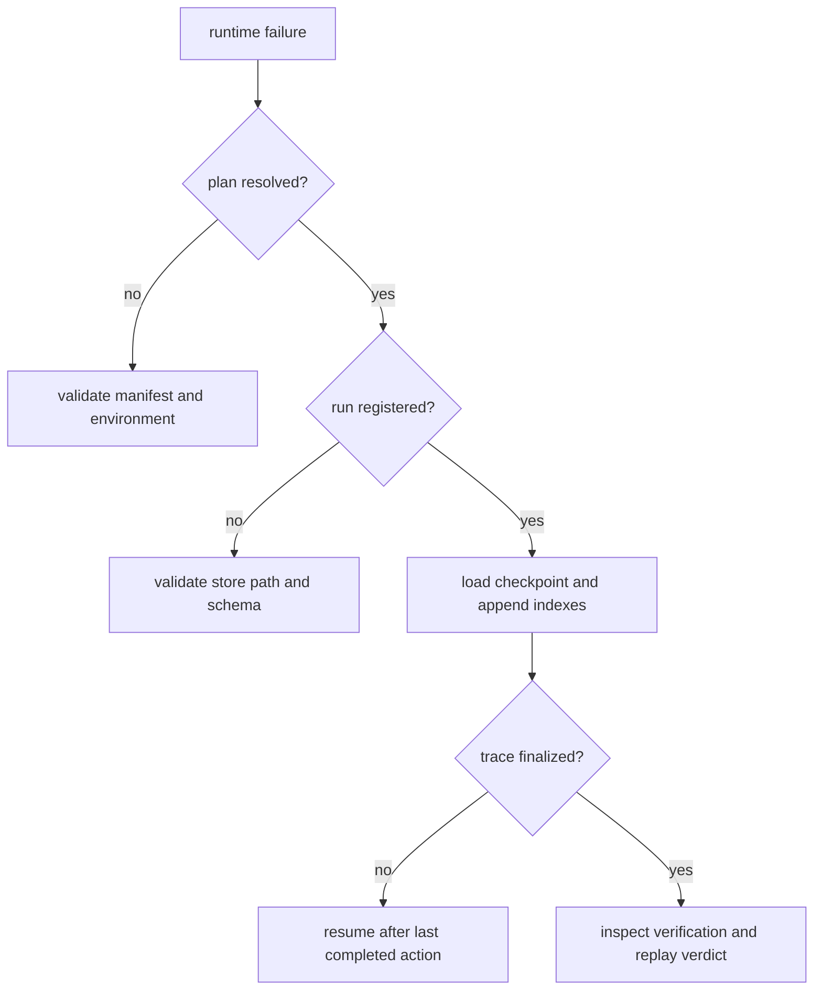

# Failure Recovery

Runtime recovery protects append-only authority. Never delete or rewrite a
failed run to make it look complete; resume it from recorded state or begin a
new run with a new identity.

## Triage by Boundary

1. Preserve the manifest, verification policy, database, run ID, tenant ID,
   package version, and error classification.
2. Confirm that the manifest resolves under the same dataset and environment
   fingerprints.
3. Inspect the run and latest checkpoint through the execution-store API.
4. Determine the last completed action and the next event, evidence, tool, and
   entropy indexes.
5. Resume only with matching tenant, plan, policy, and determinism authority.

## Failure Classes

| Symptom | Likely cause | Safe action |
| --- | --- | --- |
| configuration exit | missing or contradictory manifest/policy setting | correct input before creating another run |
| store failure before run ID | inaccessible path or schema contract failure | repair store availability or migrate through owned schema logic |
| partial run with checkpoint | interruption after persisted actions | resume from the recorded action and append indexes |
| entropy exhaustion | declared budget reached | follow recorded exhaustion action; do not silently raise the budget |
| verification `FAIL` | rule or cost-budget violation | inspect exact rules and evidence; create corrected run |
| verification `ESCALATE` | policy requires external decision | preserve arbitration record and obtain the governed decision |
| finalized trace rejected | runtime semantic coverage failure | treat as implementation or policy defect, not a successful run |
| replay mismatch | authority or semantic output drift | inspect first blocking diff and divergent action |

## Resume Safety

Resume restores persisted events, artifacts, evidence, tool invocations,
entropy usage, claim IDs, and checkpoint. New records begin after the retained
indexes. The last `STEP_END` and explicit checkpoint determine the completed
action boundary.

Do not resume when the plan hash, tenant, dataset descriptor, environment
fingerprint, verification policy, or replay envelope has changed. Those changes
describe a different governed execution and require a new run.

## Replay Diagnosis

Replay checks plan hash, determinism, acceptability, tenant, flow state,
replay envelope, environment, dataset, deprecated-data policy, verification
policy, completed actions, failed actions, and human intervention. When a
structural difference exists, artifact and evidence fingerprints add context.
Entropy analysis compares declared and observed non-determinism separately.

Start with the first reason code and divergent action. Strict replay rejects any
difference. Bounded replay distinguishes blocking differences from permitted
event, artifact, and evidence variance. Permissive replay can warn, but it does
not erase the diff. A trace marked non-certifiable always remains
non-certifiable.

## Recovery Exit Criteria

A recovered or replacement run is trustworthy when:

- the database schema contract and migrations are valid;
- the run belongs to the expected tenant and resolved plan;
- persisted append indexes are continuous after resume;
- the trace is finalized exactly once;
- live reasoning has complete verification arbitration or a recorded terminal
  failure;
- entropy use stays within the declared budget or records its exhaustion action;
  and
- replay returns the verdict required by the manifest's mode and acceptability.

Keep the original failed run for incident comparison. Recovery adds evidence;
it does not rewrite history.
