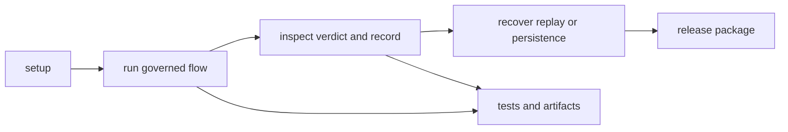

# Operations

Open this section when you need to run runtime work repeatably: install it, reproduce governed runs, diagnose acceptance or replay drift, release it, or recover from failure without inventing authority rules on the spot.

## Operating Loop

Runtime operations should make governed execution repeatable under pressure. A
maintainer needs a visible path from setup to run, from run to verdict
inspection, and from drift back to recovery, with enough checked-in proof to
show that authority was applied on purpose.

## Read These First

- open [Installation and Setup](https://bijux.io/bijux-canon/06-bijux-canon-runtime/operations/installation-and-setup/) first when you need a clean package starting point
- open [Observability and Diagnostics](https://bijux.io/bijux-canon/06-bijux-canon-runtime/operations/observability-and-diagnostics/) when governed run behavior no longer matches expectation
- open [Failure Recovery](https://bijux.io/bijux-canon/06-bijux-canon-runtime/operations/failure-recovery/) when acceptance, persistence, or replay has already gone wrong

## Operational Risk

The main operational risk here is letting run authority depend on implicit environment state or undocumented recovery steps.

## First Proof Check

- `pyproject.toml`, `README.md`, and package-local entrypoints for checked-in operating truth
- `tests` and runnable workflows for evidence that the package can be operated repeatably
- release notes and version metadata when the work changes caller expectations

## Pages In This Section

- [Installation and Setup](https://bijux.io/bijux-canon/06-bijux-canon-runtime/operations/installation-and-setup/)
- [Local Development](https://bijux.io/bijux-canon/06-bijux-canon-runtime/operations/local-development/)
- [Common Workflows](https://bijux.io/bijux-canon/06-bijux-canon-runtime/operations/common-workflows/)
- [Observability and Diagnostics](https://bijux.io/bijux-canon/06-bijux-canon-runtime/operations/observability-and-diagnostics/)
- [Performance and Scaling](https://bijux.io/bijux-canon/06-bijux-canon-runtime/operations/performance-and-scaling/)
- [Failure Recovery](https://bijux.io/bijux-canon/06-bijux-canon-runtime/operations/failure-recovery/)
- [Release and Versioning](https://bijux.io/bijux-canon/06-bijux-canon-runtime/operations/release-and-versioning/)
- [Security and Safety](https://bijux.io/bijux-canon/06-bijux-canon-runtime/operations/security-and-safety/)
- [Deployment Boundaries](https://bijux.io/bijux-canon/06-bijux-canon-runtime/operations/deployment-boundaries/)

## Leave This Section When

- leave for [Interfaces](https://bijux.io/bijux-canon/06-bijux-canon-runtime/interfaces/) when the live problem is contract shape rather than package operation
- leave for [Architecture](https://bijux.io/bijux-canon/06-bijux-canon-runtime/architecture/) when a workflow problem exposes structural drift underneath it
- leave for [Quality](https://bijux.io/bijux-canon/06-bijux-canon-runtime/quality/) when the package runs but the real question is whether the evidence is strong enough

## Design Pressure

If runtime recovery depends on improvised authority judgments, the operating
model is still too loose. This section has to make governed execution and
replay recovery repeatable from checked-in practice.
