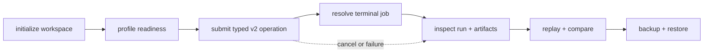

# Operations

The supported runtime workflow begins with an initialized workspace and
profile-specific readiness, submits one typed v2 operation, resolves its
durable result, and inspects the authoritative run before replay or recovery.

## Operating lifecycle

```mermaid
flowchart LR
    init["initialize workspace"]
    ready["profile readiness"]
    submit["submit typed v2 operation"]
    result["resolve terminal job"]
    inspect["inspect run + artifacts"]
    replay["replay + compare"]
    recover["backup + restore"]

    init --> ready --> submit --> result --> inspect --> replay --> recover
    submit -. cancel or failure .-> inspect
```

## Choose an operation by demonstrated authority

| Operation or surface | What it demonstrates | Current boundary |
| --- | --- | --- |
| `v2 ready` | the named operation and profile have their exact dependencies | readiness does not execute or allocate a job |
| `v2 ingest` and `v2 index` | source bytes and an immutable profile-selected index are retained | input formats, model state and resource policy remain enforced |
| `v2 search`, `v2 ask`, and `v2 research` | bounded evidence, grounded claims and research traces are produced from retained state | claims remain limited to resolvable cited evidence |
| `v2 run` | the complete linked workflow executes under one durable authority | terminal job status is separate from result and inspection payloads |
| `v2 replay` and `v2 compare` | a new attempt is bound to retained inputs and compared under declared dimensions | replay cannot reconstruct missing source or artifact bytes |
| `v2 backup` and `v2 restore` | the database, CAS, indexes and workspace controls form a verified recovery set | backup refuses live work, symlinks, drift and external model state |
| HTTP v2 liveness/readiness | process liveness plus initialized, ingest, index, retrieve, ask, research, or run dependency checks | readiness is scoped by the requested operation |
| CLI/HTTP/Python capability discovery | effective configuration origins, active identities, installed formats/providers, and readiness matrix | reports actual installed support without enabling a provider or mutating state |

Start with the strongest demonstrated surface that answers the operational
question. Do not use dry-run success as a live readiness result or one
capability's readiness as evidence that a stronger operation is ready.

## Operational rules

- Give every automation path an explicit initialized workspace and profile.
- Use the durable job ID for status and result, and the returned run/attempt
  identities for inspection, replay and comparison.
- Treat readiness as configuration evidence and only terminal persisted runs as
  execution evidence.
- Retain the workspace DuckDB, admitted CAS payloads, indexes, controls and
  workspace-owned model state as one governed set.
- Apply replay acceptability only after structural differences are known.
  Tolerance cannot be invented after divergence.

## Acceptance evidence

| Evidence | Operational question |
| --- | --- |
| resolved plan | Did the intended manifest, dependencies, dataset, and environment resolve to this plan hash? |
| finalized trace | Is causal event order closed, immutable, and semantically valid? |
| verification results | What did each engine observe and which rules were violated? |
| arbitration | Which policy fingerprint and rule produced the final decision? |
| entropy record | Which nondeterministic sources and budget consumption were declared? |
| artifact and evidence records | Can identity, hash, parentage, tenant, and payload location be resolved? |
| replay verdict and diff | Is the new run acceptable, acceptable with warnings, unacceptable, or non-certifiable? |

## Recovery routing

| Symptom | Inspect first | Safe response |
| --- | --- | --- |
| Job or run is not terminal | job transitions, last checkpoint, causal event index and stored artifacts | follow with a timeout, cancel deliberately, or replay only after terminal resolution |
| External side effect may have occurred before checkpoint | integration idempotency key or compensation record | reconcile the external system before retrying |
| Finalized run was rejected | verification results, arbitration, and certifiability | correct the failed evidence or policy input; do not relabel completion as acceptance |
| Strict replay differs | plan, tenant, environment, dataset, policy, envelope, events, artifacts, and entropy | retain the mismatch and refuse equivalence |
| Bounded replay differs | structural blockers followed by declared variance categories | accept only differences the original envelope permitted |
| DuckDB opens but evidence is incomplete | finalized flag, typed projections, schema hash, migrations, payload store | restore the governed retention set; readability is insufficient |
| Readiness is green but execution fails | requested readiness capability, dataset, tools, and request policy | verify the probe used the same operation and effective workspace configuration as the request |

## Deployment boundary

DuckDB is the durable local authority, not multi-host infrastructure. Runtime
includes a local durable job worker and governed backup/restore, but it is not a
sandbox, cluster scheduler, identity provider, secret manager, TLS terminator,
or tenant-isolation boundary. Hosts must enforce process and network isolation,
access control, encryption, capacity, retention and credentials.

## Operate by need

| Need | Guide |
| --- | --- |
| Install runtime and DuckDB support | [Installation and setup](installation-and-setup.md) |
| Develop against isolated stores and fixtures | [Local development](local-development.md) |
| Plan, execute, inspect, and replay a flow | [Common workflows](common-workflows.md) |
| Diagnose authority, verification, entropy, and drift | [Observability and diagnostics](observability-and-diagnostics.md) |
| Plan store, trace, and executor capacity | [Performance and scaling](performance-and-scaling.md) |
| Resume or recover governed state | [Failure recovery](failure-recovery.md) |
| Define deployment controls | [Security and safety](security-and-safety.md) and [Deployment boundaries](deployment-boundaries.md) |
| Release a schema- or authority-sensitive change | [Release and versioning](release-and-versioning.md) |
