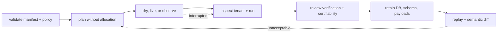

# Operations

The safest runtime workflow begins in plan mode, uses an explicit tenant,
policy, and database path for execution, inspects the finalized trace before
acceptance, and treats replay as a policy verdict rather than a text
comparison.

## Operating lifecycle

```mermaid
flowchart LR
    validate["validate manifest + policy"]
    plan["plan without allocation"]
    execute["dry, live, or observe"]
    inspect["inspect tenant + run"]
    accept["review verification + certifiability"]
    retain["retain DB, schema, payloads"]
    replay["replay + semantic diff"]

    validate --> plan --> execute --> inspect --> accept --> retain --> replay
    execute -. interrupted .-> inspect
    replay -. unacceptable .-> plan
```

## Operational rules

- Give every automation path an explicit DuckDB path and tenant identity.
- Do not run concurrent writers against the same DuckDB file.
- Treat plan mode as contract inspection, dry run as simulated evidence, and
  live mode as authoritative only after verification and finalization.
- Select runs by both tenant and run ID; an identifier alone is not sufficient
  authority.
- Retain the database, migrations, active schema hash, and external artifact
  payloads as one governed set.
- Apply replay acceptability only after structural differences are known.
  Tolerance cannot be invented after divergence.

## Acceptance evidence

| Evidence | Operational question |
| --- | --- |
| resolved plan | Did the intended manifest, dependencies, dataset, and environment resolve to this plan hash? |
| finalized trace | Is causal event order closed, immutable, and semantically valid? |
| verification results | What did each engine observe and which rules were violated? |
| arbitration | Which policy fingerprint and rule produced the final decision? |
| entropy record | Which nondeterministic sources and budget consumption were declared? |
| artifact and evidence records | Can identity, hash, parentage, tenant, and payload location be resolved? |
| replay verdict and diff | Is the new run acceptable, acceptable with warnings, unacceptable, or non-certifiable? |

## Recovery routing

| Symptom | Inspect first | Safe response |
| --- | --- | --- |
| Run exists but is not finalized | last checkpoint, causal event index, stored artifacts, tools, entropy, and claims | resume only under the same tenant, manifest, plan, dataset, policy, and store authority |
| External side effect may have occurred before checkpoint | integration idempotency key or compensation record | reconcile the external system before retrying |
| Finalized run was rejected | verification results, arbitration, and certifiability | correct the failed evidence or policy input; do not relabel completion as acceptance |
| Strict replay differs | plan, tenant, environment, dataset, policy, envelope, events, artifacts, and entropy | retain the mismatch and refuse equivalence |
| Bounded replay differs | structural blockers followed by declared variance categories | accept only differences the original envelope permitted |
| DuckDB opens but evidence is incomplete | finalized flag, typed projections, schema hash, migrations, payload store | restore the governed retention set; readability is insufficient |
| Readiness is green but execution fails | dataset, tools, providers, policy, and writable store authority | treat readiness as a storage-open probe only |

## Deployment boundary

DuckDB is a durable single-writer local store, not multi-host infrastructure.
The package is not a sandbox, queue, cluster scheduler, identity provider,
secret manager, backup system, or tenant-isolation boundary. Hosts must enforce
process and network isolation, access control, encryption, capacity, retention,
credentials, and idempotency for external effects.

## Operate by need

| Need | Guide |
| --- | --- |
| Install runtime and DuckDB support | [Installation and setup](installation-and-setup.md) |
| Develop against isolated stores and fixtures | [Local development](local-development.md) |
| Plan, execute, inspect, and replay a flow | [Common workflows](common-workflows.md) |
| Diagnose authority, verification, entropy, and drift | [Observability and diagnostics](observability-and-diagnostics.md) |
| Plan store, trace, and executor capacity | [Performance and scaling](performance-and-scaling.md) |
| Resume or recover governed state | [Failure recovery](failure-recovery.md) |
| Define deployment controls | [Security and safety](security-and-safety.md) and [Deployment boundaries](deployment-boundaries.md) |
| Release a schema- or authority-sensitive change | [Release and versioning](release-and-versioning.md) |
