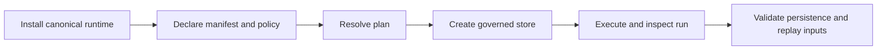

# Installation and Setup

`bijux-canon-runtime` supports Python 3.11 through 3.14. The base distribution
includes DuckDB persistence and depends on the canonical ingest, index, reason,
and agent packages so runtime contracts can bind their artifacts.



## Install

```bash
python -m venv .venv
source .venv/bin/activate
python -m pip install --upgrade pip
python -m pip install bijux-canon-runtime
```

Verify the stable package root and CLI:

```bash
python -c "from bijux_canon_runtime import FlowManifest, RunMode, execute_flow; print(RunMode.PLAN)"
bijux-canon-runtime --help
```

Install `bijux-canon` or `agentic-flows` only when an application still needs a
compatibility import or command. New code should install the canonical runtime.

## Start with the Checked-In Example

From a repository checkout, the `boring` example provides a strict manifest
and baseline policy:

```bash
make install
bijux-canon-runtime plan \
  packages/bijux-canon-runtime/examples/boring/flow.json \
  --json
```

Plan mode is the safest setup check. It validates and resolves the flow without
executing steps, writing a trace, or allocating a run identifier.

The command determines how much authority is exercised:

| Command | Effects and persistence | Appropriate use |
| --- | --- | --- |
| `plan` | resolves contracts without executing steps or writing a run | manifest and dependency review |
| `dry-run` | exercises dry-run contracts against an explicit store without live authority | execution-shape and refusal checks |
| `run` | performs governed live execution with the supplied verification policy | accepted operational work |
| `unsafe-run` | enters the explicit unsafe execution mode | isolated evidence for behavior that cannot meet the governed live posture |
| `replay` | executes against a persisted envelope and compares the new record with the original | declared replay-acceptability checks |

`unsafe-run` is not a faster form of `run`. Its mode is part of the retained
record and prevents unsafe execution from being presented as governed live
authority.

For an installed-wheel integration, create equivalent application-owned
`flow.json` and `policy.json` files from the
[data contracts](../interfaces/data-contracts.md). Do not copy identifiers,
dataset hashes, storage URIs, or tenant values from an example into production
without replacing them with real governed values.

## Create the Execution Store

Choose a durable path explicitly:

```bash
mkdir -p artifacts/bijux-canon-runtime

bijux-canon-runtime run \
  packages/bijux-canon-runtime/examples/boring/flow.json \
  --policy packages/bijux-canon-runtime/examples/boring/policy.json \
  --db-path artifacts/bijux-canon-runtime/runs.duckdb \
  --strict-determinism \
  --json
```

The operating-system user needs create, read, write, replace, and lock-file
permissions in the database directory. The execution store supports a
single-writer posture; do not point independent runtime processes at the same
file for concurrent mutation.

Validate the store before using it for inspection or replay:

```bash
bijux-canon-runtime validate db \
  --db-path artifacts/bijux-canon-runtime/runs.duckdb \
  --json
```

## Inspect the First Run

Use the `run_id` and tenant returned by execution:

```bash
bijux-canon-runtime inspect run <run-id> \
  --tenant-id tenant-a \
  --db-path artifacts/bijux-canon-runtime/runs.duckdb \
  --json
```

Confirm that the trace is finalized, dataset identity matches the manifest,
and the arbitration, entropy, artifact, evidence, and event records agree with
the intended authority.

## Replay Under the Original Identity

Replay requires the current manifest and policy as well as the original run
and tenant identities:

```bash
bijux-canon-runtime replay \
  packages/bijux-canon-runtime/examples/boring/flow.json \
  --policy packages/bijux-canon-runtime/examples/boring/policy.json \
  --run-id <run-id> \
  --tenant-id tenant-a \
  --db-path artifacts/bijux-canon-runtime/runs.duckdb \
  --strict-determinism \
  --json
```

A clean replay means the comparison found no difference outside the declared
contract. A contract-violation exit identifies a blocking difference; retain
its reason code and JSON diff. Replay does not establish that external facts
remain true, and an acceptability threshold does not erase an observed drift.

## HTTP Health and Readiness

The API extra supports operational probes:

```bash
python -m pip install 'bijux-canon-runtime[api]'

AGENTIC_FLOWS_DB_PATH=artifacts/bijux-canon-runtime/runs.duckdb \
  uvicorn bijux_canon_runtime.api.v1.app:app \
  --host 127.0.0.1 --port 8000
```

```bash
curl --fail-with-body http://127.0.0.1:8000/api/v1/health
curl --fail-with-body http://127.0.0.1:8000/api/v1/ready
```

Readiness checks storage; it does not make HTTP run or replay operational.
Those endpoints currently return `501 Not Implemented` after validating their
request boundary.

## Repository Checkout

```bash
make install
make -f "$PWD/makes/packages/bijux-canon-runtime.mk" \
  -C packages/bijux-canon-runtime help
make test PACKAGE=bijux-canon-runtime
make docs-check
```

Package Makefiles are repository profiles under `makes/packages/`; the package
directory does not contain a standalone Makefile. Use the root dispatcher for
normal checks and the explicit profile form when inspecting package targets.
The absolute profile path remains valid after Make applies `-C`.

Use package and documentation checks for the first feedback loop. Broader
repository lanes are appropriate only when a change crosses shared contracts.

## Setup Checklist

- The stable root imports and CLI resolve from the expected environment.
- Planning succeeds before any live authority is granted.
- Manifest, dataset, policy, and tenant identities are application-owned and
  explicit.
- The DuckDB directory has durable storage and one-writer coordination.
- A completed run can be inspected and the database passes schema validation.
- HTTP clients are not routed to the unimplemented run or replay endpoints.

Continue with [state and persistence](../architecture/state-and-persistence.md)
and [entrypoint examples](../interfaces/entrypoints-and-examples.md).
