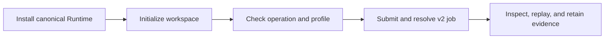

# Installation and Setup

`bijux-canon-runtime` supports Python 3.11 through 3.14. The base distribution
includes DuckDB persistence and depends on the canonical ingest, index, reason,
and agent packages so runtime contracts can bind their artifacts.



## Install

```bash
python -m venv .venv
source .venv/bin/activate
python -m pip install --upgrade pip
python -m pip install bijux-canon-runtime
```

The base installation fulfills `offline-lexical`. Choose extras by the public
operation profile rather than installing the development environment:

| Product profile | Installation | Installed capability |
| --- | --- | --- |
| offline lexical | `bijux-canon-runtime` | SQLite FTS5 ingest, index, retrieval, answer, and research without a model |
| local exact, ANN, or hybrid | `bijux-canon-runtime[local-cpu]` | NumPy, CPU FAISS, sentence-transformers, and PyTorch |
| HTTP | `bijux-canon-runtime[api]` | FastAPI, Starlette, and Uvicorn |

On Linux CPU hosts, install PyTorch from its CPU wheel index before resolving
`local-cpu`. This is required because the default Linux PyTorch wheel channel
may include CUDA runtime distributions even when Runtime selects `device=cpu`:

```bash
python -m pip install torch --index-url https://download.pytorch.org/whl/cpu
python -m pip install 'bijux-canon-runtime[local-cpu]'
```

On macOS, the native `local-cpu` profile is supported on Python 3.11. FAISS
1.7.4 is constrained with NumPy 1.26 because that combination can share a
process with PyTorch safely; newer FAISS macOS wheels abort after duplicate
OpenMP initialization, and FAISS 1.7.4 has no Python 3.12+ wheel. The base
lexical and `api` installations continue to support Python 3.11 through 3.14.

The `bijux-cli` dependency publishes a Linux x86_64 wheel. On Linux ARM64,
install a C build toolchain before installing Runtime so pip can build that
dependency from its source distribution. For example, Debian and Ubuntu hosts
can use `sudo apt-get install build-essential`.

Verify the stable package root and CLI:

```bash
python -c "from bijux_canon_runtime import FlowManifest, RunMode, execute_flow; print(RunMode.PLAN)"
bijux-canon-runtime --help
```

## Initialize a local workspace

An offline lexical workspace does not need an embedding model:

```bash
WORKSPACE=/srv/bijux-canon/research
bijux-canon-runtime init --workspace "$WORKSPACE" --json
bijux-canon-runtime v2 ready \
  --operation index \
  --profile offline-lexical
```

Omitting `--model` records that the model capability is not configured; it does
not access a model cache or network. Lexical ingest, index, retrieval, answer,
and research requests remain usable in that workspace.

For a local dense or hybrid profile, materialize a supported embedding model
into a durable local cache first. The model directory passed to Runtime is the
revision directory containing the canonical `model.lock.json` and all artifacts
named by that lock. Workspace initialization is offline and verifies every
locked artifact.

```bash
WORKSPACE=/srv/bijux-canon/research
MODEL=/srv/bijux-models/local-minilm-384/<locked-revision>

bijux-canon-runtime init \
  --workspace "$WORKSPACE" \
  --model "$MODEL" \
  --json
```

The first call atomically activates a complete workspace. Repeating the same
command returns `unchanged` and leaves all state bytes untouched. Do not
pre-create the workspace directory: an existing directory without the
canonical manifest is treated as partial state and refused rather than filled
in. Preserve the whole workspace for restart, inspection, replay, and backup;
the DuckDB file alone is not the complete authority.

### Workspace migration and rollback

Stop Runtime workers before running `init` against an older workspace. The
current Runtime recognizes exact version-1 through version-4 layouts, validates the
manifest, model, DuckDB migrations, durable-job schema, CAS, and index structure
before changing anything, and creates content-bound rollback generations below
`backups/workspace-migrations/generations/`. The ordered migrations culminate
in workspace format 5, which separates logical path-role identity from resolved
machine-local locations. Runtime writes the updated migration ledger before
activating the new `workspace.json`. A successful upgrade reports `migrated`,
the applied migration identities, and the exact rollback backup path. Repeating
`init` does not append or reapply a migration.

If the process stops after ledger publication but before manifest activation,
repeat the same `init` command. Runtime verifies the source manifest and
rollback backup identities and resumes the same migration. Do not delete the
ledger or edit either checksum. A newer workspace or a layout older than the
supported migration floor is refused before a backup or state mutation.

For an immediate rollback before admitting new work, stop Runtime, preserve the
failed or upgraded workspace, verify the reported rollback generation, and
restore the exact manifest and ledger expected by the prior Runtime release. If
any work was admitted after migration, restore a complete pre-upgrade workspace
backup instead; migration rollback generations cover workspace authority, not
later application writes.

Verify the exact operation boundary before submitting work:

```bash
BIJUX_CANON_RUNTIME_WORKING_ROOT="$WORKSPACE" \
BIJUX_CANON_RUNTIME_EMBEDDING_MODEL_PATH="$MODEL" \
  bijux-canon-runtime v2 ready \
    --operation retrieve \
    --profile local-hybrid-ann
```

A new workspace is ready for ingest before it has an index. Profile-specific
readiness reports only shared workspace dependencies for `offline-lexical`;
the supplied lexical artifact is validated immediately before submission.
Hybrid readiness additionally requires a verified dense generation and model.

Install `bijux-canon` or `agentic-flows` only when an application still needs a
compatibility import or command. New code should install the canonical runtime.

## Start with the checked-in product workflow

The ancient-DNA example exercises the base installed wheel without a model,
provider credential, optional extra, or source-tree import:

```bash
python examples/ancient-dna-research/offline_lexical_workflow.py \
  --runtime-command .venv/bin/bijux-canon-runtime \
  --workspace artifacts/ancient-dna-offline/runtime-workspace \
  --evidence-directory artifacts/ancient-dna-offline/evidence
```

The real CPU workflow uses the public pinned-model lifecycle and the same
installed Runtime service. Acquire once while online; every later validation,
index, exact/ANN query, restart, and development evaluation can run with the
network denied:

```bash
bijux-canon-index model acquire \
  --profile local-minilm-384 \
  --cache-root artifacts/ancient-dna-cpu/models

python examples/ancient-dna-research/cpu_hybrid_workflow.py \
  --runtime-command bijux-canon-runtime \
  --index-command bijux-canon-index \
  --model-directory artifacts/ancient-dna-cpu/models/local-minilm-384/1110a243fdf4706b3f48f1d95db1a4f5529b4d41 \
  --workspace artifacts/ancient-dna-cpu/runtime-workspace \
  --evidence-directory artifacts/ancient-dna-cpu/evidence
```

The compact result binds the model source, revision, Apache-2.0 license,
artifact-set digest, dimension and lock to the persistent lexical, exact, and
HNSW segments. It also records separate exact and ANN attempts under the
authoritative Runtime run identity and rejects a candidate unless the installed
development evaluator clears all frozen retrieval floors.

It discovers and ingests eight real JATS articles, builds a persistent SQLite
FTS5 index, retrieves evidence, answers with verified citations, reopens the
same workspace using its absolute spelling, and performs an exact replay and
comparison. Each CLI exchange and bounded artifact page is retained below the
selected evidence directory. The example's
[`README`](https://github.com/bijux/bijux-canon/tree/main/examples/ancient-dna-research)
documents the
network-denied installed-wheel acceptance command and the resulting identities.

The hidden manifest-oriented commands remain available only for existing
integrations. New installed-wheel workflows use `v2`; see the
[operator workflow](../interfaces/operator-workflows.md) for result,
inspection, replay, comparison, cancellation, backup, and restore commands.

## HTTP V2 Service

The API extra installs the supported v2 server command:

```bash
python -m pip install 'bijux-canon-runtime[api]'

bijux-canon-runtime init --workspace ./canon-workspace --json
bijux-canon-runtime-server --workspace ./canon-workspace
```

```bash
curl --fail-with-body -H 'Bijux-API-Version: v2' \
  http://127.0.0.1:8000/api/v2/live
curl --fail-with-body -H 'Bijux-API-Version: v2' \
  'http://127.0.0.1:8000/api/v2/ready?operation=initialized'
```

Readiness is operation- and profile-specific. The v2 server exposes the same
durable ingest, index, retrieval, answer, research, linked-run, inspection,
replay, comparison, job and evaluation application service as the v2 CLI.

## Repository Checkout

```bash
make install
make -f "$PWD/makes/packages/bijux-canon-runtime.mk" \
  -C packages/bijux-canon-runtime help
make test PACKAGE=bijux-canon-runtime
make docs-check
```

Package Makefiles are repository profiles under `makes/packages/`; the package
directory does not contain a standalone Makefile. Use the root dispatcher for
normal checks and the explicit profile form when inspecting package targets.
The absolute profile path remains valid after Make applies `-C`.

Use package and documentation checks for the first feedback loop. Broader
repository lanes are appropriate only when a change crosses shared contracts.

## Setup Checklist

- The stable root imports and CLI resolve from the expected environment.
- Planning succeeds before any live authority is granted.
- Manifest, dataset, policy, and tenant identities are application-owned and
  explicit.
- The DuckDB directory has durable storage and one-writer coordination.
- A completed run can be inspected and the database passes schema validation.
- HTTP clients are not routed to the unimplemented run or replay endpoints.

Continue with [state and persistence](../architecture/state-and-persistence.md)
and [entrypoint examples](../interfaces/entrypoints-and-examples.md).
