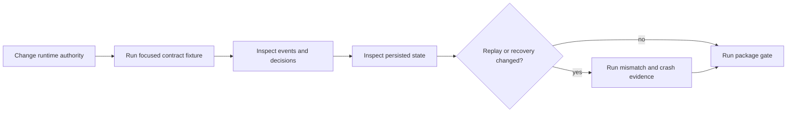

# Local Development

Develop runtime changes against the complete authority chain. A useful local
loop proves what the manifest declared, what resolution admitted, which mode
authorized execution, which effects and events occurred, how verification was
arbitrated, what became durable, and what replay may compare.



## Bootstrap from the repository root

```bash
make install
make -f makes/packages/bijux-canon-runtime.mk \
  -C packages/bijux-canon-runtime help
```

Use root dispatch for normal package gates:

```bash
make test PACKAGE=bijux-canon-runtime
make lint PACKAGE=bijux-canon-runtime
make quality PACKAGE=bijux-canon-runtime
```

The package profile installs canonical workspace dependencies into
`packages/bijux-canon-runtime/.venv` and routes generated evidence under
`artifacts/`. The package directory has no standalone Makefile; direct commands
require the repository profile path.

## Start with the nearest authority invariant

```bash
packages/bijux-canon-runtime/.venv/bin/python -m pytest \
  packages/bijux-canon-runtime/tests/<area>/<test-file>.py -q
```

| Changed behavior | Evidence to inspect |
| --- | --- |
| manifest or resolver | structural validation, semantic refusal, identity, dependency order, and plan |
| run mode | permitted work, effects, warnings, events, persistence, and certifiability |
| lower-package adapter | retained producer identity, typed failure, and absence of semantic reinterpretation |
| executor or effect | authorization, idempotency, receipt, retry, interruption, and unknown outcome |
| verification or arbitration | immutable check result, policy fingerprint, decision, and non-certifiable path |
| DuckDB store | migration, tenant isolation, event order, checkpoint, lock, finalization, and recovery |
| replay | dataset, plan, policy, entropy, envelope, acceptability, diff, and drift classification |
| CLI | exit behavior, JSON rendering, store mutation, and explanation |
| HTTP | health/readiness plus explicit `501` behavior for unimplemented run and replay handlers |

Exercise accepted, rejected, and non-certifiable outcomes. A successful live
run alone cannot prove that authority refusal or evidence insufficiency remains
honest.

## Use isolated stores and controlled effects

Give each focused test or manual run its own DuckDB path beneath `artifacts/`.
Do not share a file between concurrent writers. For external-effect changes,
use a controlled adapter that can expose the crash window between remote effect
and local event persistence.

Recovery tests must not infer that a missing completion event means an external
effect did not happen. Preserve effect receipts, idempotency keys, and an
explicit unknown state where certainty is unavailable.

## Validate public boundaries deliberately

```bash
make api PACKAGE=bijux-canon-runtime
make build PACKAGE=bijux-canon-runtime
make docs-check
```

The HTTP contract includes run and replay envelopes, but those handlers
currently return `501 Not Implemented`. API validation must preserve that
truth; schema presence is not implementation evidence.

Use the build lane for root imports, workspace dependencies, package data,
schema hashes, entry points, or distribution metadata. Use focused regression
tests when dataset evolution, policy compatibility, temporal drift, crash
recovery, or cross-process replay changes.

## Preserve the governed review unit

Retain manifest, policy, dataset descriptor, resolved plan, mode, events,
entropy record, lower-package evidence, verification results, arbitration,
trace, checkpoints, store identity, replay envelope, and diff. The DuckDB file
alone may not contain every referenced payload, so preserve external artifact
custody as part of the fixture.

See [change validation](../quality/change-validation.md) and
[state and persistence](../architecture/state-and-persistence.md) for the
required failure and recovery evidence.
