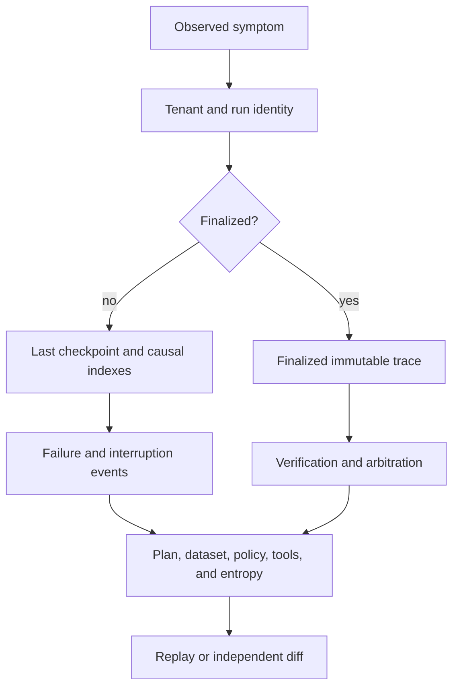

# Observability and Diagnostics

Runtime diagnostics begin with persisted authority: tenant-scoped run state,
the resolved plan, ordered events, artifacts, evidence, verification,
arbitration, and replay policy. Process logs and HTTP health probes can explain
availability, but they cannot establish that a run is finalized, certifiable,
or replay-acceptable.



## Establish Authority

Always select a run by both tenant and run ID. Then confirm:

1. manifest, resolved plan hash, flow identity, and lifecycle state;
2. dataset identity, version, content hash, and storage authority;
3. execution mode, determinism level, policy fingerprint, and replay envelope;
4. schema contract hash, migrations, runtime version, and database path;
5. whether the run is in progress, finalized, or non-certifiable.

A readable DuckDB file is not evidence that these identities agree. Likewise,
a finalized trace proves the causal boundary is closed; it does not by itself
mean verification accepted the run.

## Inspect Causal State

Read the persisted record in causal order:

| Record | Diagnostic question |
| --- | --- |
| normalized steps | what execution order and dependency structure was authorized? |
| checkpoints | which step and event index are durably complete? |
| events | where is the first failure, interruption, warning, or semantic divergence? |
| tool invocations | which integration, request identity, and result were observed? |
| entropy ledger | which nondeterministic sources were allowed and consumed? |
| artifacts and parent edges | which outputs exist, where are their payloads, and what produced them? |
| evidence and claims | which source identities support each reasoning result? |
| verification results | what did each engine observe and which rule failed? |
| arbitration | which policy and participating statuses produced the final decision? |

For an incomplete run, compare the last checkpoint with the largest persisted
event, artifact, evidence, tool, entropy, and claim indexes. A gap can identify
work that was recorded after the checkpoint and must not be duplicated during
resume.

For a finalized run, treat the trace as immutable. Investigation may create
new comparison or replay records; it must not rewrite the original causal
history.

## Command-Line Diagnostics

Use read-side commands with explicit tenant and database authority:

```bash
bijux-canon-runtime inspect run "$RUN_ID" \
  --tenant-id "$TENANT_ID" \
  --db-path artifacts/bijux-canon-runtime/runs.duckdb \
  --json

bijux-canon-runtime explain failure "$RUN_ID" \
  --tenant-id "$TENANT_ID" \
  --db-path artifacts/bijux-canon-runtime/runs.duckdb \
  --json
```

`inspect run` returns the stored trace and its event, tool-invocation, and
entropy counts. `explain failure` returns the last recognized step, retrieval,
reasoning, verification, tool, or interruption failure event. The last failure
is a useful pivot, not proof of the root cause; walk backward to the earliest
invalid authority or causal record.

Use `validate db` to confirm that the store opens and its governed schema can
be initialized or read. It is not a row-by-row integrity audit. The HTTP
`/ready` endpoint is narrower still: it checks that configured DuckDB storage
can be opened, not that datasets, providers, policy, payloads, or an individual
run are healthy. HTTP run and replay endpoints currently return `501` after
contract validation, so production execution evidence comes from the Python
and CLI surfaces.

## Verification Is Not Arbitration

Keep each verifier's result separate from the arbitration decision. A verifier
reports observed findings, randomness, targets, and rule status. Arbitration
applies a named policy rule and quorum threshold to those results.

When a run is rejected, answer these questions independently:

- Did an engine fail to execute, or did it execute and report a violation?
- Did observed randomness exceed the policy tolerance?
- Which artifacts, evidence, claims, or steps were the targets?
- Which arbitration rule and policy fingerprint converted statuses into the
  final decision?
- Did exhaustion policy make the trace non-certifiable?

Changing an arbitration outcome without retaining the original verifier
results hides the decision path.

## Symptom Routing

| Symptom | Inspect first | Common boundary |
| --- | --- | --- |
| run cannot be found | tenant, run ID, database path | authority selection or retention |
| run exists but is unfinished | finalized flag, checkpoint, last causal indexes | interruption, executor, or store write |
| tool effect exists without completion | invocation identity, checkpoint, external idempotency record | side effect before durable checkpoint |
| result is rejected | verification results, arbitration, policy fingerprint | evidence, rule, randomness, or policy |
| run is non-certifiable | entropy exhaustion, nondeterminism intent, replay envelope | declared or observed variance |
| artifact metadata exists but payload is absent | storage URI, content hash, tenant, retention set | external artifact store |
| replay differs | identity and structural diff before bounded categories | plan, tenant, dataset, environment, policy, event, or entropy drift |
| `validate db` succeeds but inspection fails | schema hash, migrations, tenant/run rows | incomplete or semantically invalid store |

## Replay and Diff

Use `replay` when one run is the authority and a new execution must satisfy its
declared replay contract. Use `diff run` when comparing two independent stored
histories. `diff run` reports differences without failing the process;
automation must inspect the JSON result.

Interpret differences in this order:

1. tenant, flow, run, dataset, and plan identity;
2. mode, policy, verification gates, and authority;
3. environment, executor, provider, and tool identity;
4. causal events, artifacts, evidence, claims, and entropy;
5. replay envelope, allowed variance categories, and acceptability.

Strict mode permits no semantic difference. Bounded mode does not waive
structural mismatches; it applies only the variance declared by the original
run after structural checks pass. Retain the new run ID and complete JSON diff
with every replay verdict.

## Minimum Incident Record

Preserve the DuckDB file through a quiescent or DuckDB-compatible snapshot,
plus:

- manifest, policy, resolved plan, dataset descriptor, and schema metadata;
- tenant and run IDs, mode, budget, determinism, and replay envelope;
- external artifact payloads and content hashes;
- executor, tool, provider, and environment versions;
- structured process logs and any external idempotency or compensation record;
- inspection output, failure explanation, replay run ID, and semantic diff.

Observers and read-side diagnostics must not acquire mutation authority. Keep
sensitive prompts, evidence, credentials, and derived artifacts inside the
same access controls as the execution store.

See [Failure Recovery](failure-recovery.md) for resume decisions,
[Artifact Contracts](../interfaces/artifact-contracts.md) for stored authority,
and [CLI Surface](../interfaces/cli-surface.md) for exact command behavior.
