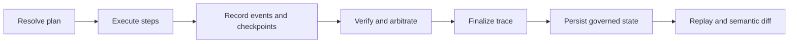
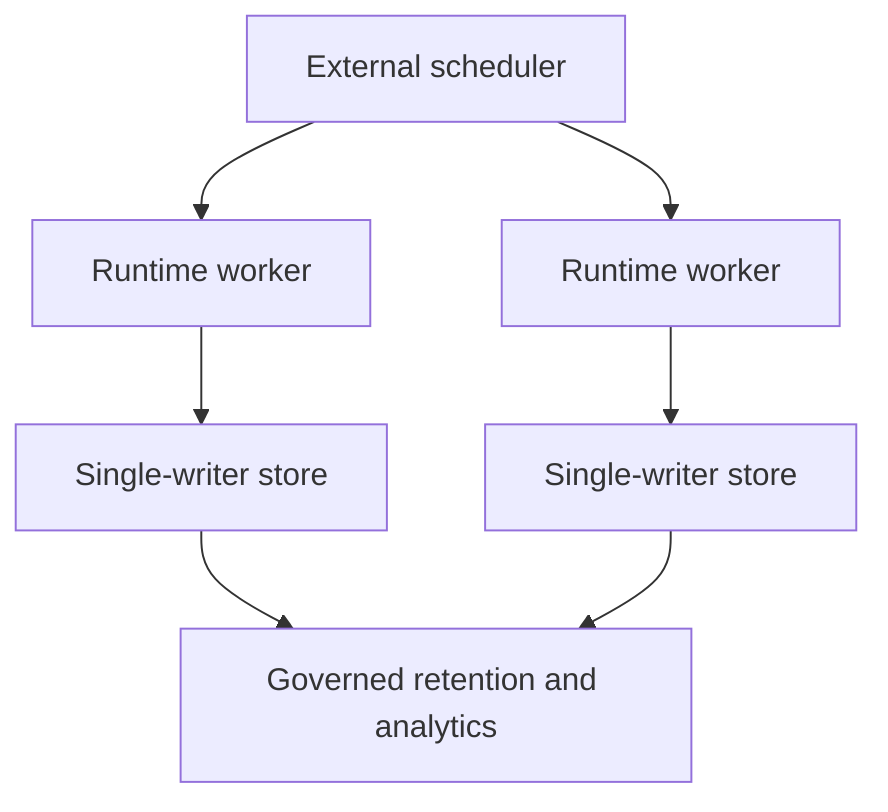

# Performance and Scaling

`bijux-canon-runtime` combines execution with durable causal recording,
verification, arbitration, trace finalization, and replay. The cost of a run is
therefore the executor path plus the work required to make that path governed
and inspectable.

Removing events, evidence, verification, or persistence may reduce latency,
but it also removes runtime guarantees. Compare performance only between runs
with the same manifest authority, mode, policy, dataset, budget, and replay
envelope.

## Cost Centres

| Cost centre | Primary scale variable | Durable consequence |
| --- | --- | --- |
| planning | steps, dependencies, retrieval contracts | resolved plan and plan hash |
| execution | steps, tool calls, provider latency | step and tool events |
| artifact handling | count, payload bytes, parent edges | artifact identities and storage references |
| evidence and reasoning | evidence items, claims, reasoning bundles | typed projections and trace events |
| persistence | events, checkpoints, record groups | DuckDB writes and causal indexes |
| verification | actions, engines, rules, evidence | per-engine results and findings |
| arbitration | results, policy rule, target set | policy fingerprint and decision |
| finalization | total trace records | immutable final trace |
| replay | a second execution plus semantic comparison | new run, diff, acceptability verdict |

The slowest external tool can dominate wall time, while event volume and
artifact size dominate local I/O. Keep these measurements separate. A single
end-to-end number cannot show whether the next improvement belongs in an
executor, the store, verification, or artifact transport.

## Retrieval Resource Lifecycle

One composed Runtime service retains its verified embedding model and a bounded
set of immutable index generations across retrieval requests. The embedding
model is keyed by the exact `model.lock.json` content; a lock change is loaded
and verified before it replaces the resident model. Index handles are keyed by
generation identity plus mutation-sensitive file identities. Activation,
recovery, or an on-disk identity change invalidates resident handles before a
new generation can answer a query. Generation access and local model inference
are serialized so request workers can safely reuse the same read-only resource.

Every `index.evidence-set.v1` payload includes `resource_reuse`. Its archive
status distinguishes `cold`, `warm`, and `invalidated` admission; generation
and embedding observations report content-safe cache identity, access/load
counters, and last-load timing. A process restart is cold by definition. Cache
identity is scoped to the resolved workspace index root, and the generation
cache retains at most two idle or active generations by default. These fields
must accompany cold/warm latency comparisons; a warm end-to-end measurement
without matching resource evidence is not a valid warm retrieval result.

## Execution Budgets

The Python API accepts an `ExecutionBudget` with limits for:

- steps;
- tokens;
- total artifacts;
- artifacts produced within one step;
- evidence items; and
- trace events.

These are governed work counters. They do not impose operating-system CPU,
memory, process, filesystem-byte, or wall-clock limits. Hosts must provide
those controls. A budget exception is an explicit execution outcome and must
remain visible in the trace or failure record; increasing a limit after
exhaustion changes the execution contract.

Size budgets from representative runs with headroom for diagnostic events and
verification. A trace-event limit that allows the nominal path but not a
recorded failure can erase the evidence needed to explain the incident.

## DuckDB Write Path

The execution store is a durable single-writer boundary. It uses a sibling
lock file and commits related record groups as store methods complete. Do not
run concurrent mutating commands against one database or remove the lock to
force a second writer.

For one run, persistence grows with:

- normalized steps and ordered events;
- checkpoints and resume indexes;
- tool invocations and entropy use;
- artifacts, parent edges, evidence, and claims;
- verification and arbitration state; and
- finalized trace and replay metadata.

Checkpoint frequency trades repeated work after interruption against write
amplification. Choose checkpoints at boundaries where re-execution is costly
or unsafe, and align external side effects with idempotency or compensation.
The store cannot roll back a provider call or filesystem mutation.

Read-side inspection uses a separate capability, but DuckDB file access still
requires operational coordination with the writer. For analytics over many
runs, export or replicate from a quiescent, governed snapshot rather than
turning the execution database into an unconstrained reporting workload.

## Artifacts and Payloads

Artifact identity, hash, parentage, tenant, and payload location belong in the
governed record. Large payloads may live in an external artifact store, but the
database and payload store must be retained, secured, and restored as one
authority set.

Moving bytes outside DuckDB is useful when payload size dominates the
database; it does not remove the need to hash, address, authorize, and retain
them. Measure metadata rows and payload bytes separately, and include external
store latency in step and replay measurements.

## Verification and Replay

Verification cost depends on the number of governed actions, configured
engines and rules, evidence links, content hashes, randomness checks, and rule
cost budgets. Arbitration is a separate policy step and must not be folded
into an aggregate verifier timing when diagnosing a bottleneck.

Replay performs another governed execution and writes a new run before
comparing semantic structure. It is expected to approach the cost of live
execution when external work is repeated. Strict replay rejects every
semantic difference; bounded replay still performs structural checks before
applying the original variance envelope.

Do not optimize replay by comparing only displayed output. Plan, tenant,
environment, dataset, policy, envelope, event, artifact, evidence, claim, and
entropy differences are part of the verdict.

## Benchmark Contract

Retain these fields with every measurement:

1. manifest, plan hash, tenant, dataset descriptor and hash, policy
   fingerprint, mode, determinism level, and replay envelope;
2. runtime and schema version, DuckDB path or storage class, executor/tool
   versions, and artifact-store configuration;
3. step count, event count, checkpoints, tool invocations, entropy records,
   artifacts and bytes, evidence items, claims, verification results, and
   arbitrations;
4. planning, executor, persistence, verification, arbitration, finalization,
   and replay/diff durations;
5. budget limits and observed exhaustion or certifiability state;
6. warm-up policy, machine resources, cache state, and external-provider
   conditions.

Report median and tail latency, not only throughput. Pair every performance
result with finalization status, verification decision, certifiability, and
replay acceptability so a faster incomplete run cannot appear superior.

## Scaling Topology

Scale independent runs across workers, each with exclusive write ownership of
its store or with writes serialized by an external service. Keep execution
work and governed state distinct:

The package is not a queue, cluster scheduler, distributed lock service, or
multi-host database. A shared deployment needs external run routing, tenant
isolation, capacity limits, credential management, payload storage, backup,
and idempotency for side effects.

See [Configuration Surface](../interfaces/configuration-surface.md) for mode and
authority inputs, [State and Persistence](../architecture/state-and-persistence.md)
for the single-writer contract, and [Observability and Diagnostics](observability-and-diagnostics.md)
for interpreting measured runs.
