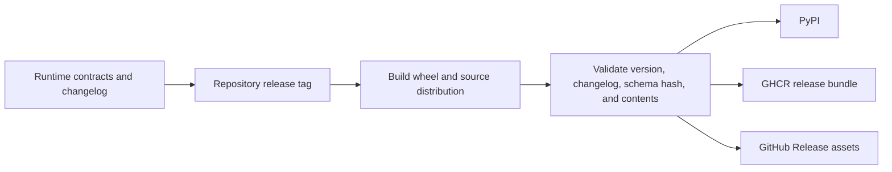

# Release and Versioning

`bijux-canon-runtime` derives its version from the repository-wide
`v<version>` tag. A runtime release binds manifest and policy contracts,
execution modes, lower-package adapters, verification arbitration, DuckDB
persistence, CLI behavior, HTTP schema, and replay semantics to one source
state.



## What constitutes a runtime release change

| Changed surface | Release significance |
| --- | --- |
| manifest, policy, plan, event, trace, or decision model | authority contract change |
| plan, dry-run, live, observe, or unsafe behavior | execution-permission change |
| lower-package adapter | composition and compatibility change |
| verification rule or arbitration | acceptance and certifiability change |
| effect, retry, checkpoint, or recovery | operational safety change |
| DuckDB schema, migration, or lock | persistence compatibility change |
| replay envelope, acceptability, or diff | historical comparison change |
| CLI command, root import, HTTP schema, or status | public interface change |

Record the caller-visible effect in
`packages/bijux-canon-runtime/CHANGELOG.md`. The release build requires the
resolved base-version section to contain `Added`, `Changed`, and `Fixed`
headings. State whether existing databases require migration, which historical
runs remain reconstructable, and whether replay policy changed.

## Version and artifact guards

Hatch VCS resolves the version from Git. Dirty and untagged checkouts may
produce local or development versions, which publication rejects unless the
workflow explicitly permits them. Artifact filenames must match the resolved
version.

The wheel carries `py.typed` and the runtime API schema hash. A release is
invalid if the checked-in API source, pinned schema, packaged hash, or handler
behavior disagree. The current run and replay HTTP handlers must remain
documented as `501 Not Implemented` until implementation and contract evidence
land together.

## Focused release evidence

```bash
make test PACKAGE=bijux-canon-runtime
make lint PACKAGE=bijux-canon-runtime
make quality PACKAGE=bijux-canon-runtime
make api PACKAGE=bijux-canon-runtime
make build PACKAGE=bijux-canon-runtime
```

Inspect the built distributions for the full runtime package, root exports,
canonical CLI, license, README, typed marker, and schema hash. Install the wheel
in isolation with canonical workspace dependencies and prove planning,
execution, database validation, inspection, and replay against a controlled
manifest.

Persistence or replay changes require representative migration and historical
state fixtures, not only a new empty database. External effects require a
partial-failure proof because local persistence cannot provide a distributed
transaction.

## Compatibility and publication

`bijux-canon` and `agentic-flows` expose compatibility paths to canonical
runtime authority. New modes, decisions, persistence meaning, and replay
verdicts begin in `bijux-canon-runtime`; aliases must delegate.

The same staged distributions feed PyPI, GHCR release bundles, and GitHub
Release assets. Multiple custody surfaces do not create separate runtime
authorities.

Version 0.4.0 provides the Runtime service through the installed Python
distribution and does not provide an executable container or service image.
GHCR objects are non-executable OCI release bundles containing candidate-bound
distribution assets. A future image must independently prove non-root execution,
persistent workspace mounts, readiness, and an installed v2 smoke workflow
before it becomes a supported release surface.

A release is incomplete if operators cannot tell how to migrate stored state,
interpret historical verdicts, or distinguish implemented interfaces from
schema-only commitments.
