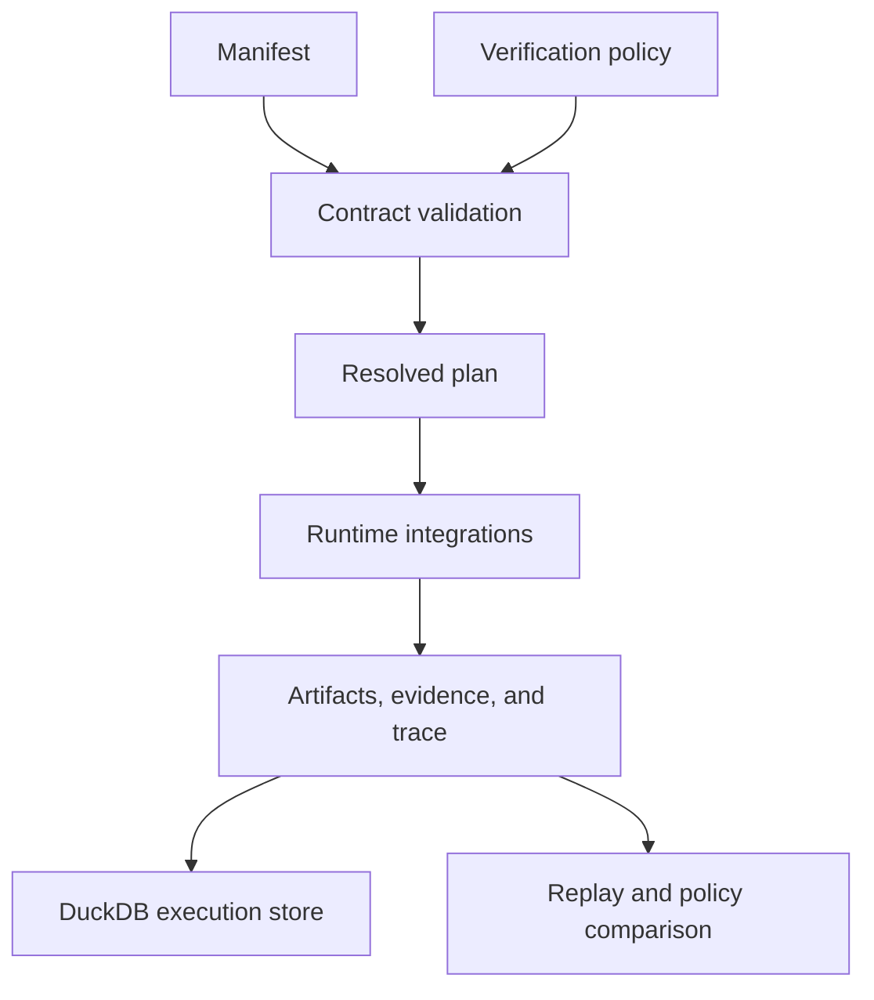

# Security and Safety

The runtime crosses three high-authority boundaries: it loads datasets and
integration code, executes declared flows, and persists tenant-scoped evidence
and traces. A valid manifest is an execution contract, not proof that its
author is trusted.

## Authority path

## Safe operating envelope

- Review dataset `storage_uri` values before execution. Local `file://` and
  path values can cause the process to read files available to its account.
- Run with a dedicated unprivileged identity and narrow filesystem and network
  access. Installed agent, retrieval, and reasoning integrations execute as
  Python code inside the runtime process; they are not sandboxed.
- Keep the DuckDB file outside web-served paths, restrict its permissions, and
  back it up as an audit record. The store verifies schema and migration hashes
  when opened.
- Treat tenant identifiers as data-partition keys, not authentication. Store
  reads include tenant predicates, but a caller allowed to choose a tenant ID
  still needs authorization at the enclosing service boundary.
- Configure `ExecutionBudget` for untrusted or shared workloads. Its limits
  cover steps, tokens, artifacts, artifacts per step, evidence, and trace
  events; they do not impose operating-system memory, CPU, or wall-clock caps.
- Prefer strict determinism for governed runs. Declare every permitted entropy
  source and magnitude, retain policy fingerprints, and investigate any replay
  difference before accepting substituted output.
- Avoid putting credentials or private material in manifests, tool outputs,
  evidence, or traces. These records are designed to persist and be inspected.

## HTTP boundary

The FastAPI surface is explicitly experimental and not production ready. Its
health route reports process liveness. Readiness only checks whether the
DuckDB path in `AGENTIC_FLOWS_DB_PATH` can be opened; it is not a deep check of
datasets, integrations, or policies.

Run and replay requests require `X-Agentic-Gate`, `X-Determinism-Level`, and
`X-Policy-Fingerprint` headers. These are contract declarations, not
credentials: the application does not authenticate their values or associate
them with a principal. OpenAPI declares no security scheme, and the application
does not provide TLS, authorization, rate limiting, tenant identity, or a
request-body size limit.

Both mutable endpoints validate their request and headers, then return `501`
without executing a flow. Keep them disabled or behind a trusted gateway. If
they become executable, that gateway must enforce authenticated identity,
tenant authorization, TLS, body and concurrency limits, deadlines, and audit
correlation before requests reach the runtime.

## Meaning of deterministic

Strict execution constrains declared runtime behavior and enables replay
comparison. It does not freeze the operating system, installed integration
code, undeclared external services, or mutable dataset bytes. A trustworthy run
retains the manifest, resolved plan, dataset identity and hash, policy
fingerprint, environment fingerprint, artifacts, evidence, and finalized trace.
