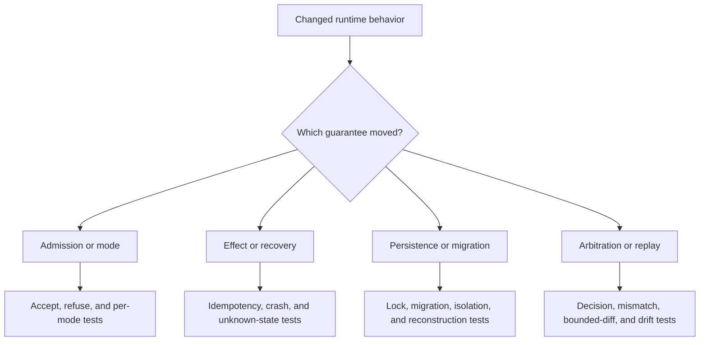

# Change Validation

Validate runtime changes against authority, durability, and replay—not merely
terminal execution. A run can complete while violating mode policy, losing an
external effect, misclassifying verification, persisting partial state, or
accepting incompatible replay.



## Risk-to-evidence matrix

| Risk | Required focused evidence |
| --- | --- |
| valid shape bypasses semantic admission | structurally valid but semantically refused manifest fixture |
| non-live mode causes effects | plan, dry-run, and observe effect-denial tests |
| unsafe run appears certifiable | warning event, stored mode, arbitration, and result classification tests |
| lower-package failure is reinterpreted | producer artifact and typed-failure preservation tests |
| external effect is duplicated after interruption | idempotency key, receipt, checkpoint, crash, and retry tests |
| unknown effect is presented as absent | partial-failure fixture with explicit uncertainty |
| concurrent writers corrupt state | lock acquisition, contention, release, and recovery tests |
| migration changes identity or order | historical database fixture and typed reconstruction assertions |
| finalized trace mutates | post-finalization write rejection and stable fingerprint tests |
| arbitration rewrites verification | immutable result plus policy-derived decision assertions |
| replay accepts changed data or policy | dataset, plan, policy, environment, and envelope mismatch fixtures |
| HTTP schema overstates implementation | health/readiness success and run/replay `501` contract tests |

## Select the narrowest useful command

```bash
packages/bijux-canon-runtime/.venv/bin/python -m pytest \
  packages/bijux-canon-runtime/tests/<area>/<test-file>.py -q

make test PACKAGE=bijux-canon-runtime
```

Add only affected boundary lanes:

```bash
make api PACKAGE=bijux-canon-runtime
make lint PACKAGE=bijux-canon-runtime
make quality PACKAGE=bijux-canon-runtime
make build PACKAGE=bijux-canon-runtime
make docs-check
```

Use focused regression cases for replay, dataset evolution, temporal drift,
crash recovery, stateful executors, partial live failure, and cross-process
state. Do not replace them with a broad green suite that lacks the relevant
failure condition.

## Inspect durable state and external custody

Query the resulting run through the public inspection path and validate the
database schema. Confirm tenant, run, plan, dataset, policy, event, decision,
checkpoint, and replay identities. Then inspect referenced payload custody;
the execution database may retain hashes and lineage without embedding every
byte required for replay.

Update mode, persistence, recovery, API, limitation, and release documentation
whenever an operator's interpretation changes.

Validation is sufficient when accepted, rejected, and non-certifiable paths
are reproducible; crash uncertainty remains visible; and replay refuses every
undeclared identity or policy difference.
