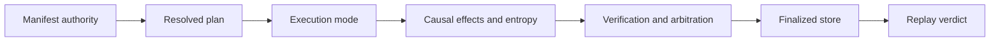

# Governed Run Acceptance

A runtime change is releasable when declared authority, execution mode,
effects, verification, persistence, recovery, and replay remain one causal
record. Correct refusal is acceptance evidence; a completed flow is not enough.

## Acceptance record

| Changed surface | Required evidence | Release-blocking result |
| --- | --- | --- |
| manifest or plan | structure, semantic refusal, dependency order, identity, and golden plan | invalid or ambiguous authority resolves |
| execution mode | permitted effects, required resources, warnings, strictness, and trace behavior | plan, dry, live, observe, or unsafe semantics are conflated |
| event or effect | authorization, causal order, idempotency, receipt, failure, and unknown outcome | an unauthorized or ambiguous effect is finalized as success |
| nondeterminism | declared intent, entropy budget/use, environment identity, and strict refusal | undeclared variance receives an exact/replayable classification |
| verification or arbitration | immutable findings, rule coverage, policy fingerprint, decision, and non-certifiable path | a weaker or incomplete policy is presented as accepted authority |
| DuckDB store | migration, tenant isolation, writer guard, ordered persistence, finalization, and round trip | corrupt, cross-tenant, or partial state loads as authoritative |
| resume or recovery | checkpoint, reconstructed indices, retained effects, interruption, and unknown-state evidence | recovery repeats an effect without idempotency or loses causal history |
| replay | original envelope, dataset, plan, policy, environment, entropy, semantic diff, verdict, and reason | changed authority or unacceptable drift passes |
| HTTP boundary | schema and observed health/readiness/`501` behavior | schema presence is presented as implemented run or replay |

## Authority claims form a lattice

A runtime record may support one state without supporting the stronger state
to its right. Reviewers must name the highest state actually established:

| Established state | What the evidence proves | What it does not prove |
| --- | --- | --- |
| resolved or planned | manifest, dataset, dependencies, policy, and mode formed an admissible plan | any step ran or any effect occurred |
| executed | recorded steps produced effects, outcomes, and causal events | the trace finalized or policy accepted the result |
| finalized | the event history closed and the store retained its terminal state | verification passed or the result is certifiable |
| accepted | immutable findings were arbitrated under the named policy | factual truth, universal safety, or acceptance under another policy |
| non-certifiable | required evidence or checks were absent, failed, or insufficient | that every execution step failed |
| resumable | the checkpoint, authority, indices, and effect state permit compatible continuation | that continuation is complete or side effects are reversible |
| replay acceptable | the observed comparison satisfies the original replay envelope | bitwise equality unless exact replay was required and demonstrated |

No later state may be inferred from an earlier one. In particular, a zero exit
from plan mode, a finalized DuckDB row, and an acceptable bounded replay carry
different authority.

## Release evidence packet

For each governed-run acceptance decision, retain:

- the exact manifest, normalized policy, dataset descriptor, resolved plan,
  selected mode, resources, and authority fingerprints;
- effects, receipts, idempotency identities, unknown outcomes, events, entropy,
  tool calls, artifacts, evidence, and claims in causal order;
- immutable verification findings, arbitration, certifiability, checkpoints,
  store identity, migrations, and the finalized trace; and
- the replay envelope, comparison inputs, semantic diff, verdict, and reason.

The packet must be sufficient to derive the terminal state without trusting a
summary field or database filename. Package-local seam tests establish runtime
behavior but do not establish installed-package live composition. Until the
canonical adapters described in [known limitations](known-limitations.md) have
an installed-package execution test, release evidence must state that boundary
and must not claim end-to-end live composition.

## Custody boundary

Retain the manifest, policy, dataset descriptor, resolved plan, events, entropy
record, lower-package artifacts, verification findings, arbitration, trace,
checkpoints, store identity, replay envelope, and diff. The DuckDB file alone
may reference payloads stored elsewhere; those payloads remain part of custody.

Use [change validation](change-validation.md) for authority-specific routing and
[known limitations](known-limitations.md) to bound infrastructure and factual
claims.
