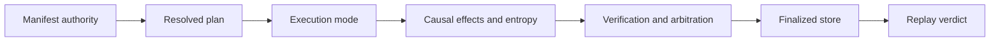

# Governed Run Acceptance

A runtime change is releasable when declared authority, execution mode,
effects, verification, persistence, recovery, and replay remain one causal
record. Correct refusal is acceptance evidence; a completed flow is not enough.

## Acceptance record

| Changed surface | Required evidence | Release-blocking result |
| --- | --- | --- |
| manifest or plan | structure, semantic refusal, dependency order, identity, and golden plan | invalid or ambiguous authority resolves |
| execution mode | permitted effects, required resources, warnings, strictness, and trace behavior | plan, dry, live, observe, or unsafe semantics are conflated |
| event or effect | authorization, causal order, idempotency, receipt, failure, and unknown outcome | an unauthorized or ambiguous effect is finalized as success |
| nondeterminism | declared intent, entropy budget/use, environment identity, and strict refusal | undeclared variance receives an exact/replayable classification |
| verification or arbitration | immutable findings, rule coverage, policy fingerprint, decision, and non-certifiable path | a weaker or incomplete policy is presented as accepted authority |
| DuckDB store | migration, tenant isolation, writer guard, ordered persistence, finalization, and round trip | corrupt, cross-tenant, or partial state loads as authoritative |
| resume or recovery | checkpoint, reconstructed indices, retained effects, interruption, and unknown-state evidence | recovery repeats an effect without idempotency or loses causal history |
| replay | original envelope, dataset, plan, policy, environment, entropy, semantic diff, verdict, and reason | changed authority or unacceptable drift passes |
| HTTP boundary | schema and observed health/readiness/`501` behavior | schema presence is presented as implemented run or replay |

## Custody boundary

Retain the manifest, policy, dataset descriptor, resolved plan, events, entropy
record, lower-package artifacts, verification findings, arbitration, trace,
checkpoints, store identity, replay envelope, and diff. The DuckDB file alone
may reference payloads stored elsewhere; those payloads remain part of custody.

Use [change validation](change-validation.md) for authority-specific routing and
[known limitations](known-limitations.md) to bound infrastructure and factual
claims.
