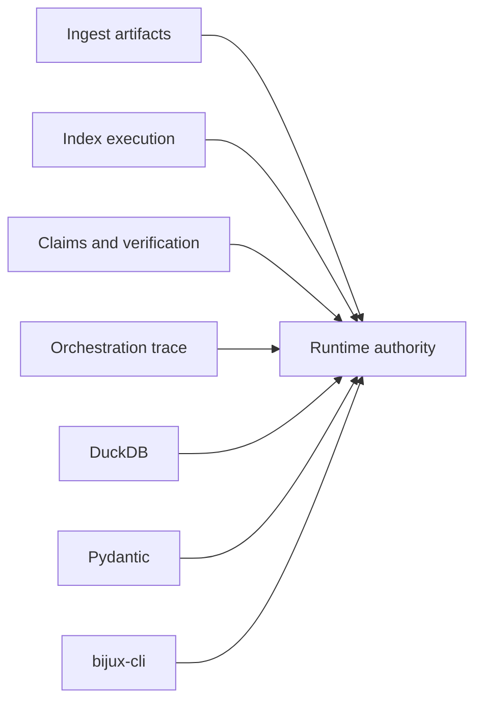

# Runtime Dependency Authority

Runtime composes the canonical ingest, index, reason, and agent contracts. It
must preserve their typed evidence without reinterpreting package-owned
semantics, while DuckDB and interface dependencies own persistence and access
behavior.

## Dependency classes

| Boundary | Authority introduced | Evidence required when it changes |
| --- | --- | --- |
| ingest | source, prepared artifact, chunk, and citation identity | adapter fixtures and unchanged producer semantics |
| index | execution plan, backend capability, ranked result, provenance, and replay record | exact/ANN identity and lower-package failure preservation |
| reason | plan, claim, support, verification, and evidence bundle | complete support linkage and immutable findings |
| agent | lifecycle, convergence, termination, result, and trace | orchestration identity and terminal-state preservation |
| DuckDB | schema migration, durability, locking, tenant state, checkpoints, and replay storage | migration, round trip, hostile-store, crash, and cross-process evidence |
| Pydantic | manifest/model validation, serialization, and accepted configuration | invalid/extra-field cases, golden plan, and envelope comparison |
| bijux-cli | command integration and compatibility behavior | command parsing, typed errors, exit status, and result rendering |
| FastAPI, Starlette, and Uvicorn extra | HTTP validation, exceptions, schema, liveness, and readiness | schema drift plus observed endpoint behavior |

## Composition rules

- Lower-package failures remain typed and retain their producer identity.
- Runtime arbitration can admit or reject verification findings; it does not
  rewrite the finding itself.
- A dependency version participating in replay identity is retained with the
  environment record.
- DuckDB coordination never implies atomicity with a remote provider or tool;
  integrations supply idempotency or compensation.
- An HTTP dependency upgrade cannot turn schema-only flow endpoints into an
  implementation claim.

Dependency locks and audits establish resolution and known advisories.
Cross-package semantic compatibility additionally requires adapter, authority,
persistence, recovery, and replay evidence.

## Maintain a composition compatibility record

For each runtime release, record the exact five canonical distribution
versions and the contract actually consumed from each lower package:

| Boundary | Record | Executable proof |
| --- | --- | --- |
| ingest service | parser/configuration identity, retained source, corpus and chunk schemas, failure mapping | installed valid, hostile, malformed and unsupported document cases |
| index service | profile, model, backend, generation, ranking provenance and refusal mapping | installed lexical, exact and ANN cases with unsupported capability and corrupt state |
| reason service | retrieval dependency, claims, qualifiers, citations and verification mapping | installed supported, insufficient, conflicting and tampered evidence cases |
| agent service | budget, tool calls, decisions, convergence and terminal failure mapping | installed converged, exhausted, cancelled, partial and failed workflows |
| runtime | workspace/configuration, request plan, job, run, attempt and artifact authority | governed execution retaining all producer and consumer identities across restart |

Dependency resolution proves only that distributions can coexist. Installed
composition additionally requires typed application execution without
source-tree imports, causal identity checks, restart, replay, comparison and
failure tests. Record those results rather than inferring capability from
imports or metadata.

## Admit persistence and interface upgrades

For a DuckDB change, retain the prior database fixture, schema/migration hashes,
old-reader/new-reader behavior, migration result, tenant isolation, writer-lock
behavior, interruption around checkpoint/finalization, corrupt-state refusal,
cross-process round trip, and replay comparison. Test both an empty store and a
store containing finalized, partial, resumable, and non-certifiable runs.

For Pydantic or `bijux-cli`, compare manifest admission, resolved plans,
defaults, strict fields, stable JSON/error envelopes and exit status. For the
HTTP extra, compare checked-in schema with the live health, readiness, header,
error and `501` behavior. An interface dependency change cannot turn an
unimplemented endpoint into supported capability, nor can schema parity prove
that a governed effect occurred.

Classify every observed difference as producer-owned, runtime-owned,
persistence-owned, interface-owned, or environmental. Runtime may translate
at its boundary, but it must not rewrite lower-package evidence so an
incompatible dependency appears successful.

Use [test strategy](test-strategy.md) for the owning gates and
[risk register](risk-register.md) for residual composed-system exposure.
