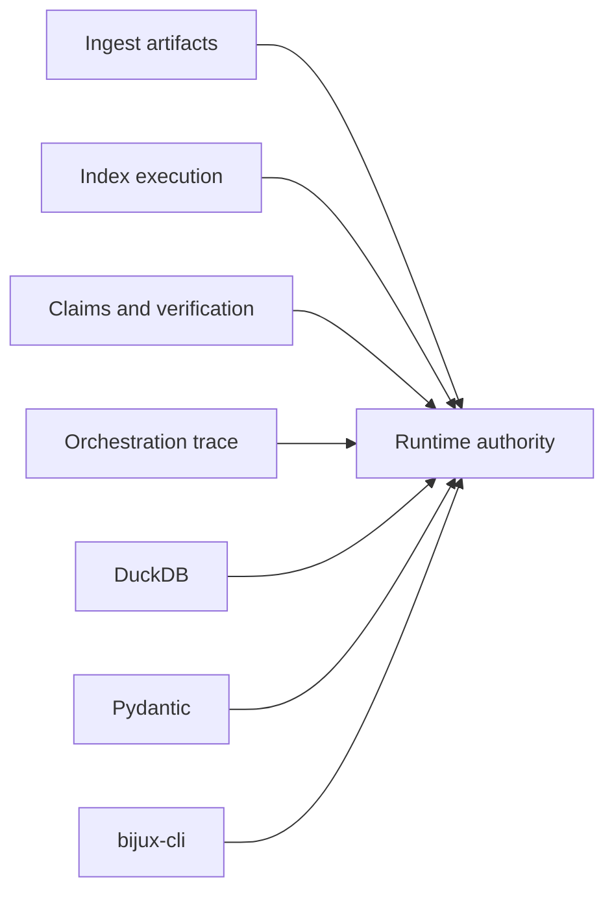

# Runtime Dependency Authority

Runtime composes the canonical ingest, index, reason, and agent contracts. It
must preserve their typed evidence without reinterpreting package-owned
semantics, while DuckDB and interface dependencies own persistence and access
behavior.

## Dependency classes

| Boundary | Authority introduced | Evidence required when it changes |
| --- | --- | --- |
| ingest | source, prepared artifact, chunk, and citation identity | adapter fixtures and unchanged producer semantics |
| index | execution plan, backend capability, ranked result, provenance, and replay record | exact/ANN identity and lower-package failure preservation |
| reason | plan, claim, support, verification, and evidence bundle | complete support linkage and immutable findings |
| agent | lifecycle, convergence, termination, result, and trace | orchestration identity and terminal-state preservation |
| DuckDB | schema migration, durability, locking, tenant state, checkpoints, and replay storage | migration, round trip, hostile-store, crash, and cross-process evidence |
| Pydantic | manifest/model validation, serialization, and accepted configuration | invalid/extra-field cases, golden plan, and envelope comparison |
| bijux-cli | command integration and compatibility behavior | command parsing, typed errors, exit status, and result rendering |
| FastAPI, Starlette, and Uvicorn extra | HTTP validation, exceptions, schema, liveness, and readiness | schema drift plus observed endpoint behavior |

## Composition rules

- Lower-package failures remain typed and retain their producer identity.
- Runtime arbitration can admit or reject verification findings; it does not
  rewrite the finding itself.
- A dependency version participating in replay identity is retained with the
  environment record.
- DuckDB coordination never implies atomicity with a remote provider or tool;
  integrations supply idempotency or compensation.
- An HTTP dependency upgrade cannot turn schema-only flow endpoints into an
  implementation claim.

Dependency locks and audits establish resolution and known advisories.
Cross-package semantic compatibility additionally requires adapter, authority,
persistence, recovery, and replay evidence.

Use [test strategy](test-strategy.md) for the owning gates and
[risk register](risk-register.md) for residual composed-system exposure.
