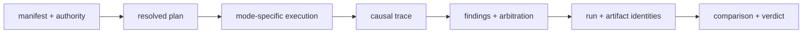

# Interpreting Runtime Evidence

Runtime records several decisions that are often collapsed into “success”:
resolution, authorization, execution, trace finalization, verification,
arbitration, certifiability, persistence, and replay. Interpret each from its
own evidence before deciding what a run establishes.

## Read One Run Verdict

| Review question | Evidence to inspect | Unsafe inference |
| --- | --- | --- |
| What was permitted? | manifest, authority token, mode, policy and environment fingerprints | assuming a completed call was authorized |
| What order was resolved? | immutable plan, dependency graph, dataset and contract identities | treating manifest construction as semantic validation |
| What actually executed? | causal events, step outcomes, tool calls, evidence and artifacts | inferring execution from plan or dry-run records |
| Is the record closed? | finalized trace, terminal fields, checkpoints and store state | treating a readable or partial database row as complete |
| Which checks ran? | complete verification findings, policy fingerprint and arbitration | equating trace finalization with acceptance |
| Can the result be certified? | acceptance, contradiction, entropy and `non_certifiable` state | reducing all outcomes to a Boolean success field |
| Are payloads available? | external content store plus hashes in artifact and evidence metadata | assuming DuckDB contains artifact bytes |
| What did replay decide? | original envelope, retained identities, structured diff and verdict | accepting similar final prose as equivalent execution |

## Bounded Runtime Vocabulary

| Claim | Required evidence | Bound on the claim |
| --- | --- | --- |
| resolved flow | semantically valid manifest, dependency order, identities, and immutable plan | has not necessarily been authorized or executed |
| governed live run | live mode, applicable adapters, policy, authorized effects, verification and finalized trace | covers recorded integrations and declared rules only |
| dry run | synthetic step events and lifecycle evidence | does not exercise lower-package intelligence or live effects |
| observed run | supplied run evidence evaluated under observer policy | cannot reconstruct host activity that was omitted |
| unsafe run | explicit unsafe mode, warning, relaxed guarantees and finalized trace | is not equivalent to governed live execution |
| verified result | complete registered findings and recorded arbitration | does not establish factual or scientific truth |
| resumable run | compatible authority, checkpoint, indices, effect state and store identity | cannot make unrecorded external effects transactional |
| acceptable replay | original envelope and policy admit the retained differences | bounded acceptance is not exact equality |

## Separate Record Closure From Acceptance

Finalization means the trace and required terminal records were closed.
Arbitration determines whether the registered verification results admit the
run under policy. `non_certifiable` means retained evidence cannot support the
requested guarantee. Persist all three so a downstream consumer cannot promote
a weaker state into a stronger one.

The run row retains the policy fingerprint and arbitration decision. Detailed
verification and intervention information may be carried in events, while the
current schema has no dedicated per-engine verification-result or replay
analysis tables. Inspect the event record and typed execution result when that
detail matters.

## Treat Persistence As Identity Custody

DuckDB stores run, dataset, step, event, checkpoint, artifact, evidence,
entropy, tool, and claim projections. Artifact and evidence rows retain hashes
and metadata, not content payloads. Exact inspection or replay therefore also
requires an external content store whose retention, authorization, and hash
verification are bound to the run.

Continue with [invariants](invariants.md) for authority laws,
[known limitations](known-limitations.md) for integration, persistence, replay,
and hosting boundaries, and the [risk register](risk-register.md) for refusal
signals and controls.
