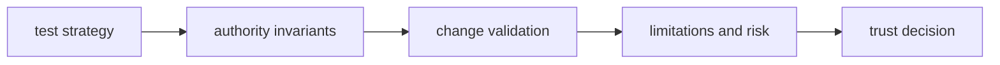

# Quality

Open this section when you need to decide whether governed run behavior is proven strongly enough for acceptance, persistence, and replay to be trusted as authority rather than habit.

## Trust Model

Runtime quality is the proof path behind authority. The section should make it
clear how accepted and replayable runs are tested, which invariants protect the
authority model, and where the package still names limits instead of hiding
them behind a green build.

## Read These First

- open [Test Strategy](https://bijux.io/bijux-canon/06-bijux-canon-runtime/quality/test-strategy/) first when you need the broad proof shape behind runtime authority
- open [Invariants](https://bijux.io/bijux-canon/06-bijux-canon-runtime/quality/invariants/) when the question is what must not drift across acceptance and replay behavior
- open [Change Validation](https://bijux.io/bijux-canon/06-bijux-canon-runtime/quality/change-validation/) when you need the minimum proof for a safe runtime change

## Trust Risk

The main quality risk here is accepting or replaying runs under rules that are weaker in practice than the docs imply.

## First Proof Check

- `tests` and package-local validation surfaces for executable evidence
- invariants, limitations, and risk pages for the trust boundaries that still matter after green checks
- release notes and caller-facing docs when the change alters what readers may safely assume

## Pages In This Section

- [Test Strategy](https://bijux.io/bijux-canon/06-bijux-canon-runtime/quality/test-strategy/)
- [Invariants](https://bijux.io/bijux-canon/06-bijux-canon-runtime/quality/invariants/)
- [Review Checklist](https://bijux.io/bijux-canon/06-bijux-canon-runtime/quality/review-checklist/)
- [Documentation Standards](https://bijux.io/bijux-canon/06-bijux-canon-runtime/quality/documentation-standards/)
- [Definition of Done](https://bijux.io/bijux-canon/06-bijux-canon-runtime/quality/definition-of-done/)
- [Dependency Governance](https://bijux.io/bijux-canon/06-bijux-canon-runtime/quality/dependency-governance/)
- [Change Validation](https://bijux.io/bijux-canon/06-bijux-canon-runtime/quality/change-validation/)
- [Known Limitations](https://bijux.io/bijux-canon/06-bijux-canon-runtime/quality/known-limitations/)
- [Risk Register](https://bijux.io/bijux-canon/06-bijux-canon-runtime/quality/risk-register/)

## Leave This Section When

- leave for [Foundation](https://bijux.io/bijux-canon/06-bijux-canon-runtime/foundation/) when the doubt is really about package ownership rather than proof
- leave for [Interfaces](https://bijux.io/bijux-canon/06-bijux-canon-runtime/interfaces/) when the question is what the contract is rather than whether it is defended
- leave for [Operations](https://bijux.io/bijux-canon/06-bijux-canon-runtime/operations/) when the package already seems trustworthy and the real issue is how to run it repeatably

## Design Pressure

If authority can drift while tests still look healthy, the package becomes
dangerously shallow. This section has to show how trust in verdicts, replay,
and persistence is actually defended.
