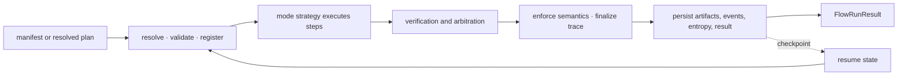

# Invariants

`bijux-canon-runtime` is the authority boundary for composed execution. It
resolves a manifest, chooses mode-specific behavior, records causal events and
entropy use, arbitrates verification, persists resumable state, and returns a
finalized trace.

## Manifest authority

A `FlowManifest` binds the flow and tenant to its determinism level, replay
acceptability, entropy budget, replay envelope, dataset descriptor, agents,
dependencies, retrieval contracts, verification gates, non-determinism intent,
and replay mode. The structure is immutable; semantic validity is enforced
during planning and execution rather than assumed from construction alone.

Execution accepts exactly one authority source: a manifest to resolve or an
already resolved plan. Supplying both or neither is rejected. The configured
determinism level must be explicit.

## Mode invariants

| Mode | Authority and side effects |
| --- | --- |
| `plan` | resolves the manifest and returns the immutable plan without a run identifier, trace, or execution artifacts |
| `dry-run` | executes the dry-run strategy and records the run without performing live package work |
| `live` | performs governed execution and requires verification coverage for reasoning steps |
| `observe` | evaluates an observed run through the observer strategy and records runtime decisions |
| `unsafe` | permits relaxed execution policy but emits a semantic warning and still requires a finalized trace |

Every non-plan mode requires an execution store. Live, observe, and unsafe
modes also require a verification policy. When strict mode is enabled through
the runtime environment, dry-run and unsafe execution are refused.

## Execution lifecycle

Planning is restartable. A persisted execution can resume after its latest
completed step using retained events, evidence, artifacts, tool invocations,
claim identifiers, and entropy usage. Dataset registration, run creation,
persisted writes, and finalization are irreversible boundaries.

## Trace and causality invariants

- An execution result outside plan mode contains a trace.
- A returned trace is finalized and cannot be finalized twice.
- Trace fields are inaccessible before finalization, preventing consumers from
  treating partial state as an authoritative record.
- Events have deterministic indices, causal tags, timestamps, payload hashes,
  and owned authority for append operations.
- Tool invocations, evidence, artifacts, reasoning bundles, claims, entropy
  consumption, and verification decisions remain correlated with the run and
  tenant.
- Live execution verifies each reasoning bundle exactly once or records a
  terminating step/retrieval/reasoning failure.

## Non-determinism invariants

Non-determinism is authorized by intent, bounded by magnitude and budget, and
recorded as entropy usage. Strict execution rejects undeclared or exhausted
entropy. Relaxed configurations generate semantic-violation evidence instead
of silently presenting themselves as strict.

Replay compares the stored envelope, dataset, environment, policy, plan,
events, and declared acceptability. Exact-match policy requires equality;
bounded policies still require the divergence to remain inside the declared
contract.

## Persistence invariants

The DuckDB store applies ordered schema migrations and separates read and write
protocols. It records run registration, resolved steps, checkpoints, events,
artifacts, evidence, tool calls, entropy, replay envelopes, verification, and
final trace state. Resume continues indices from persisted state rather than
restarting an audit trail at zero.

The [test strategy](test-strategy.md) maps these authority claims to contract,
runtime, regression, replay, and crash-recovery evidence.
