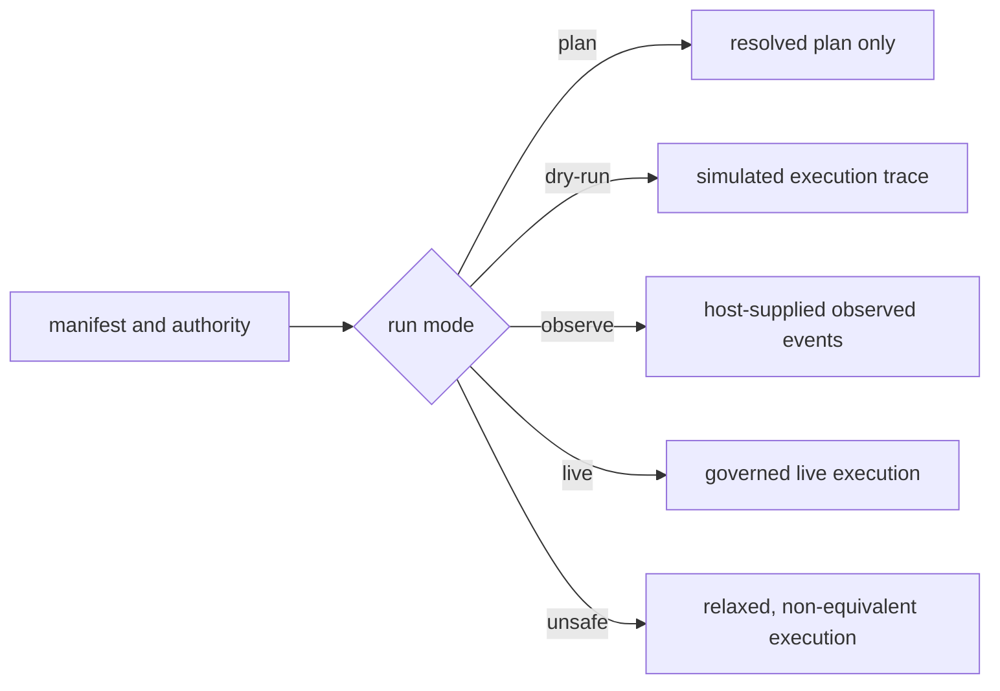

# Known Limitations

`bijux-canon-runtime` makes execution authority, causal history, verification,
and divergence inspectable. It does not make an external tool trustworthy,
turn registered checks into factual truth, or provide distributed isolation and
durability by itself.

## Mode Guarantees

| Mode | Package output | Claim that must not be made |
| --- | --- | --- |
| `plan` | resolved immutable plan; no execution trace or run ID | that any tool ran, side effect was authorized, or result was verified |
| `dry-run` | simulated events, artifacts, and persisted lifecycle evidence | that live permissions, latency, provider behavior, or side effects were exercised |
| `observe` | governance over events supplied by the host | that omitted host activity was reconstructed or controlled |
| `live` | execution under declared authority, determinism, verification, and persistence contracts | that external content is true or external effects are transactionally reversible |
| `unsafe` | explicit relaxed execution with finalized evidence | equivalence to a governed live run or eligibility for certification |

Non-plan runs require an explicit execution store. Live, observe, and unsafe
execution also require the applicable verification policy. Defaults select
behavior; they do not create hidden databases, credentials, or deployment
resources.

## Canonical Live Composition

The live step executors currently resolve four package-root callables that the
canonical packages do not provide in the required form:

| Boundary | Runtime expects | Current canonical surface |
| --- | --- | --- |
| agent | `bijux_canon_agent.run(...)` returning artifact dictionaries | root exports only `API_VERSION`; native execution returns `PipelineResult` and `RunTrace` |
| retrieval | `bijux_canon_ingest.retrieve(query, top_k, scope, vector_contract_id)` | native retrieval is index-path based and returns typed candidates |
| vector enforcement | `bijux_canon_index.enforce_contract(contract_id, evidence)` | no root callable; native decision carries plans, capability, budget, provenance and refusal |
| reasoning | `bijux_canon_reason.reason(...)` returning runtime `ReasoningBundle` | no root callable; native models are reason-owned claims, support, traces and reports |

The preserved `bijux-agent`, `bijux-rag`, `bijux-vex`, and `bijux-rar` roots
delegate to those canonical surfaces and do not add missing adapters. Runtime
tests that inject seam-specific callables establish executor, verification,
replay, and failure behavior; they do not establish installed-package
composition.

Plan, dry-run, and observe remain useful because they do not invoke lower-
package intelligence in the same way. A live composition claim requires an
installed-package test that executes the applicable adapters and preserves
source, contract, evidence, claim, trace, artifact, and failure identities.

## Replay Is Evidence-Bounded

Strict replay is a refusal policy over the captured envelope. It can detect
differences in recorded authority, plan, policy fingerprint, dataset descriptor,
environment fingerprint, entropy use, events, tools, and artifacts. It cannot
compare a field that was never captured or recover an external artifact that
was deleted.

A seed cannot control provider upgrades, mutable remote data, wall-clock
services, parallel hardware, unversioned tools, or hidden host state. Bounded
acceptability permits only the differences declared in the original replay
policy; it must not be selected retrospectively after seeing a favorable
result. Human intervention is replayable only when the decision and its
meaning-bearing input are retained as governed events.

## Verification Is Not Truth Certification

A passing arbitration establishes that registered structural, epistemic,
budget, evidence, artifact, and policy rules produced the recorded decision. It
does not establish scientific truth, legal compliance, model calibration, or
completeness of the rule registry. Permissive arbitration and verification
failure modes are policy choices and must remain visible with the
`non_certifiable` classification.

The host remains responsible for deciding which rules are mandatory for the
use case and whether acting on a verified claim is allowed.

## Persistence And Recovery

DuckDB is a durable local execution store with migrations and a filesystem
single-writer guard. It is not a replicated service, consensus system, or
multi-region event log. Copying or editing the database outside the protocol
bypasses its lock and append-only expectations.

Checkpoints are written after successful steps. An external side effect can
occur before its corresponding checkpoint becomes durable. Runtime cannot
atomically commit its DuckDB transaction and a provider call, filesystem
mutation, or remote database write. Resumable integrations therefore require
idempotency identity, deduplication, or compensation at the executor boundary.

The single-writer guard uses exclusive creation of a lock file and records the
writer process ID. Stale-lock recovery tests that PID for liveness. This model
assumes a local filesystem and a shared interpretation of process IDs; it is
not a safe coordination protocol across hosts, containers with independent PID
namespaces, or filesystems whose create and visibility semantics are unsuitable
for locking.

## Artifact Availability

The default artifact registry is in memory, and the `ArtifactStore` protocol
stores metadata rather than payload bytes. DuckDB likewise persists artifact
identity, hash, scope, producer, and parent edges but not content. A completed
run can therefore remain structurally readable after the process exits while
its artifact payloads are unavailable.

For durable execution, the host must provide a content store with atomic
publication, hash verification, tenant authorization, retention, and garbage
collection tied to run retention. Replay can compare retained content hashes;
it cannot reconstruct missing bytes from those hashes.

Artifact payloads and the execution database require host-level backup,
encryption, retention, access control, integrity monitoring, and capacity
management. Tenant identifiers in records are not filesystem or database
isolation.

## HTTP And CLI Posture

The HTTP application publishes request and response schemas, health, readiness,
header validation, and failure envelopes. `/api/v1/flows/run` and
`/api/v1/flows/replay` currently return `501 Not Implemented` after header
validation. Schema presence is not executable capability; clients must not use
those endpoints for production execution or replay.

The CLI supplies working execution and inspection paths, but several commands
are suppressed from top-level argparse help, including operational commands
documented in the command reference. Help output is therefore not a complete
capability inventory.

## Deployment Boundary

Runtime is not a process sandbox, queue, cluster scheduler, identity provider,
or secret manager. Execute untrusted tools behind operating-system or container
isolation; enforce tenant access outside the in-process authority token; and
keep credentials out of manifests, traces, replay envelopes, artifacts, and
diagnostic events.

See the [risk register](risk-register.md) for failure signals and controls, and
the [test strategy](test-strategy.md) for executable evidence.
