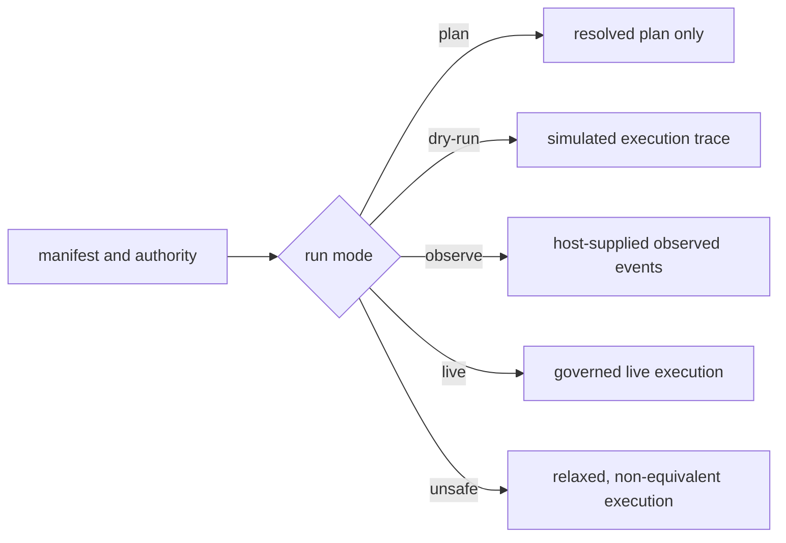

# Known Limitations

`bijux-canon-runtime` makes execution authority, causal history, verification,
and divergence inspectable. It does not make an external tool trustworthy,
turn registered checks into factual truth, or provide distributed isolation and
durability by itself.

## Mode Guarantees

| Mode | Package output | Claim that must not be made |
| --- | --- | --- |
| `plan` | resolved immutable plan; no execution trace or run ID | that any tool ran, side effect was authorized, or result was verified |
| `dry-run` | simulated events, artifacts, and persisted lifecycle evidence | that live permissions, latency, provider behavior, or side effects were exercised |
| `observe` | governance over events supplied by the host | that omitted host activity was reconstructed or controlled |
| `live` | execution under declared authority, determinism, verification, and persistence contracts | that external content is true or external effects are transactionally reversible |
| `unsafe` | explicit relaxed execution with finalized evidence | equivalence to a governed live run or eligibility for certification |

Non-plan runs require an explicit execution store. Live, observe, and unsafe
execution also require the applicable verification policy. Defaults select
behavior; they do not create hidden databases, credentials, or deployment
resources.

## Installed Composition Boundary

Runtime v2 composes the canonical packages through domain application services
and retains their results in one causal artifact graph. This does not make all
profiles equivalent:

- `offline-lexical` is complete in the base wheel and schedules no model or
  dense operation;
- dense and hybrid work requires the `local-cpu` extra, a pinned materialized
  model, compatible native backends, and a validated vector dimension;
- model acquisition is explicitly networked, while validation and reuse can be
  network-disabled;
- the optional hosted-provider surface is not required for core acceptance and
  must not be inferred from local provider abstractions;
- the legacy manifest execution API remains a compatibility surface; new
  whole-product integrations use Runtime v2.

## Replay Is Evidence-Bounded

Strict replay is a refusal policy over the captured envelope. It can detect
differences in recorded authority, plan, policy fingerprint, dataset descriptor,
environment fingerprint, entropy use, events, tools, and artifacts. It cannot
compare a field that was never captured or recover an external artifact that
was deleted.

A seed cannot control provider upgrades, mutable remote data, wall-clock
services, parallel hardware, unversioned tools, or hidden host state. Bounded
acceptability permits only the differences declared in the original replay
policy; it must not be selected retrospectively after seeing a favorable
result. Human intervention is replayable only when the decision and its
meaning-bearing input are retained as governed events.

## Verification Is Not Truth Certification

A passing arbitration establishes that registered structural, epistemic,
budget, evidence, artifact, and policy rules produced the recorded decision. It
does not establish scientific truth, legal compliance, model calibration, or
completeness of the rule registry. Permissive arbitration and verification
failure modes are policy choices and must remain visible with the
`non_certifiable` classification.

The host remains responsible for deciding which rules are mandatory for the
use case and whether acting on a verified claim is allowed.

## Persistence And Recovery

DuckDB and the workspace CAS form a durable local authority with migrations,
job transitions, causal artifacts, and governed backup/restore. They are not a
replicated service, consensus system, or multi-region event log. Copying or
editing either store outside the protocol bypasses its identity and integrity
checks.

Checkpoints are written after successful steps. An external side effect can
occur before its corresponding checkpoint becomes durable. Runtime cannot
atomically commit its DuckDB transaction and a provider call, filesystem
mutation, or remote database write. Resumable integrations therefore require
idempotency identity, deduplication, or compensation at the executor boundary.

The single-writer guard uses exclusive creation of a lock file and records the
writer process ID. Stale-lock recovery tests that PID for liveness. This model
assumes a local filesystem and a shared interpretation of process IDs; it is
not a safe coordination protocol across hosts, containers with independent PID
namespaces, or filesystems whose create and visibility semantics are unsuitable
for locking.

## Artifact Availability

The installed v2 composition publishes immutable payloads to the workspace CAS
and metadata plus causal edges to DuckDB. New-format inspection fails closed
when a required payload, edge, locator or digest is missing. Legacy runs created
before source-archive retention may report `legacy-unresolved`; that status is
not equivalent to verified provenance.

Runtime backup authenticates admitted payloads and the workspace database, but
the host still owns encryption, retention, access control, integrity monitoring
and capacity. Tenant identifiers in records are not filesystem or database
isolation. Hashes cannot reconstruct deliberately deleted bytes.

## HTTP And CLI Posture

The installed server exposes Runtime v2 only and defaults to loopback. It has
no built-in authentication, tenant authorization, TLS termination, sandboxing,
distributed quota, or multi-writer coordination. Durable submissions require
idempotency identities, and result, inspection and artifact payloads use
explicit bounded follow-up reads.

The CLI advertises `init` and the complete local-first `v2` group. The older
manifest commands and v1 ASGI module remain compatibility surfaces but are not
the primary product workflow. The explicitly hosted v1 run and replay routes
remain unimplemented; the installed server does not mount them.

## Deployment Boundary

Runtime is not a process sandbox, cluster scheduler, identity provider, TLS
terminator, or secret manager. Execute untrusted tools behind operating-system or container
isolation; enforce tenant access outside the in-process authority token; and
keep credentials out of manifests, traces, replay envelopes, artifacts, and
diagnostic events.

See the [risk register](risk-register.md) for failure signals and controls, and
the [test strategy](test-strategy.md) for executable evidence.
