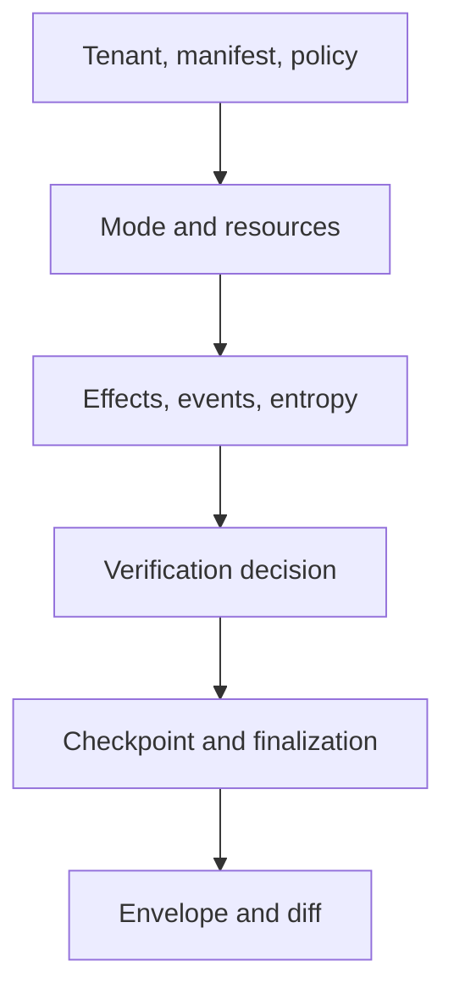

# Runtime Authority Review

Review follows authority from manifest admission through persisted replay.
Every irreversible effect and acceptance decision must have an owner and a
retained record.

## Authority and execution

- Are tenant, dataset, determinism, replay, entropy, agent, dependency, and
  verification identities explicit in the manifest?
- Does planning reject semantic contradictions rather than relying on model
  construction alone?
- Does the selected mode permit exactly the observed effects and require the
  correct store and policy resources?
- Are unsafe or relaxed outcomes visibly non-equivalent to governed live work?

## Effects, verification, and entropy

- Is every effect authorized before execution and tied to an idempotency key or
  explicit unknown state across the checkpoint gap?
- Do event indices, causal tags, artifacts, evidence, claims, tools, and entropy
  remain correlated with run and tenant?
- Are undeclared or exhausted entropy refused under strict execution?
- Are immutable verification findings separated from policy arbitration and
  certifiability?

## Persistence and recovery

- Does the store enforce migrations, one-writer discipline, tenant isolation,
  and finalized-trace immutability?
- Can partial, corrupt, hostile, or incompatible state be refused precisely?
- Does resume continue persisted event and entropy indices after the latest
  completed checkpoint?
- Can recovery distinguish an effect that failed, completed, or may have
  completed before local persistence?

## Replay and interfaces

- Does replay bind the original dataset, plan, policy, environment, entropy,
  envelope, and acceptability rule?
- Are verdict and reason asserted together, with acceptable and blocking diffs
  retained?
- Does cross-process replay rely only on durable state?
- Do HTTP tests prove actual health, readiness, and unimplemented endpoint
  behavior rather than only schema shape?

Conclude with [governed run acceptance](definition-of-done.md) and
[known limitations](known-limitations.md).
