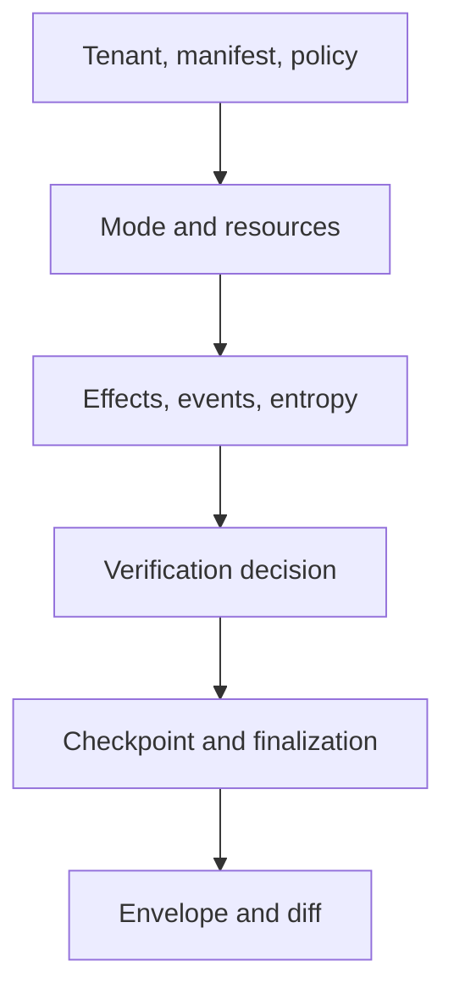
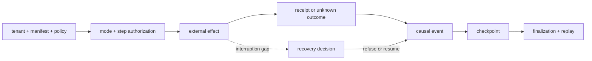

# Runtime Authority Review

Review follows authority from manifest admission through persisted replay.
Every irreversible effect and acceptance decision must have an owner and a
retained record.

## Audit the first irreversible effect

Choose the earliest external effect in the candidate trace. Audit backward to
the authority that permitted it and forward to the final replay decision:

The audit passes only when:

- tenant, manifest, plan, mode, policy, step, and effect identities agree;
- authorization precedes execution and the receipt records success, failure,
  or an explicit unknown outcome;
- the idempotency or compensation rule survives interruption before the next
  checkpoint;
- event and entropy indices continue monotonically through resume; and
- finalization and replay retain the effect rather than reconstructing a more
  favorable history.

Repeat the audit for each distinct effect class and for any effect whose
outcome was initially unknown.

## Hostile and recovery cases

| Mutation or fault | Review expectation |
| --- | --- |
| authority token names another tenant | refusal before store access, tool use, or artifact disclosure |
| manifest or policy changes after planning | identity mismatch; the old plan is not executed under new authority |
| process stops after an effect but before its checkpoint | unknown-outcome recovery uses idempotency, deduplication, compensation, or refusal |
| event index is duplicated or reordered | persistence refuses the causal-history violation |
| entropy is undeclared or exhausted | strict execution refuses instead of inventing deterministic authority |
| mandatory verification is missing or contradictory | explicit non-certifiable or rejected disposition |
| artifact metadata survives but payload bytes do not | availability failure; a hash is not treated as recovered content |
| DuckDB schema is incompatible or state is corrupt | precise migration or load refusal without partial authority |
| replay uses a changed dataset or environment | blocking identity or envelope diff with verdict and reason |
| canonical live adapter is absent or incompatible | composition refusal; seam-injected success is not substituted |

## Authority and execution

- Are tenant, dataset, determinism, replay, entropy, agent, dependency, and
  verification identities explicit in the manifest?
- Does planning reject semantic contradictions rather than relying on model
  construction alone?
- Does the selected mode permit exactly the observed effects and require the
  correct store and policy resources?
- Are unsafe or relaxed outcomes visibly non-equivalent to governed live work?

## Effects, verification, and entropy

- Is every effect authorized before execution and tied to an idempotency key or
  explicit unknown state across the checkpoint gap?
- Do event indices, causal tags, artifacts, evidence, claims, tools, and entropy
  remain correlated with run and tenant?
- Are undeclared or exhausted entropy refused under strict execution?
- Are immutable verification findings separated from policy arbitration and
  certifiability?

## Persistence and recovery

- Does the store enforce migrations, one-writer discipline, tenant isolation,
  and finalized-trace immutability?
- Can partial, corrupt, hostile, or incompatible state be refused precisely?
- Does resume continue persisted event and entropy indices after the latest
  completed checkpoint?
- Can recovery distinguish an effect that failed, completed, or may have
  completed before local persistence?

## Replay and interfaces

- Does replay bind the original dataset, plan, policy, environment, entropy,
  envelope, and acceptability rule?
- Are verdict and reason asserted together, with acceptable and blocking diffs
  retained?
- Does cross-process replay rely only on durable state?
- Do HTTP tests prove actual health, readiness, and unimplemented endpoint
  behavior rather than only schema shape?

Conclude with [governed run acceptance](definition-of-done.md) and
[known limitations](known-limitations.md).
