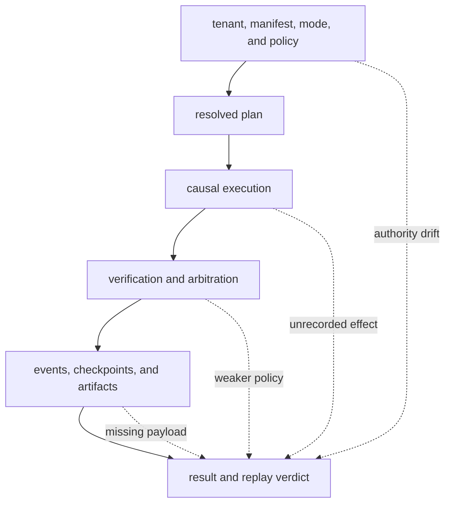
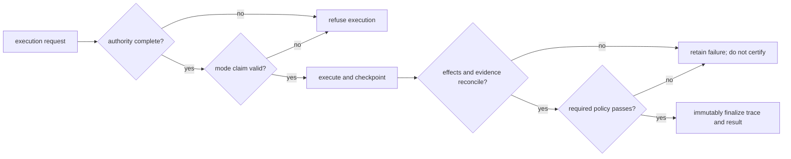

# Risk Register

Runtime is the admission boundary for composed execution. Its highest-severity
failure is false acceptance: a run is presented as governed, certifiable,
resumable, or replayable although the authority, dataset, policy, external
effects, or retained evidence no longer describes one causal history.

## Authority To Verdict

## Persistent Risks

| Hazard | Severity | Detection signal | Required control | Residual owner |
| --- | --- | --- | --- | --- |
| tenant, manifest, mode, or policy changes during resume | critical | persisted authority identity differs from the resume request | bind authority and plan identity to run, checkpoint, and replay envelope; refuse mismatch | service operator |
| plan output is treated as an executed run | critical | result has no run ID or trace but is displayed as completed | preserve mode and require execution evidence for execution claims | API consumer |
| dry-run or observe is treated as live effect evidence | critical | trace mode does not match the claim or host events are incomplete | retain mode in every result and label simulated or observed provenance | application owner |
| unsafe output is promoted to certifiable success | critical | unsafe mode or `non_certifiable` is absent from downstream presentation | make certification classification mandatory at release | decision owner |
| dataset identity resolves to changed content or state | critical | dataset version, state, hash, tenant, or storage reference differs | bind complete dataset descriptor and refuse mismatched resume or replay | data owner |
| entropy or environment influence is omitted | high | observed nondeterminism has no authorized source, intent, or budget entry | fingerprint environment; declare entropy intent and enforce budget | executor owner |
| replay tolerance is widened after output is known | critical | replay policy differs from the original manifest or envelope | bind acceptability before execution and treat mismatch as authority failure | policy owner |
| verification or arbitration is presented as factual truth | critical | accepted status lacks rule coverage or is used beyond declared semantics | retain rules, findings, coverage, arbitration, and non-certifiable state | decision owner |
| DuckDB single-writer discipline is bypassed | critical | lock, schema, causal indices, hashes, or checkpoints are inconsistent | access through guarded stores; validate schema and run invariants | storage operator |
| an external effect occurs across a checkpoint gap | critical | provider records an effect with no matching durable invocation or checkpoint | require idempotency key, deduplication, or compensation before admitting the executor | integration owner |
| artifact metadata remains but payload is missing or corrupt | critical | payload cannot be resolved or its digest differs | verify payload before use; back up metadata and content as one retention unit | artifact owner |
| finalized trace is mutated or extended | critical | terminal hash, event count, causal order, or linked artifacts change | enforce trace immutability and create a linked corrective run | store administrator |
| HTTP schema is mistaken for working run or replay capability | high | client receives `501` after successful schema and header validation | gate integration on behavioral readiness, not OpenAPI presence | client owner |
| tenant or secret isolation is inferred from in-process contracts | critical | host access permits cross-tenant files, database rows, tools, or credentials | enforce OS, database, network, and secret boundaries outside runtime | deployment operator |

## Admission And Finalization Gate

An admitted executor must declare its effect class, idempotency behavior,
credential scope, entropy sources, artifact protocol, and failure mapping.
Finalization must reconcile planned and completed steps, tool invocations,
effects, evidence, claims, verification results, arbitration, artifacts, and the
latest checkpoint before the trace becomes immutable.

## Evidence Required By Change

- Authority, manifest, or mode changes require misuse, cross-tenant, missing
  policy, incompatible resume, and explicit refusal scenarios.
- Executor or checkpoint changes require idempotency, partial effect, crash,
  resume, duplicate invocation, compensation, and event-order evidence.
- Dataset and artifact changes require identity evolution, missing payload,
  corruption, hostile store, retention, and replay-mismatch evidence.
- Determinism changes require environment drift, undeclared entropy, budget
  exhaustion, canary, exact and bounded replay, and policy-mismatch tests.
- Verification changes require rule coverage, contradiction, permissive and
  strict arbitration, failure mapping, and non-certifiable propagation.
- Store changes require migrations, single-writer conflict, interrupted write,
  causal reconstruction, immutable finalization, and cross-process reads.
- HTTP changes require behavioral endpoint tests in addition to schema and
  failure-envelope snapshots; `501` remains the authority until execution is
  actually wired.

Runtime can prove only what its authority and retained evidence cover. Host
isolation, payload durability, secret management, external effect safety, and
truth evaluation remain deployment responsibilities; missing evidence requires
a narrower claim or a refusal.

See [known limitations](known-limitations.md) for unsupported claims and
[architecture risks](../architecture/architecture-risks.md) for failure
mechanisms.
