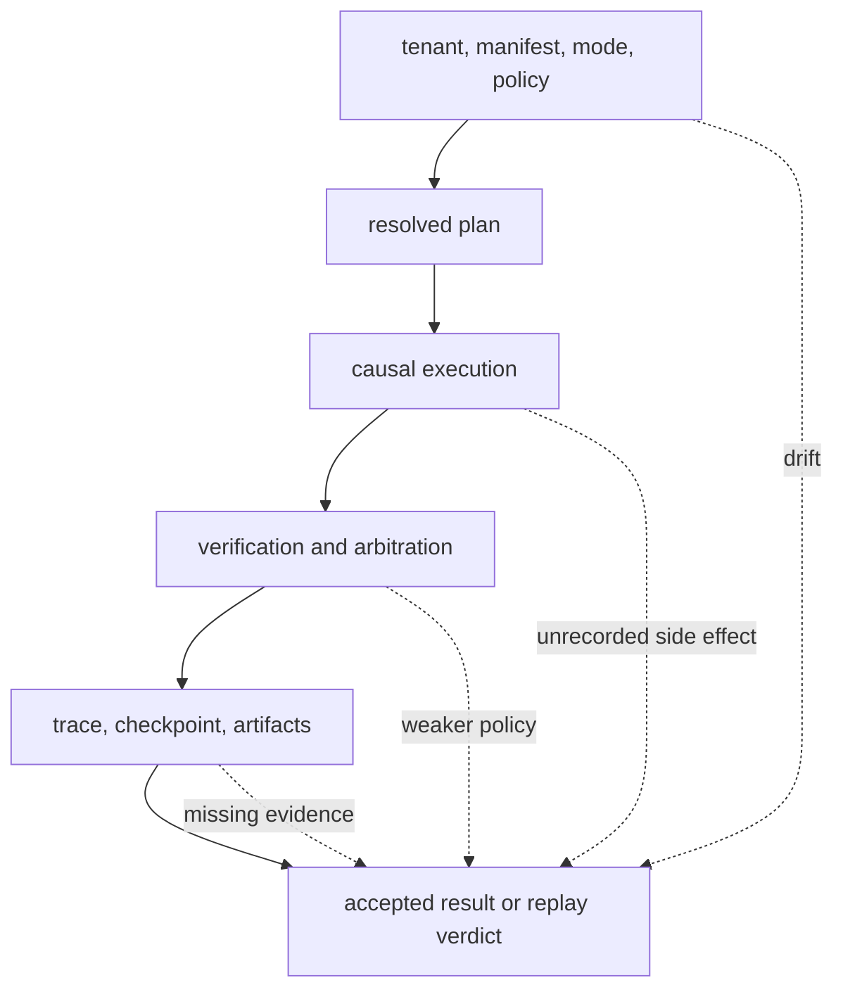
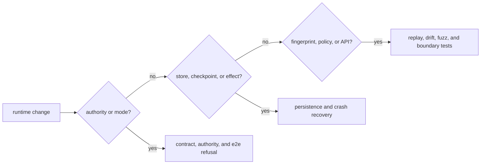

# Risk Register

Runtime authorizes and retains composed execution. Its central risk is false
acceptance: a run is reported as governed, resumable, or replayable even though
its authority, dataset, effects, verification policy, or artifacts no longer
match the recorded history.

## Risk Topology

## Active Risks And Controls

| Risk | Consequence | Preventive control | Detection evidence | Residual exposure |
| --- | --- | --- | --- | --- |
| tenant, manifest, mode, or policy changes during resume | two authority contracts are joined into one history | bind authority identity to plan, store, and replay envelope | authority-abuse, policy, preparation, and replay-mismatch tests | deployment credentials and access policy remain external |
| `unsafe` output is promoted to certified success | relaxed execution appears to satisfy live verification | retain mode and `non_certifiable` state in final evidence | flow execution, verification-policy, and compatibility tests | downstream presentation can discard the classification |
| dataset name resolves to different bytes or state | replay operates on changed evidence | retain version, state, hash, and storage reference | dataset contract, transition, evolution, and replay-mismatch tests | mutable remote sources can change or disappear |
| artifact metadata survives but payload is missing or corrupt | trace is readable but cannot support the original claim | hash payloads and guard artifact-store protocol | artifact contract, store guard, hostile-store, and replay tests | external payload durability is deployment-owned |
| entropy or environment influence is omitted | exact replay is claimed for uncontrolled variance | authorize nondeterminism, budget entropy, and fingerprint environment | entropy intent/budget/canary, strict determinism, and temporal-drift tests | providers and parallel hardware may remain nondeterministic |
| bounded replay policy is changed after observing output | tolerated divergence is chosen retrospectively | bind replay policy in the original manifest and envelope | replay acceptability, policy mismatch, envelope, and fuzz tests | semantic tolerance still requires domain judgment |
| verification or arbitration is mistaken for truth | registered checks imply factual or scientific correctness | retain rules, coverage, findings, and arbitration decision | contradiction, reasoning-content, arbitration, and verification-failure tests | completeness and truth remain outside runtime proof |
| DuckDB single-writer discipline is bypassed | causal order, checkpoints, or schema state corrupt | guarded writer lock and schema migrations | store round trip, migration, crash recovery, and cross-process replay | copying or editing database files bypasses the protocol |
| external effect occurs across a checkpoint gap | recovery repeats or loses a non-idempotent action | require executor idempotency, deduplication, or compensation | stateful-executor, partial-failure, and crash-recovery tests | runtime cannot transact an external provider call with its database |
| terminal trace is mutated or extended | retained evidence no longer describes the accepted run | immutable finalized trace and linked corrective runs | trace immutability, causality, diff, and invariant snapshot tests | privileged storage mutation remains possible outside the API |
| HTTP schema is mistaken for implemented execution | clients depend on run/replay endpoints that return `501` | document endpoint posture and test actual responses | HTTP contract and schema stability tests | schema presence can still mislead clients that skip behavior checks |

## Evidence Routing

Changes frequently traverse all three routes. Adding an execution event, for
example, can affect authority checks, store migration, causal reconstruction,
fingerprints, replay differences, and public result rendering.

## Operational Interpretation

Runtime can prove that declared policies governed recorded inputs and effects
within its retained boundary. Deployment owners still provide filesystem and
tenant isolation, payload durability, secret management, executor idempotency,
and controls for external services. Missing deployment evidence requires a
narrower claim or refusal.

Use [architecture risks](../architecture/architecture-risks.md) for failure
mechanisms, [test strategy](test-strategy.md) for executable evidence, and
[known limitations](known-limitations.md) for current interface and deployment
constraints.
