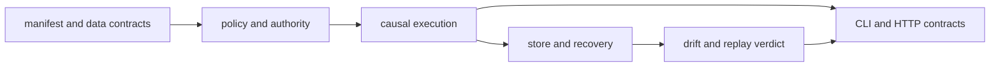

# Test Strategy

Runtime tests are organized around authority failures: invalid manifests,
undeclared entropy, incomplete verification, mutable traces, corrupt stores,
environment drift, and unacceptable replay. The suite checks refusal paths as
carefully as successful execution.

## Evidence Layers

The proof chain requires both success and refusal evidence. A test that only
executes a flow cannot establish that changed authority, missing artifacts, or
unacceptable variance would be rejected.

| Test family | Principal claim |
| --- | --- |
| `tests/unit/contracts/` | manifests, dependencies, datasets, artifacts, resolved flows, and execution plans enforce structural contracts |
| `tests/unit/model/` | flow/plan models remain immutable and execution traces expose state only after finalization |
| `tests/unit/runtime/` | authority, event causality, entropy, strict determinism, budgets, persistence, resume, trace diff, and verification policy behave locally |
| `tests/e2e/` | a manifest resolves and executes in order while environment, reasoning, contract, and verification failures are refused |
| `tests/regression/` | replay, drift, crash recovery, partial failure, adversarial stores, long runs, and compatibility remain stable across composed behavior |
| `tests/smoke/` | the DuckDB store completes a real write/read round trip |
| `tests/api/` and `tests/unit/api/` | checked-in schema, HTTP inputs, outputs, and error contracts remain stable |

## Authority matrix

| Change | Minimum focused evidence |
| --- | --- |
| manifest or plan field | model/contract tests, dependency resolution, and golden execution plan |
| run-mode behavior | preparation/strategy tests and the matching end-to-end flow |
| determinism or entropy rule | strict-determinism, authorization-intent, budget DB, entropy canary, and replay tests |
| event or trace field | event-causality, trace immutability/diff, system snapshot, and replay envelope tests |
| verification rule or arbitration | authority policy, contradiction, reasoning-content, arbitration, and verification-failure tests |
| execution-store schema | migration, persistence, DuckDB round trip, crash recovery, and cross-process replay |
| resume behavior | persistence/resume tests, stateful executor, partial failure, and crash recovery |
| replay acceptance | equivalence, policy mismatch, dataset/environment drift, fuzzing, and replay acceptability tests |
| API shape | HTTP contract tests and schema stability/freeze checks |

## Replay evidence

Replay has multiple independent canaries:

- canonical envelope hashes detect serialization or input drift;
- exact-equivalence tests compare governed outputs;
- structured trace diff identifies the earliest divergent step;
- dataset and environment tests require refusal when pinned context changes;
- policy-mismatch tests prevent a run from being judged under a different
  acceptance contract;
- cross-process and DuckDB tests prove that replay does not depend on transient
  in-memory state;
- fuzz tests vary recorded evidence and demand stable classification.

A replay test must assert the verdict and the reason. Merely completing without
an exception can hide a downgrade from exact match to tolerated divergence.

## Recovery evidence

Crash-recovery and partial-failure tests persist execution incrementally,
reopen the store, reconstruct indices and entropy state, and continue from the
last checkpoint. Hostile-store tests ensure the runtime refuses behavior that
violates the write protocol. Long-horizon and stress flows check that event,
claim, evidence, and entropy correlation does not decay over many steps.

These tests cover runtime bookkeeping around supplied executors. An external
side effect still needs an idempotency contract at its own integration boundary.

## Regression standard

Place a regression at the authority layer that should have refused the bad
state: contract, planner, executor, verifier, trace, or store. Add end-to-end
coverage when a credible-looking `FlowRunResult` could have escaped. Add replay
coverage whenever the changed data participates in a fingerprint, envelope,
dataset descriptor, policy decision, or persisted trace.

## Claims Outside The Test Boundary

The suite does not make external side effects transactional, enforce host or
tenant isolation, prove factual truth, or guarantee exact replay when a
provider, dataset, tool, or environment was not fully captured. Those claims
require integration-owned idempotency, deployment controls, retained payloads,
and explicit environment evidence.
