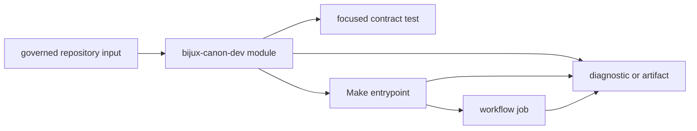

# bijux-canon-dev

`bijux-canon-dev` is the repository's maintenance-policy implementation. It
turns rules about APIs, documentation, dependencies, security, supply-chain
evidence, and publication into importable Python modules with focused tests.
Make targets and workflows call those modules; product applications do not.

## Control Path

The helper is the decision owner. Make supplies a stable local command and
environment. A workflow decides when and with which permissions that command
runs. Tests protect the rule independently of either orchestration layer.

## Module Ownership

| Module | Governs | Typical caller | Evidence |
| --- | --- | --- | --- |
| `api.freeze_contracts` | OpenAPI pins and schema hashes across canonical packages | `makes/api-freeze.mk` | pin/hash comparison and focused API-freeze tests |
| `api.openapi_drift` | checked-in schema versus application-generated schema | package API Make profiles | generated schema and drift verdict |
| `docs.mkdocs_config` | effective MkDocs configuration and generated reference inputs | root docs targets | rendered configuration and strict build result |
| `docs.repository_docs_catalog` | public documentation inventory and generated API references | docs preparation | generated reference tree and publication tests |
| `docs.badge_sync` | generated badge blocks in repository readmes | `make sync-badges`, `make check-badges` | source-to-rendered comparison |
| `quality.deptry_scan` | dependency declarations and import use | quality targets | filtered dependency report and exit status |
| `security.pip_audit_gate` | repository vulnerability policy over audit results | security targets | normalized audit verdict |
| `release.publication_guard` | package eligibility and publication metadata | release Make surfaces | package/version acceptance or explicit refusal |
| `release.version_resolver` | version used by build and SBOM operations | build, publication, SBOM targets | resolved SCM version |
| `sbom.requirements_writer` | dependency input for SBOM generation | SBOM targets | package-specific requirements file |
| `packages.*` | agent hygiene, index plugin contracts, runtime dependency allowlist | package profiles | package-bound diagnostics |
| `trusted_process` | validated execution of repository-owned absolute commands | version, quality, and package-maintenance helpers | completed process or typed command failure |

These modules are invoked with `python -m ...` from checked-in Make fragments;
the package does not publish a general-purpose console command. That keeps each
rule independently callable without inventing a catch-all maintainer CLI.

## Evidence Chain For A Failure

When a repository gate refuses a change, retain the complete chain:

1. the exact governed input, such as a schema, package manifest, audit report,
   or documentation tree;
2. the helper module and arguments that evaluated it;
3. the focused test that defines the intended rule;
4. the Make target or workflow job that supplied execution context;
5. the exit status and diagnostic artifact under `artifacts/`.

Changing only the workflow presentation cannot repair a helper rule. Likewise,
a direct helper invocation can prove the rule but not that CI triggers it with
the intended permissions and dependencies.

## Reader Routes

| Question | Continue with |
| --- | --- |
| Which behavior belongs in this maintenance package? | [Package overview](package-overview.md) and [scope and non-goals](scope-and-non-goals.md) |
| Where is a helper implemented? | [Module map](module-map.md) |
| Which check protects quality or dependencies? | [Quality gates](quality-gates.md) |
| How are audit results evaluated? | [Security gates](security-gates.md) |
| How do schema source, pins, hashes, and generated output relate? | [Schema governance](schema-governance.md) |
| How are versions and publication eligibility resolved? | [Release support](release-support.md) |
| How are SBOM inputs and outputs produced? | [SBOM and supply chain](sbom-and-supply-chain.md) |
| What rules apply when adding a helper? | [Operating guidelines](operating-guidelines.md) |

## Boundary

`bijux-canon-dev` may inspect product packages and invoke their public
validation surfaces, but it must not become a runtime dependency or a hidden
home for product semantics. A rule that changes how ingest prepares content,
index executes a request, reason evaluates support, agent orchestrates roles, or
runtime admits a run belongs in that canonical package.
