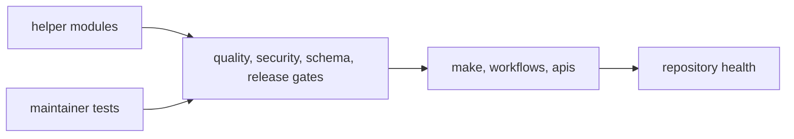

# bijux-canon-dev

`bijux-canon-dev` is the maintainer package for repository health. It keeps
schema drift checks, release guards, supply-chain helpers, docs publication
contracts, and repository-wide validation logic in one place outside the
end-user product surface.

That boundary matters. Hidden maintainer policy weakens trust quickly, so the
package should make repository rules inspectable in helper modules, tests, and
explicit integration points.

## Package Model

This page should make `bijux-canon-dev` feel like a real package with a clear
operating role, not just a bin for repository glue. Helper modules define the
rules, tests prove them, and checked-in integration points show where those
rules actually get enforced.

## What Maintainers Should Expect Here

- helper code that explains repository policy in Python rather than in shell fragments
- tests that prove the helper package is enforcing the intended contract
- visible integration seams back into `make`, workflows, docs, schemas, and release gates

## Package Pages

- [Package Overview](https://bijux.io/bijux-canon/07-bijux-canon-maintain/bijux-canon-dev/package-overview/)
- [Scope and Non-Goals](https://bijux.io/bijux-canon/07-bijux-canon-maintain/bijux-canon-dev/scope-and-non-goals/)
- [Module Map](https://bijux.io/bijux-canon/07-bijux-canon-maintain/bijux-canon-dev/module-map/)
- [Quality Gates](https://bijux.io/bijux-canon/07-bijux-canon-maintain/bijux-canon-dev/quality-gates/)
- [Security Gates](https://bijux.io/bijux-canon/07-bijux-canon-maintain/bijux-canon-dev/security-gates/)
- [Schema Governance](https://bijux.io/bijux-canon/07-bijux-canon-maintain/bijux-canon-dev/schema-governance/)
- [Release Support](https://bijux.io/bijux-canon/07-bijux-canon-maintain/bijux-canon-dev/release-support/)
- [SBOM and Supply Chain](https://bijux.io/bijux-canon/07-bijux-canon-maintain/bijux-canon-dev/sbom-and-supply-chain/)
- [Operating Guidelines](https://bijux.io/bijux-canon/07-bijux-canon-maintain/bijux-canon-dev/operating-guidelines/)

## Start With

- Open [Package Overview](https://bijux.io/bijux-canon/07-bijux-canon-maintain/bijux-canon-dev/package-overview/) for the shortest statement of what the
  maintainer package owns.
- Open [Module Map](https://bijux.io/bijux-canon/07-bijux-canon-maintain/bijux-canon-dev/module-map/) when you need the code layout first.
- Open [Quality Gates](https://bijux.io/bijux-canon/07-bijux-canon-maintain/bijux-canon-dev/quality-gates/), [Security Gates](https://bijux.io/bijux-canon/07-bijux-canon-maintain/bijux-canon-dev/security-gates/), or [Schema Governance](https://bijux.io/bijux-canon/07-bijux-canon-maintain/bijux-canon-dev/schema-governance/) when the question is an enforcement rule.
- Open [Release Support](https://bijux.io/bijux-canon/07-bijux-canon-maintain/bijux-canon-dev/release-support/) or [SBOM and Supply Chain](https://bijux.io/bijux-canon/07-bijux-canon-maintain/bijux-canon-dev/sbom-and-supply-chain/) when the concern is publication or provenance.

## Module Roots

- `src/bijux_canon_dev/api` for schema drift and API freeze helpers
- `src/bijux_canon_dev/quality` for repository quality checks
- `src/bijux_canon_dev/security` for audit gates
- `src/bijux_canon_dev/release` for publication guards and version resolution
- `src/bijux_canon_dev/sbom` for requirements and SBOM support
- `src/bijux_canon_dev/docs` for docs publication and badge support

## Proof Path

- `packages/bijux-canon-dev/src/bijux_canon_dev` carries the helper code.
- `packages/bijux-canon-dev/tests` carries the executable proof.
- `apis/`, `Makefile`, and `.github/workflows/` show where the helpers are
  consumed.

## Review Sequence

When a maintainer rule looks wrong, inspect it in this order:

1. the owning helper module
2. the test that proves the rule
3. the `make` or workflow entrypoint that invokes it
4. the generated artifact or CI output that exposed the problem

## Boundary

`bijux-canon-dev` owns maintainer automation, not product behavior. If a change
would alter user-facing ingest, index, reason, agent, or runtime semantics,
this section should stop at the integration seam and hand the explanation back
to the owning package handbook.

## Design Pressure

If repository policy can only be found in workflow logs or shell fragments, the
maintainer package is still too hidden. This section has to keep helper code,
proof, and integration points visibly tied together.
