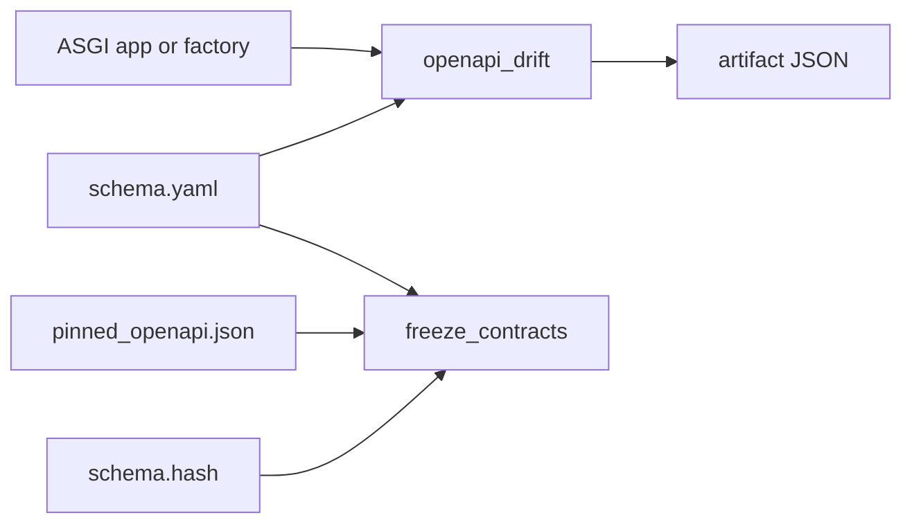
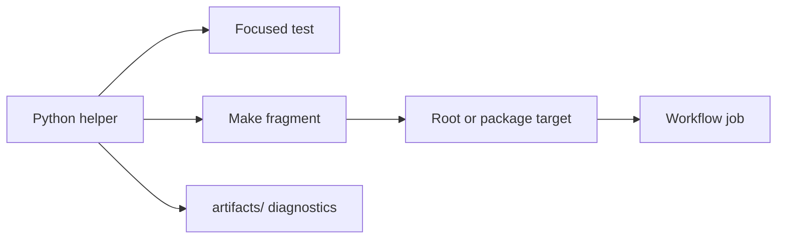

# Module Map

`bijux_canon_dev` is organized by governed repository responsibility. Each
module owns one policy decision and exposes a focused callable surface; Make
and workflow layers compose those decisions without reimplementing them.

```text
bijux_canon_dev/
├── api/
├── docs/
├── packages/
│   ├── agent/
│   ├── index/
│   └── runtime/
├── quality/
├── release/
├── sbom/
├── security/
└── trusted_process.py
```

## Module Responsibilities

| Module | Inputs | Decision or output |
| --- | --- | --- |
| `api.freeze_contracts` | `apis/*/v1/schema.yaml`, pin, digest | canonical pin equality and YAML SHA-256 validity |
| `api.openapi_drift` | application import and checked-in schema | generated canonical JSON plus drift verdict; optional intentional pinning |
| `docs.badge_sync` | badge catalog and workspace/package metadata | generated README badge blocks or drift refusal |
| `docs.mkdocs_config` | source MkDocs configuration and build paths | rewritten build configuration and prepared source paths |
| `docs.repository_docs_catalog` | repository package catalog and documentation model | generated reference inputs used by the public site |
| `quality.deptry_scan` | shared Deptry policy and package metadata | package-specific merged dependency scan configuration and exit status |
| `security.pip_audit_gate` | pip-audit JSON and strict/ignore policy | normalized vulnerability table and gate status |
| `release.python_support_matrix` | workspace metadata and one complete wheel set | isolated installed-package results for every advertised Python version |
| `release.version_resolver` | package metadata and Git history | static, Hatch VCS, or matching-tag version |
| `release.publication_guard` | resolved version and optional dist directory | prerelease/local-version policy and artifact-version agreement |
| `sbom.requirements_writer` | package dependencies and optional development group | deduplicated prod or dev requirements with local workspace references |
| `trusted_process` | absolute executable and argument sequence | text-mode completed process or `TrustedCommandError` |

## API Modules

`freeze_contracts` walks all `apis/*/v1/schema.yaml` roots. It canonicalizes
YAML and pinned JSON before comparison, then hashes the exact YAML text and
compares it with the `sha256:` entry. It fails if no schemas exist or if any
pin, digest, or match is missing.

`openapi_drift` imports an ASGI application or zero-argument factory, writes
its generated OpenAPI as canonical JSON, and compares it with the checked-in
schema. `--pin` deliberately writes the generated schema back to the named
source file; it does not update the separate pinned JSON and digest. A complete
intentional change still runs freeze synchronization afterward.



## Documentation Modules

`mkdocs_config` rewrites repository-relative paths for an isolated build source
and output directory. `repository_docs_catalog` supplies the package inventory
and generated reference material consumed during docs preparation.
`badge_sync` reads the public package set from workspace metadata and renders
named badge templates into marked README blocks.

These helpers own generation and comparison. The authored pages, public
navigation, theme, and package behavior remain in their corresponding source
trees.

## Quality and Security Modules

`quality.deptry_scan` merges shared Deptry configuration with a package-specific
override, filters optional dependency groups to those actually declared, and
invokes the configured Deptry executable through a generated configuration.

`security.pip_audit_gate` accepts pip-audit’s list or dependency-envelope JSON,
matches both vulnerability IDs and aliases against the configured ignore set,
and prints remaining findings with fix versions. Strict mode fails on missing,
malformed, or non-empty disallowed findings. Non-strict mode is visible in the
output and must not be presented as a strict pass.

## Release and SBOM Modules

Version resolution proceeds from an explicit project version, to `hatch
version`, to the latest matching Git tag, then returns `0.0.0` when no source
resolves. The publication guard refuses unresolved, prerelease, local/dirty, or
artifact-mismatched versions unless the relevant exception is explicit.

The Python support matrix derives its interpreter rows from every package's
classifiers, checks those rows against `requires-python`, and requires exactly
one wheel for the repository distribution and every configured package. Each
row installs that immutable wheel set into an isolated environment, checks
dependency metadata, imports every wheel-owned module from `site-packages`, and
loads every declared console entry point. The JSON outcome binds the source
commit, package metadata, lock file, wheel hashes, commands, and failures. It
refuses output, wheel, and environment paths outside the ignored `artifacts/`
tree.

The SBOM requirements writer produces separate production and development
inputs. Local workspace dependencies become absolute `file:` requirements so
the downstream CycloneDX process can resolve the actual checkout. It preserves
extras and environment markers and removes duplicate requirement strings.

## Package Adapters

Package-specific modules exist only where a repository rule needs a narrow
adapter:

| Adapter | Repository rule |
| --- | --- |
| `packages.agent.check_no_generated_files` | generated files must not be tracked in the agent package |
| `packages.agent.check_no_stray_dirs` | agent source layout must not accumulate forbidden directories |
| `packages.index.plugin_contract_report` | index plugin declarations produce a reviewable conformance report |
| `packages.runtime.check_dependency_allowlist` | runtime dependencies remain within the governed allowlist |

An adapter can report a product package’s conformance but cannot become the
home of the product rule itself.

## Finding the Caller



Search module imports and `python -m` invocations in `makes/` before changing a
helper. Then inspect workflow callers for matrices, permissions, and artifact
retention. The module test establishes policy logic; the caller chain
establishes where that policy is enforced.

See [Package Overview](package-overview.md) for the boundary and the focused
[Schema Governance](schema-governance.md), [Security Gates](security-gates.md),
[Release Support](release-support.md), and [SBOM and Supply Chain](sbom-and-supply-chain.md)
pages for operational detail.
