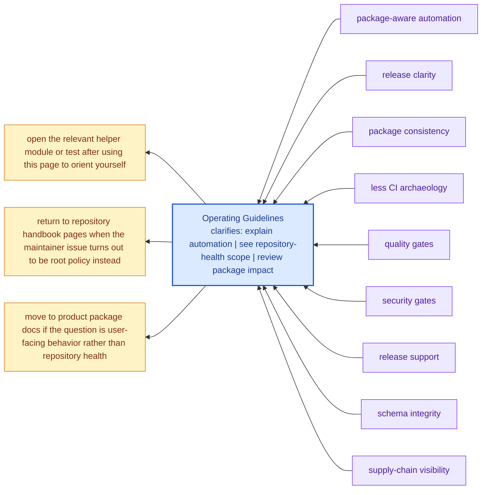

# Operating Guidelines

Changes in `bijux-canon-dev` should be especially careful because they can
affect multiple packages at once.

That is why this section needs to be unusually honest. A small maintainer
change can carry wide consequences, so the package should bias toward
explicit scope, explicit tests, and explicit explanations.

These maintainer pages should read like explicit operational memory for repository-health work. They are strongest when they expose automation intent, package impact, and repository policy without pretending that CI logs are documentation.

## Visual Summary

## Guidelines

- prefer checks that are reviewable and testable over opaque shell glue
- keep repository automation explicit about which packages it touches
- document maintainer-only behavior in this section rather than in user-facing package pages

## Concrete Anchors

- `packages/bijux-canon-dev/src/bijux_canon_dev` for maintainer helpers
- `packages/bijux-canon-dev/tests` for executable maintenance proof
- `apis/` and root workflows for repository-level integration points

## Use This Page When

- you are changing repository automation, validation, or release support
- you need maintainer-only context that should not live in product package docs
- you are reviewing CI, schema drift, or supply-chain behavior

## Decision Rule

Use `Operating Guidelines` to decide whether a change belongs to maintainer automation or to a product package contract. If the change would affect end-user behavior directly, this page should push the review back toward the owning product package instead of letting maintainer scope sprawl.

## What This Page Answers

- which repository maintenance concern this page explains
- which maintainer modules or tests support that concern
- what a reviewer should confirm before changing repository automation

## Reviewer Lens

- compare the described maintainer behavior with the actual helper modules and tests
- check that maintainer-only guidance has not leaked into product-facing pages
- confirm that repository automation still names its package impact explicitly

## Next Checks

- move to product package docs if the question is user-facing behavior rather than repository health
- open the relevant helper module or test after using this page to orient yourself
- return to repository handbook pages when the maintainer issue turns out to be root policy instead

## Honesty Boundary

This section can describe maintainer automation and repository health work, but it should never imply that maintainer tooling is part of the end-user product surface. It also should not pretend that hidden scripts count as documentation just because CI happens to run them.

## Purpose

This page records the expected maintenance posture for the package.

## Stability

Update these guidelines only when the repository operating model genuinely changes.
